Linear Regression
================
KS
2019-03-10

``` r
library("MASS")
library("ISLR")
library("tidyverse")
library("broom")
library("ggfortify")
library("car")
```

### Ch3: Linear Regression

#### Applied Exercises

##### Q8: Use of simple linear regression on the Auto data set

###### (a)

``` r
auto <- as_tibble(Auto)
glimpse(auto)
```

    ## Observations: 392
    ## Variables: 9
    ## $ mpg          <dbl> 18, 15, 18, 16, 17, 15, 14, 14, 14, 15, 15, 14, 15,…
    ## $ cylinders    <dbl> 8, 8, 8, 8, 8, 8, 8, 8, 8, 8, 8, 8, 8, 8, 4, 6, 6, …
    ## $ displacement <dbl> 307, 350, 318, 304, 302, 429, 454, 440, 455, 390, 3…
    ## $ horsepower   <dbl> 130, 165, 150, 150, 140, 198, 220, 215, 225, 190, 1…
    ## $ weight       <dbl> 3504, 3693, 3436, 3433, 3449, 4341, 4354, 4312, 442…
    ## $ acceleration <dbl> 12.0, 11.5, 11.0, 12.0, 10.5, 10.0, 9.0, 8.5, 10.0,…
    ## $ year         <dbl> 70, 70, 70, 70, 70, 70, 70, 70, 70, 70, 70, 70, 70,…
    ## $ origin       <dbl> 1, 1, 1, 1, 1, 1, 1, 1, 1, 1, 1, 1, 1, 1, 3, 1, 1, …
    ## $ name         <fct> chevrolet chevelle malibu, buick skylark 320, plymo…

``` r
lm_fit <- lm(mpg ~ horsepower, data = auto)
summary(lm_fit)
```

    ## 
    ## Call:
    ## lm(formula = mpg ~ horsepower, data = auto)
    ## 
    ## Residuals:
    ##      Min       1Q   Median       3Q      Max 
    ## -13.5710  -3.2592  -0.3435   2.7630  16.9240 
    ## 
    ## Coefficients:
    ##              Estimate Std. Error t value Pr(>|t|)    
    ## (Intercept) 39.935861   0.717499   55.66   <2e-16 ***
    ## horsepower  -0.157845   0.006446  -24.49   <2e-16 ***
    ## ---
    ## Signif. codes:  0 '***' 0.001 '**' 0.01 '*' 0.05 '.' 0.1 ' ' 1
    ## 
    ## Residual standard error: 4.906 on 390 degrees of freedom
    ## Multiple R-squared:  0.6059, Adjusted R-squared:  0.6049 
    ## F-statistic: 599.7 on 1 and 390 DF,  p-value: < 2.2e-16

``` r
glance(lm_fit)
```

    ## # A tibble: 1 x 11
    ##   r.squared adj.r.squared sigma statistic  p.value    df logLik   AIC   BIC
    ##       <dbl>         <dbl> <dbl>     <dbl>    <dbl> <int>  <dbl> <dbl> <dbl>
    ## 1     0.606         0.605  4.91      600. 7.03e-81     2 -1179. 2363. 2375.
    ## # … with 2 more variables: deviance <dbl>, df.residual <int>

``` r
tidy(lm_fit)
```

    ## # A tibble: 2 x 5
    ##   term        estimate std.error statistic   p.value
    ##   <chr>          <dbl>     <dbl>     <dbl>     <dbl>
    ## 1 (Intercept)   39.9     0.717        55.7 1.22e-187
    ## 2 horsepower    -0.158   0.00645     -24.5 7.03e- 81

There is a negative association between horsepower and mpg. The
coefficient on the predictor is highly significant and negative. The RSE
is 4.91 which means that actual mpg for each car deviates from the true
regression line by approximately 4.91, on average. The mean mpg for all
cars is 23.44592 and so the percentage error is 4.91/23.44592 = 21%.

The \(R^2\) value indicates that about 60% of the variance in mpg can be
explained by horsepower.

The confidence and prediction intervals when horsepower = 98 are:

``` r
predict(lm_fit, data.frame(horsepower = 98), interval = "confidence")
```

    ##        fit      lwr      upr
    ## 1 24.46708 23.97308 24.96108

``` r
predict(lm_fit, data.frame(horsepower = 98), interval = "prediction")
```

    ##        fit     lwr      upr
    ## 1 24.46708 14.8094 34.12476

The predicted mpg associated with horsepower of 98 is 24.46708. The
confidence and prediction intervals are (23.97308, 24.96108) and
(14.8094 34.12476). As expected, the latter is wider than the former.

###### (b)

A plot of the response and the predictor with a least squares regression
line.

``` r
ggplot(data = auto, aes(x = horsepower, y = mpg)) +
    geom_smooth(method = "lm", color = "red", se = FALSE, size = 0.3) + 
    geom_point(alpha = 0.3)
```

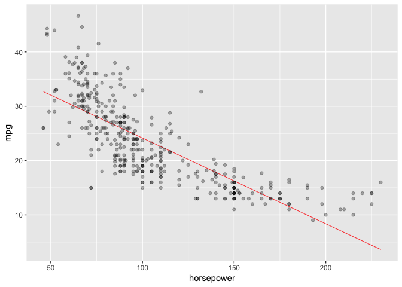<!-- -->

###### (c)

Diagnostic plots of the least squares regression fit.

``` r
diag_plots <- autoplot(lm_fit, which = 1:6, colour = "dodgerblue3",
                       smooth.colour = "red", smooth.linetype = "dashed",
                       ad.colour = "blue",
                       label.size = 3, label.n = 5, label.colour = "black",
                       ncol = 2, alpha = 0.3)
diag_plots
```

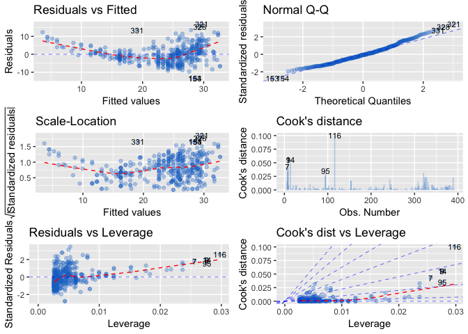<!-- -->

The residuals versus fitted plot indicates a curvilinear relationship
between mpg and horsepower. Observation 116 stands out as having both
high leverage and a high studentized residual suggesting that it is an
outlier with high leverage.

##### Q9: Use of multiple linear regression on the Auto data set

###### (a)

A scatterplot matrix of all the variables

``` r
pairs(auto)
```

<!-- -->

###### (b)

A scatterplot matrix of all the
    variables

``` r
cor(auto[1:8])
```

    ##                     mpg  cylinders displacement horsepower     weight
    ## mpg           1.0000000 -0.7776175   -0.8051269 -0.7784268 -0.8322442
    ## cylinders    -0.7776175  1.0000000    0.9508233  0.8429834  0.8975273
    ## displacement -0.8051269  0.9508233    1.0000000  0.8972570  0.9329944
    ## horsepower   -0.7784268  0.8429834    0.8972570  1.0000000  0.8645377
    ## weight       -0.8322442  0.8975273    0.9329944  0.8645377  1.0000000
    ## acceleration  0.4233285 -0.5046834   -0.5438005 -0.6891955 -0.4168392
    ## year          0.5805410 -0.3456474   -0.3698552 -0.4163615 -0.3091199
    ## origin        0.5652088 -0.5689316   -0.6145351 -0.4551715 -0.5850054
    ##              acceleration       year     origin
    ## mpg             0.4233285  0.5805410  0.5652088
    ## cylinders      -0.5046834 -0.3456474 -0.5689316
    ## displacement   -0.5438005 -0.3698552 -0.6145351
    ## horsepower     -0.6891955 -0.4163615 -0.4551715
    ## weight         -0.4168392 -0.3091199 -0.5850054
    ## acceleration    1.0000000  0.2903161  0.2127458
    ## year            0.2903161  1.0000000  0.1815277
    ## origin          0.2127458  0.1815277  1.0000000

###### (c)

Fit a multiple linear regression model.

``` r
lm_fit_full <- lm(mpg ~. -name, data = auto) 
summary(lm_fit_full)
```

    ## 
    ## Call:
    ## lm(formula = mpg ~ . - name, data = auto)
    ## 
    ## Residuals:
    ##     Min      1Q  Median      3Q     Max 
    ## -9.5903 -2.1565 -0.1169  1.8690 13.0604 
    ## 
    ## Coefficients:
    ##                Estimate Std. Error t value Pr(>|t|)    
    ## (Intercept)  -17.218435   4.644294  -3.707  0.00024 ***
    ## cylinders     -0.493376   0.323282  -1.526  0.12780    
    ## displacement   0.019896   0.007515   2.647  0.00844 ** 
    ## horsepower    -0.016951   0.013787  -1.230  0.21963    
    ## weight        -0.006474   0.000652  -9.929  < 2e-16 ***
    ## acceleration   0.080576   0.098845   0.815  0.41548    
    ## year           0.750773   0.050973  14.729  < 2e-16 ***
    ## origin         1.426141   0.278136   5.127 4.67e-07 ***
    ## ---
    ## Signif. codes:  0 '***' 0.001 '**' 0.01 '*' 0.05 '.' 0.1 ' ' 1
    ## 
    ## Residual standard error: 3.328 on 384 degrees of freedom
    ## Multiple R-squared:  0.8215, Adjusted R-squared:  0.8182 
    ## F-statistic: 252.4 on 7 and 384 DF,  p-value: < 2.2e-16

``` r
tidy(lm_fit_full)
```

    ## # A tibble: 8 x 5
    ##   term          estimate std.error statistic  p.value
    ##   <chr>            <dbl>     <dbl>     <dbl>    <dbl>
    ## 1 (Intercept)  -17.2      4.64        -3.71  2.40e- 4
    ## 2 cylinders     -0.493    0.323       -1.53  1.28e- 1
    ## 3 displacement   0.0199   0.00752      2.65  8.44e- 3
    ## 4 horsepower    -0.0170   0.0138      -1.23  2.20e- 1
    ## 5 weight        -0.00647  0.000652    -9.93  7.87e-21
    ## 6 acceleration   0.0806   0.0988       0.815 4.15e- 1
    ## 7 year           0.751    0.0510      14.7   3.06e-39
    ## 8 origin         1.43     0.278        5.13  4.67e- 7

``` r
glance(lm_fit_full)
```

    ## # A tibble: 1 x 11
    ##   r.squared adj.r.squared sigma statistic   p.value    df logLik   AIC
    ##       <dbl>         <dbl> <dbl>     <dbl>     <dbl> <int>  <dbl> <dbl>
    ## 1     0.821         0.818  3.33      252. 2.04e-139     8 -1023. 2065.
    ## # … with 3 more variables: BIC <dbl>, deviance <dbl>, df.residual <int>

The p-value on the F-statistic is extremely small which indicates that
there is a relationship between the predictors and the response.

displacement, weight, year and origin appear to have statistically
significant relationship to the response.

The coefficient on the year variable is highly significant and positive
which suggest that mpg has improved over
time.

###### (d)

``` r
diag_plots <- autoplot(lm_fit_full, which = c(1:4, 6), colour = "dodgerblue3",
                       smooth.colour = "red", smooth.linetype = "dashed",
                       ad.colour = "blue",
                       label.size = 3, label.n = 5, label.colour = "black",
                       ncol = 2, alpha = 0.3)
diag_plots
```

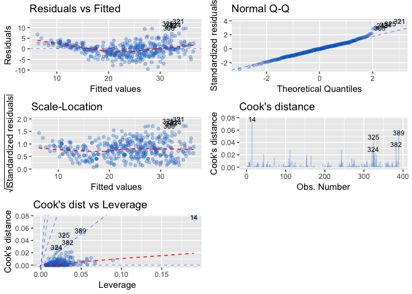<!-- -->

There doesn’t appear to be any unusually large outlier. Observation 14
seems to have unusually high leverage. We can fit the model again
without that observation and inspect the results.

##### Q10: Use of multiple linear regression on the Carseats data set

###### carseats data

``` r
carseats <- as_tibble(Carseats)
names(carseats) <- tolower(names(carseats))
names(carseats)
```

    ##  [1] "sales"       "compprice"   "income"      "advertising" "population" 
    ##  [6] "price"       "shelveloc"   "age"         "education"   "urban"      
    ## [11] "us"

``` r
glimpse(carseats)
```

    ## Observations: 400
    ## Variables: 11
    ## $ sales       <dbl> 9.50, 11.22, 10.06, 7.40, 4.15, 10.81, 6.63, 11.85, …
    ## $ compprice   <dbl> 138, 111, 113, 117, 141, 124, 115, 136, 132, 132, 12…
    ## $ income      <dbl> 73, 48, 35, 100, 64, 113, 105, 81, 110, 113, 78, 94,…
    ## $ advertising <dbl> 11, 16, 10, 4, 3, 13, 0, 15, 0, 0, 9, 4, 2, 11, 11, …
    ## $ population  <dbl> 276, 260, 269, 466, 340, 501, 45, 425, 108, 131, 150…
    ## $ price       <dbl> 120, 83, 80, 97, 128, 72, 108, 120, 124, 124, 100, 9…
    ## $ shelveloc   <fct> Bad, Good, Medium, Medium, Bad, Bad, Medium, Good, M…
    ## $ age         <dbl> 42, 65, 59, 55, 38, 78, 71, 67, 76, 76, 26, 50, 62, …
    ## $ education   <dbl> 17, 10, 12, 14, 13, 16, 15, 10, 10, 17, 10, 13, 18, …
    ## $ urban       <fct> Yes, Yes, Yes, Yes, Yes, No, Yes, Yes, No, No, No, Y…
    ## $ us          <fct> Yes, Yes, Yes, Yes, No, Yes, No, Yes, No, Yes, Yes, …

###### (a) Fit a multiple regression model to predict Sales using Price, Urban and US.

``` r
m1 <- lm(sales ~ price + urban + us, data = carseats)
tidy(m1)
```

    ## # A tibble: 4 x 5
    ##   term        estimate std.error statistic  p.value
    ##   <chr>          <dbl>     <dbl>     <dbl>    <dbl>
    ## 1 (Intercept)  13.0      0.651     20.0    3.63e-62
    ## 2 price        -0.0545   0.00524  -10.4    1.61e-22
    ## 3 urbanYes     -0.0219   0.272     -0.0807 9.36e- 1
    ## 4 usYes         1.20     0.259      4.63   4.86e- 6

``` r
glance(m1)
```

    ## # A tibble: 1 x 11
    ##   r.squared adj.r.squared sigma statistic  p.value    df logLik   AIC   BIC
    ##       <dbl>         <dbl> <dbl>     <dbl>    <dbl> <int>  <dbl> <dbl> <dbl>
    ## 1     0.239         0.234  2.47      41.5 2.39e-23     4  -928. 1865. 1885.
    ## # … with 2 more variables: deviance <dbl>, df.residual <int>

``` r
summary(m1)
```

    ## 
    ## Call:
    ## lm(formula = sales ~ price + urban + us, data = carseats)
    ## 
    ## Residuals:
    ##     Min      1Q  Median      3Q     Max 
    ## -6.9206 -1.6220 -0.0564  1.5786  7.0581 
    ## 
    ## Coefficients:
    ##              Estimate Std. Error t value Pr(>|t|)    
    ## (Intercept) 13.043469   0.651012  20.036  < 2e-16 ***
    ## price       -0.054459   0.005242 -10.389  < 2e-16 ***
    ## urbanYes    -0.021916   0.271650  -0.081    0.936    
    ## usYes        1.200573   0.259042   4.635 4.86e-06 ***
    ## ---
    ## Signif. codes:  0 '***' 0.001 '**' 0.01 '*' 0.05 '.' 0.1 ' ' 1
    ## 
    ## Residual standard error: 2.472 on 396 degrees of freedom
    ## Multiple R-squared:  0.2393, Adjusted R-squared:  0.2335 
    ## F-statistic: 41.52 on 3 and 396 DF,  p-value: < 2.2e-16

The price company charges for car seats at each site (price) and whether
the store is in the US or not (usYes) are statistically significant at
the 0.001 level. The former has a negative effect on sales while the
latter has a negative effect. Specifically, a one unit change in price
is associated with a decrease in sales of 0.054 units. If the store is
located in the US, sales increase by 1.2 units. However, whether the
store is located in an urban or rural location (urbanYes) is not
statistically
significant.

###### (e) On the basis of your response to the previous question, fit a smaller model that only uses the predictors for which there is evidence of association with the outcome. Fit model with price and us.

``` r
m2 <- lm(sales ~ price + us, data = carseats)
tidy(m2)
```

    ## # A tibble: 3 x 5
    ##   term        estimate std.error statistic  p.value
    ##   <chr>          <dbl>     <dbl>     <dbl>    <dbl>
    ## 1 (Intercept)  13.0      0.631       20.7  7.00e-65
    ## 2 price        -0.0545   0.00523    -10.4  1.27e-22
    ## 3 usYes         1.20     0.258        4.64 4.71e- 6

``` r
glance(m2)
```

    ## # A tibble: 1 x 11
    ##   r.squared adj.r.squared sigma statistic  p.value    df logLik   AIC   BIC
    ##       <dbl>         <dbl> <dbl>     <dbl>    <dbl> <int>  <dbl> <dbl> <dbl>
    ## 1     0.239         0.235  2.47      62.4 2.66e-24     3  -928. 1863. 1879.
    ## # … with 2 more variables: deviance <dbl>, df.residual <int>

``` r
summary(m2)
```

    ## 
    ## Call:
    ## lm(formula = sales ~ price + us, data = carseats)
    ## 
    ## Residuals:
    ##     Min      1Q  Median      3Q     Max 
    ## -6.9269 -1.6286 -0.0574  1.5766  7.0515 
    ## 
    ## Coefficients:
    ##             Estimate Std. Error t value Pr(>|t|)    
    ## (Intercept) 13.03079    0.63098  20.652  < 2e-16 ***
    ## price       -0.05448    0.00523 -10.416  < 2e-16 ***
    ## usYes        1.19964    0.25846   4.641 4.71e-06 ***
    ## ---
    ## Signif. codes:  0 '***' 0.001 '**' 0.01 '*' 0.05 '.' 0.1 ' ' 1
    ## 
    ## Residual standard error: 2.469 on 397 degrees of freedom
    ## Multiple R-squared:  0.2393, Adjusted R-squared:  0.2354 
    ## F-statistic: 62.43 on 2 and 397 DF,  p-value: < 2.2e-16

The R Square and RSE values in both models are identical. In this case,
we prefer the simpler model in m2 with fewer
predictors.

###### (g) Using the model from (e), obtain 95% confidence intervals for the coefficient(s).

``` r
upper <- tidy(m2)["estimate"] + qt(.975, 397) * tidy(m2)["std.error"]
lower <- tidy(m2)["estimate"] - qt(.975, 397) * tidy(m2)["std.error"]
cbind(upper, lower)
```

    ##      estimate    estimate
    ## 1 14.27126531 11.79032020
    ## 2 -0.04419543 -0.06475984
    ## 3  1.70776632  0.69151957

``` r
confint(m2)
```

    ##                   2.5 %      97.5 %
    ## (Intercept) 11.79032020 14.27126531
    ## price       -0.06475984 -0.04419543
    ## usYes        0.69151957  1.70776632

###### (h) Is there evidence of outliers or high leverage observations in the model from (e)? We can examine some diagnostic plots.

We can look at plots of studentized residuals versus fitted values.

``` r
aug_m2 <- augment(m2)
y.fitted <- flatten_dbl(aug_m2[".fitted"])
stu.resids <- rstudent(m2)
stres_plt <- ggplot(data = NULL, mapping = aes(x = y.fitted, y = stu.resids)) +
    geom_point(color = "dodgerblue") +
    geom_hline(yintercept = 0, color = "grey") +
    xlab("Fitted Values") +
    ylab("Studentized Residuals")
stres_plt
```

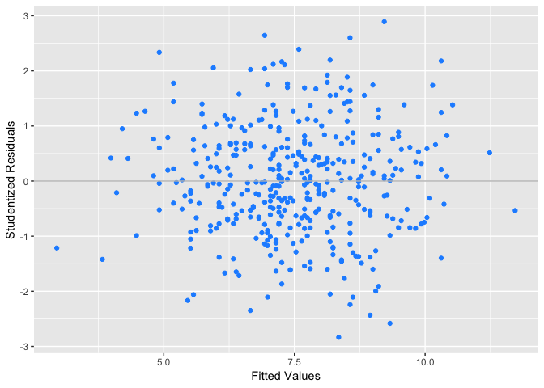<!-- -->

As there are no observations greater then 3 in absolute value, we may
conclude that there are no outliers.

To identify high leverage observations we can plot studentized residuals
versus leverage.

``` r
hats <- flatten_dbl(aug_m2[".hat"])
lev_plt <- ggplot(data = carseats, mapping = aes(x = hats, y = stu.resids, 
                  label =      rownames(carseats))) +
    geom_text(color = "dodgerblue") +
    geom_hline(yintercept = 0, color = "grey") +
    xlab("Leverage") +
    ylab("Studentized Residuals")
lev_plt
```

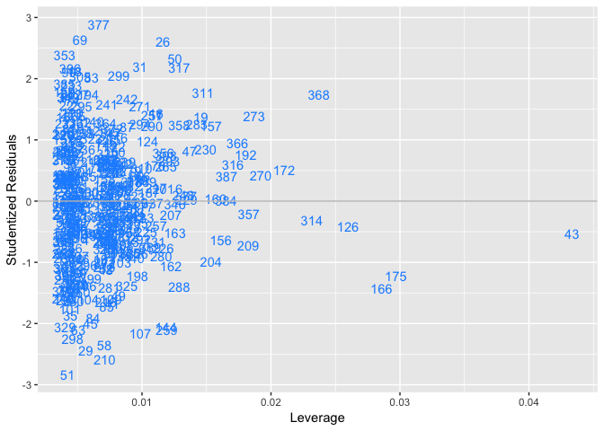<!-- -->

Observation 43 is possibly a high leverage point. Removing it and
estimating the model again shows a very slight reduction in the
R-squared and the RSE
values.

##### Q11. In this problem we will investigate the t-statistic for the null hypoth- esis H0 : β = 0 in simple linear regression without an intercept.

generate a predictor x and a response y:

``` r
set.seed(1)
x <- rnorm(100)
y <- 2 * x + rnorm(100)
```

###### (a) Perform a simple linear regression of y onto x, without an intercept.

``` r
lm.fit_yx <- lm(y ~ x + 0)
tidy(lm.fit_yx)
```

    ## # A tibble: 1 x 5
    ##   term  estimate std.error statistic  p.value
    ##   <chr>    <dbl>     <dbl>     <dbl>    <dbl>
    ## 1 x         1.99     0.106      18.7 2.64e-34

The coefficient is highly statistically significant (\(beta\) = 1.99, SE
= 0.106, t-statistic = 18.7, p-value = 2.64e-34). We can reject the
null.

###### (b) Perform a simple linear regression of x onto y without an intercept.

``` r
lm.fit_xy <- lm(x ~ y + 0)
tidy(lm.fit_xy)
```

    ## # A tibble: 1 x 5
    ##   term  estimate std.error statistic  p.value
    ##   <chr>    <dbl>     <dbl>     <dbl>    <dbl>
    ## 1 y        0.391    0.0209      18.7 2.64e-34

The coefficient is highly statistically significant (\(beta\) = 0.391,
SE = 0.0209, t-statistic = 18.7, p-value = 2.64e-34). We can reject the
null.

The t-statistics are identical in a and
b.

###### (f) In R, show that when regression is performed with an intercept, the t-statistic for H0 : β1 = 0 is the same for the regression of y onto x as it is for the regression of x onto y.

``` r
lm.fit_yx <- lm(y ~ x)
tidy(lm.fit_yx)
```

    ## # A tibble: 2 x 5
    ##   term        estimate std.error statistic  p.value
    ##   <chr>          <dbl>     <dbl>     <dbl>    <dbl>
    ## 1 (Intercept)  -0.0377    0.0970    -0.389 6.98e- 1
    ## 2 x             2.00      0.108     18.6   7.72e-34

``` r
lm.fit_xy <- lm(x ~ y)
tidy(lm.fit_xy)
```

    ## # A tibble: 2 x 5
    ##   term        estimate std.error statistic  p.value
    ##   <chr>          <dbl>     <dbl>     <dbl>    <dbl>
    ## 1 (Intercept)   0.0388    0.0427     0.910 3.65e- 1
    ## 2 y             0.389     0.0210    18.6   7.72e-34

The values for the t-statistics are identical (18.6) in both
regressions.

##### (12) This problem involves simple linear regression without an intercept.

###### (a) Under what circumstance is the coefficient estimate for the regression of X onto Y the same as the coefficient estimate for the regression of Y onto X?

The coefficient estimate for the regression of X onto Y is same as the
coefficient estimate for the regression of Y onto X when the Sum of
squares of X = Sum of squares of
Y.

###### (b) Generate an example in R with n = 100 observations in which the coefficient estimate for the regression of X onto Y is different from the coefficient estimate for the regression of Y onto X.

``` r
set.seed(1)
obs = 100
x = rnorm(obs)
sum(x^2)
```

    ## [1] 81.05509

``` r
y = 3*x + rnorm(obs, sd = 0.2)
sum(y^2)
```

    ## [1] 732.5393

``` r
yonx <- lm(y ~ x + 0)
tidy(yonx)
```

    ## # A tibble: 1 x 5
    ##   term  estimate std.error statistic   p.value
    ##   <chr>    <dbl>     <dbl>     <dbl>     <dbl>
    ## 1 x         3.00    0.0213      141. 7.31e-116

``` r
xony <- lm(x ~ y + 0)
tidy(xony)
```

    ## # A tibble: 1 x 5
    ##   term  estimate std.error statistic   p.value
    ##   <chr>    <dbl>     <dbl>     <dbl>     <dbl>
    ## 1 y        0.332   0.00236      141. 7.31e-116

###### (c) Generate an example in R with n = 100 observations in which the coefficient estimate for the regression of X onto Y is *the* *same* *as* the coefficient estimate for the regression of Y onto X.

``` r
x = rnorm(obs)
y = sample(x)
sum(x^2)
```

    ## [1] 105.9889

``` r
sum(y^2)
```

    ## [1] 105.9889

``` r
yonx <- lm(y ~ x + 0)
tidy(yonx)
```

    ## # A tibble: 1 x 5
    ##   term  estimate std.error statistic p.value
    ##   <chr>    <dbl>     <dbl>     <dbl>   <dbl>
    ## 1 x       0.0274     0.100     0.273   0.786

``` r
xony <- lm(x ~ y + 0)
tidy(xony)
```

    ## # A tibble: 1 x 5
    ##   term  estimate std.error statistic p.value
    ##   <chr>    <dbl>     <dbl>     <dbl>   <dbl>
    ## 1 y       0.0274     0.100     0.273   0.786

The estimates are identical as
expected.

##### (13) Create some simulated data and fit simple linear regression models to it.

###### (a) create feature X with 100 observations drawn from N(0, 1)

``` r
set.seed(1)
obs = 100
x = rnorm(obs, mean = 0.0, sd = 1) # variance = 1
mean(x)
```

    ## [1] 0.1088874

``` r
sd(x)
```

    ## [1] 0.8981994

###### (b) create feature X with 100 observations drawn from N(0, 0.25)

``` r
eps = rnorm(obs, mean = 0.0, sd = sqrt(0.25)) # variance = 0.25
mean(eps)
```

    ## [1] -0.01890404

``` r
sd(eps)
```

    ## [1] 0.4789395

###### (c) Using x and eps, generate a vector y according to the model

y = −1 + 0.5x + ε.

``` r
y = -1 + (0.5 * x) + eps
length(y)
```

    ## [1] 100

\(\beta_{0}\) = -1, \(\beta_{1}\) = 0.5 in the linear model.

###### (d) Scatterplot displaying the relationship between x and y

``` r
plt_xyd <- ggplot(data = NULL, mapping = aes(x = x, y = y)) + 
    geom_point(color = "dodgerblue")
plt_xyd
```

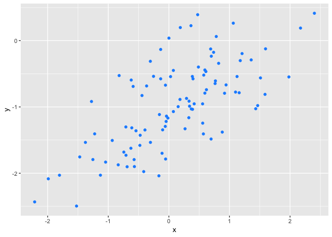<!-- -->

The relationship appears to be linear and positive; as x increases, so
does y.

###### (e) Fit a least squares model to predict y using x.

``` r
yonx13 <- lm(y ~ x)
tidy(yonx13)
```

    ## # A tibble: 2 x 5
    ##   term        estimate std.error statistic  p.value
    ##   <chr>          <dbl>     <dbl>     <dbl>    <dbl>
    ## 1 (Intercept)   -1.02     0.0485    -21.0  4.50e-38
    ## 2 x              0.499    0.0539      9.27 4.58e-15

The estimated values of the intercept \(\hat{\beta_{0}}\) (-1.0188463)
and the slope \(\hat{\beta_{1}}\) (0.4994698) are very close to the true
values. The \(R^2\) and RSE values are 46% and 0.481,
respectively.

###### (f) Display the least squares line and the population regression line on the scatterplot obtained in (d)

``` r
reg_plt <- ggplot(data = NULL, aes(x = x, y = y)) + 
    geom_smooth(method = "lm", color = "red", se = FALSE) + 
    geom_point(color = "dodger blue") + 
    geom_abline(slope = 0.5, intercept = -1, color = "dark green")
reg_plt
```

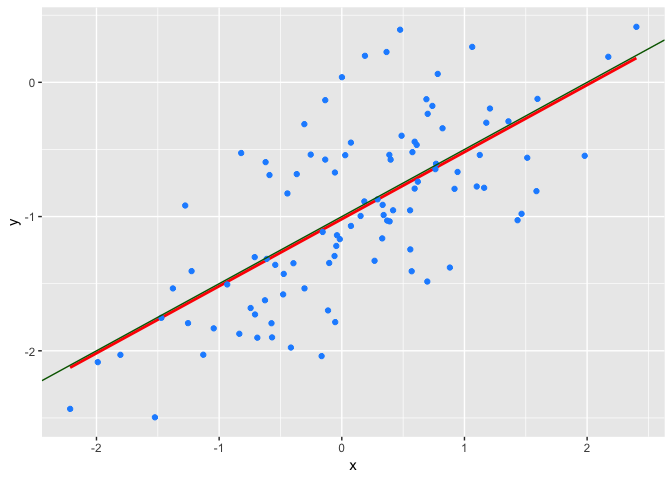<!-- -->

###### (g) Fit a polynomial regression model that predicts y using x and \(x^2\)

``` r
lm.fit_poly2 = lm(y ~ x + I(x^2))
tidy(lm.fit_poly2)
```

    ## # A tibble: 3 x 5
    ##   term        estimate std.error statistic  p.value
    ##   <chr>          <dbl>     <dbl>     <dbl>    <dbl>
    ## 1 (Intercept)  -0.972     0.0588    -16.5  6.08e-30
    ## 2 x             0.509     0.0540      9.42 2.40e-15
    ## 3 I(x^2)       -0.0595    0.0424     -1.40 1.64e- 1

``` r
# using orthogoal polynomials
lm.fit_opoly2 = lm(y ~ poly(x, 2))
tidy(lm.fit_opoly2)
```

    ## # A tibble: 3 x 5
    ##   term        estimate std.error statistic  p.value
    ##   <chr>          <dbl>     <dbl>     <dbl>    <dbl>
    ## 1 (Intercept)   -0.964    0.0479    -20.1  2.05e-36
    ## 2 poly(x, 2)1    4.46     0.479       9.32 3.97e-15
    ## 3 poly(x, 2)2   -0.672    0.479      -1.40 1.64e- 1

``` r
glance(lm.fit_opoly2)
```

    ## # A tibble: 1 x 11
    ##   r.squared adj.r.squared sigma statistic  p.value    df logLik   AIC   BIC
    ##       <dbl>         <dbl> <dbl>     <dbl>    <dbl> <int>  <dbl> <dbl> <dbl>
    ## 1     0.478         0.467 0.479      44.4 2.04e-14     3  -66.8  142.  152.
    ## # … with 2 more variables: deviance <dbl>, df.residual <int>

There is a very slight improvement in \(R^2\) and RSE values. We can
also examine the plot of residuals versus fitted
values.

``` r
diag_plots13g <- autoplot(lm.fit_opoly2, which = 1, colour = "dodgerblue3",
                       smooth.colour = "red", smooth.linetype = "dashed",
                       ad.colour = "blue",
                       label.size = 3, label.n = 5, label.colour = "black",
                       ncol = 2, alpha = 0.3)
diag_plots13g
```

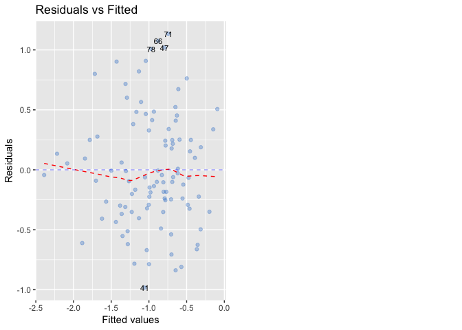<!-- -->

For comparison we may look at the same plot obtained from the model
without the polynomial term.

``` r
diag_plots13 <- autoplot(yonx13, which = 1, colour = "dodgerblue3",
                       smooth.colour = "red", smooth.linetype = "dashed",
                       ad.colour = "blue",
                       label.size = 3, label.n = 5, label.colour = "black",
                       ncol = 2, alpha = 0.3)
diag_plots13
```

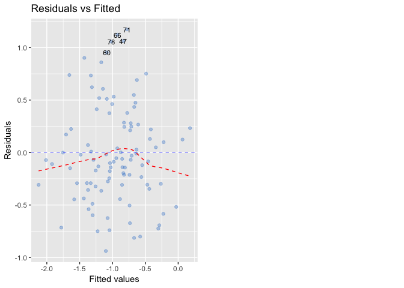<!-- -->

We can that there is some improvement in the fit from the model with the
polynomial term. The smoothed line (red) is flatter.

###### (h) Repeat (a) - (f) with less noise

``` r
eps = rnorm(100, mean = 0, sd = 0.10)
y = -1 + 0.5*x + eps
length(y)
```

    ## [1] 100

Scatterplot between x and y.

``` r
plt_xyh <- ggplot(data = NULL, mapping = aes(x = x, y = y)) + 
    geom_point(color = "dodgerblue")
plt_xyh
```

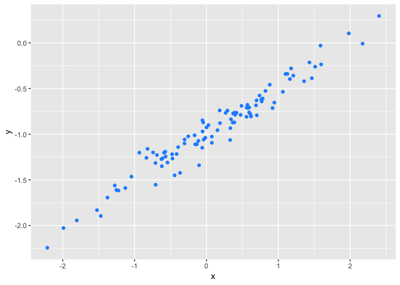<!-- -->

As expected the data are less spread out in the y direction compared to
the case when the errors were drawn from a distribution with higher
variance.

``` r
yonx13h <- lm(y ~ x)
tidy(yonx13h)
```

    ## # A tibble: 2 x 5
    ##   term        estimate std.error statistic  p.value
    ##   <chr>          <dbl>     <dbl>     <dbl>    <dbl>
    ## 1 (Intercept)   -0.997    0.0105     -95.2 2.10e-98
    ## 2 x              0.502    0.0116      43.2 1.39e-65

``` r
glance(yonx13h)
```

    ## # A tibble: 1 x 11
    ##   r.squared adj.r.squared sigma statistic  p.value    df logLik   AIC   BIC
    ##       <dbl>         <dbl> <dbl>     <dbl>    <dbl> <int>  <dbl> <dbl> <dbl>
    ## 1     0.950         0.950 0.104     1864. 1.39e-65     2   85.5 -165. -157.
    ## # … with 2 more variables: deviance <dbl>, df.residual <int>

The estimated values of the intercept \(\hat{\beta_{0}}\) (-0.9972631)
and the slope \(\hat{\beta_{1}}\) (0.5021167) are very close to the true
values. However, the \(R^2\) and RSE values are 95% and 0.104,
respectively.

###### (i) Repeat (a) - (f) with more noise

``` r
eps = rnorm(100, mean = 0, sd = 1.0)
y = -1 + 0.5*x + eps
length(y)
```

    ## [1] 100

Scatterplot between x and y.

``` r
plt_xyi <- ggplot(data = NULL, mapping = aes(x = x, y = y)) + 
    geom_point(color = "dodgerblue")
plt_xyi
```

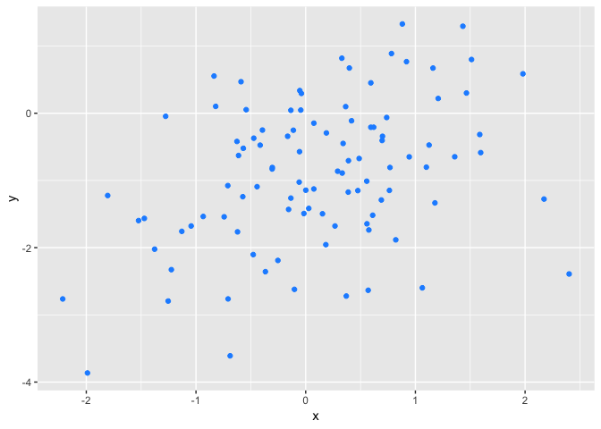<!-- -->

As expected the data are more spread out in the y direction compared to
the case when the errors were drawn from a distribution with lower
variance.

``` r
yonx13i <- lm(y ~ x)
tidy(yonx13i)
```

    ## # A tibble: 2 x 5
    ##   term        estimate std.error statistic  p.value
    ##   <chr>          <dbl>     <dbl>     <dbl>    <dbl>
    ## 1 (Intercept)   -0.942     0.100     -9.40 2.47e-15
    ## 2 x              0.444     0.111      3.99 1.28e- 4

``` r
glance(yonx13i)
```

    ## # A tibble: 1 x 11
    ##   r.squared adj.r.squared sigma statistic p.value    df logLik   AIC   BIC
    ##       <dbl>         <dbl> <dbl>     <dbl>   <dbl> <int>  <dbl> <dbl> <dbl>
    ## 1     0.140         0.131 0.995      15.9 1.28e-4     2  -140.  287.  295.
    ## # … with 2 more variables: deviance <dbl>, df.residual <int>

The estimated values of the intercept \(\hat{\beta_{0}}\) (-0.9423346)
and the slope \(\hat{\beta_{1}}\) (0.4443139) are very close to the true
values. However, the \(R^2\) and RSE values are 15% and 1.10,
respectively. The regression model accounts for only 15% of the
variance.

###### (j) Confidence intervals for \(\beta_{0}\) and \(\beta_{1}\) based on the original, less noisy and more noisy data sets.

``` r
confint(yonx13) # original
```

    ##                  2.5 %     97.5 %
    ## (Intercept) -1.1150804 -0.9226122
    ## x            0.3925794  0.6063602

``` r
confint(yonx13h) # less noise
```

    ##                  2.5 %     97.5 %
    ## (Intercept) -1.0180413 -0.9764850
    ## x            0.4790377  0.5251957

``` r
confint(yonx13i) # more noise
```

    ##                  2.5 %     97.5 %
    ## (Intercept) -1.1413399 -0.7433293
    ## x            0.2232721  0.6653558

As expected the confidence interval is narrowest for the data with the
least noise while it is the widest for the data with the most noise. The
original data had noise between these two extremes and hence has a
confidence interval within these extremes. Estimates are more uncertain
when there is more noise.

##### (14) Focus on the *collinearity* problem

###### (a)

``` r
set.seed(1)
x1 <- runif(100)
x2 <- (0.5 * x1) + rnorm(100)/10
y <- 2 + (2 * x1) + (0.3 * x2) + rnorm(100)
```

Form of the linear model:
\[Y = \beta_{0} + \beta_{1}x1 + \beta_{2}x2 + \epsilon\].

The coefficient values are: (\(\beta_{0}\) = 2, \(\beta_{1}\) = 2,
\(\beta_{2}\) =
0.3)

###### (b) Correlation between x1 and x2; scatterplot between the two variables.

``` r
cor(x1, x2)
```

    ## [1] 0.8351212

``` r
x1x2 <- ggplot(data = NULL, aes(x = x1, y = x2)) + 
    geom_point(color = "dodger blue")
x1x2
```

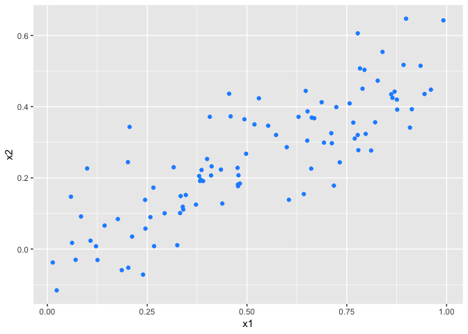<!-- -->

There is a linear association between the two which can be seen in the
scatterplot. The correlation between the two variables is 0.8351212.

###### (c) Fit a least squares regression to predict y using x1 and x2.

``` r
lm.fit14 <- lm(y ~ x1 + x2)
tidy(lm.fit14)
```

    ## # A tibble: 3 x 5
    ##   term        estimate std.error statistic  p.value
    ##   <chr>          <dbl>     <dbl>     <dbl>    <dbl>
    ## 1 (Intercept)     2.13     0.232     9.19  7.61e-15
    ## 2 x1              1.44     0.721     2.00  4.87e- 2
    ## 3 x2              1.01     1.13      0.891 3.75e- 1

``` r
glance(lm.fit14)
```

    ## # A tibble: 1 x 11
    ##   r.squared adj.r.squared sigma statistic p.value    df logLik   AIC   BIC
    ##       <dbl>         <dbl> <dbl>     <dbl>   <dbl> <int>  <dbl> <dbl> <dbl>
    ## 1     0.209         0.193  1.06      12.8 1.16e-5     3  -146.  300.  310.
    ## # … with 2 more variables: deviance <dbl>, df.residual <int>

\(\hat{\beta_{0}}\) (2.1304996), \(\hat{\beta_{1}}\) (1.4395554),
\(\hat{\beta_{2}}\) (1.0096742)

Except for the intercept, these are not good estimates of the true
\(\beta_{1}\) and \(\beta_{2}\). We can reject the null hypothesis of
\(H_{0}\): \(\beta_{1}\) = 0 at the 0.05 level. However, \(H_{0}\):
\(\beta_{2}\) = 0 cannot be rejected at conventional levels.

###### (d) Fit least squares regression to predict y using x1.

``` r
lm.fit14x1 <- lm(y ~ x1)
tidy(lm.fit14x1)
```

    ## # A tibble: 2 x 5
    ##   term        estimate std.error statistic  p.value
    ##   <chr>          <dbl>     <dbl>     <dbl>    <dbl>
    ## 1 (Intercept)     2.11     0.231      9.15 8.27e-15
    ## 2 x1              1.98     0.396      4.99 2.66e- 6

``` r
glance(lm.fit14x1)
```

    ## # A tibble: 1 x 11
    ##   r.squared adj.r.squared sigma statistic p.value    df logLik   AIC   BIC
    ##       <dbl>         <dbl> <dbl>     <dbl>   <dbl> <int>  <dbl> <dbl> <dbl>
    ## 1     0.202         0.194  1.06      24.9 2.66e-6     2  -146.  298.  306.
    ## # … with 2 more variables: deviance <dbl>, df.residual <int>

We can reject the null hypothesis of \(H_{0}\): \(\beta_{1}\) = 0 at the
0.001 level.

###### (d) Fit least squares regression to predict y using x2.

``` r
lm.fit14x2 <- lm(y ~ x2)
tidy(lm.fit14x2)
```

    ## # A tibble: 2 x 5
    ##   term        estimate std.error statistic  p.value
    ##   <chr>          <dbl>     <dbl>     <dbl>    <dbl>
    ## 1 (Intercept)     2.39     0.195     12.3  1.68e-21
    ## 2 x2              2.90     0.633      4.58 1.37e- 5

``` r
glance(lm.fit14x2)
```

    ## # A tibble: 1 x 11
    ##   r.squared adj.r.squared sigma statistic p.value    df logLik   AIC   BIC
    ##       <dbl>         <dbl> <dbl>     <dbl>   <dbl> <int>  <dbl> <dbl> <dbl>
    ## 1     0.176         0.168  1.07      21.0 1.37e-5     2  -148.  302.  310.
    ## # … with 2 more variables: deviance <dbl>, df.residual <int>

We can reject the null hypothesis of \(H_{0}\): \(\beta_{1}\) = 0 at the
0.001 level.

The results from (c) and (d) seemingly contradict the result from (b).
However, we know that x1 and x2 are correlated making it difficult to
separate out the effects of each on the response y. The presence of
collinearity inflates the standard errors so much so that the
coefficient on x2 in the multiple regression with x1 and x2 becomes
statistically insignificant. For this particular example, we may
consider dropping x2 since the presence of collinearity implies that the
information about the response obtained from x2 is redundant in the
presence of x1.

###### (f) Suppose we obtain an additional observation (mismeasured)

``` r
mean(y)
```

    ## [1] 3.135623

``` r
mean(x1)
```

    ## [1] 0.5178471

``` r
mean(x2)
```

    ## [1] 0.2571656

``` r
x1 <- c(x1, 0.1)
x2 <- c(x2, 0.8)
y <- c(y, 6)

mean(y)
```

    ## [1] 3.163983

``` r
mean(x1)
```

    ## [1] 0.51371

``` r
mean(x2)
```

    ## [1] 0.2625402

``` r
cor(x1, x2)
```

    ## [1] 0.7392279

Re-fit the models from (c) to (e) with the additional observation in the
data.

``` r
lm.fit14h <- lm(y ~ x1 + x2)
tidy(lm.fit14h)
```

    ## # A tibble: 3 x 5
    ##   term        estimate std.error statistic  p.value
    ##   <chr>          <dbl>     <dbl>     <dbl>    <dbl>
    ## 1 (Intercept)    2.23      0.231     9.62  7.91e-16
    ## 2 x1             0.539     0.592     0.911 3.65e- 1
    ## 3 x2             2.51      0.898     2.80  6.14e- 3

``` r
lm.fit14x1h <- lm(y ~ x1)
tidy(lm.fit14x1h)
```

    ## # A tibble: 2 x 5
    ##   term        estimate std.error statistic  p.value
    ##   <chr>          <dbl>     <dbl>     <dbl>    <dbl>
    ## 1 (Intercept)     2.26     0.239      9.44 1.78e-15
    ## 2 x1              1.77     0.412      4.28 4.29e- 5

``` r
lm.fit14x2h <- lm(y ~ x2)
tidy(lm.fit14x2h)
```

    ## # A tibble: 2 x 5
    ##   term        estimate std.error statistic  p.value
    ##   <chr>          <dbl>     <dbl>     <dbl>    <dbl>
    ## 1 (Intercept)     2.35     0.191     12.3  1.40e-21
    ## 2 x2              3.12     0.604      5.16 1.25e- 6

The addition of the extra observation reduces the correlation between x1
and x2 to 0.7392279. Examining the model with both predictors, we find
that we can no longer reject \(H_{0}\): \(\beta_{1}\) = 0 but we can,
however, reject \(H_{0}\): \(\beta_{2}\) = 0 at conventional levels. The
individual models with x1 and x2 show an increase and a decrease in the
standard error for each, respectively.

We may examine a plot of studentized residuals against fitted values to
check for outliers.

``` r
aug_14 <- augment(lm.fit14h)
y.fitted <- flatten_dbl(aug_14[".fitted"])
stu.resids <- rstudent(lm.fit14h)
stres_plt14 <- ggplot(data = NULL, mapping = aes(x = y.fitted, y = stu.resids)) +
    geom_point(color = "dodgerblue") +
    geom_hline(yintercept = 0, color = "grey") +
    xlab("Fitted Values") +
    ylab("Studentized Residuals")
stres_plt14
```

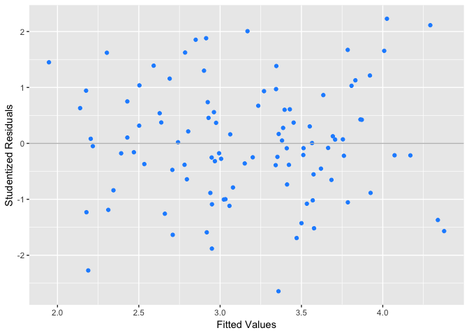<!-- -->

All values are within absolute value of 3 indicating that there are no
outliers in the data.

What about leverage? To identify high leverage observations we can plot
studentized residuals versus leverage.

``` r
hats <- flatten_dbl(aug_14[".hat"])
stu.resids <- rstudent(lm.fit14h)
lev_plt <- ggplot(data = NULL, mapping = aes(x = hats, y = stu.resids)) +
    geom_point(color = "dodger blue") + 
    geom_hline(yintercept = 0, color = "grey") +
    xlab("Leverage") +
    ylab("Studentized Residuals")
lev_plt
```

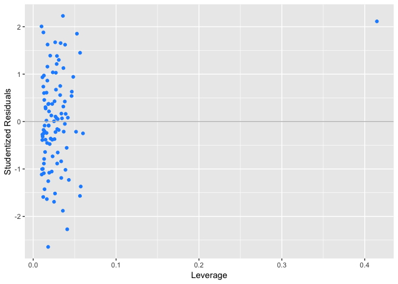<!-- -->

We can see that the added observation is a high leverage point but does
not appear to be an
outlier.

##### (15) Try to predict per capita crime rate using the other variables in the Boston data set. Per capita crime rate is the response, and the other variables are the predictors.

``` r
boston <- as_tibble(Boston)
glimpse(boston)
```

    ## Observations: 506
    ## Variables: 14
    ## $ crim    <dbl> 0.00632, 0.02731, 0.02729, 0.03237, 0.06905, 0.02985, 0.…
    ## $ zn      <dbl> 18.0, 0.0, 0.0, 0.0, 0.0, 0.0, 12.5, 12.5, 12.5, 12.5, 1…
    ## $ indus   <dbl> 2.31, 7.07, 7.07, 2.18, 2.18, 2.18, 7.87, 7.87, 7.87, 7.…
    ## $ chas    <int> 0, 0, 0, 0, 0, 0, 0, 0, 0, 0, 0, 0, 0, 0, 0, 0, 0, 0, 0,…
    ## $ nox     <dbl> 0.538, 0.469, 0.469, 0.458, 0.458, 0.458, 0.524, 0.524, …
    ## $ rm      <dbl> 6.575, 6.421, 7.185, 6.998, 7.147, 6.430, 6.012, 6.172, …
    ## $ age     <dbl> 65.2, 78.9, 61.1, 45.8, 54.2, 58.7, 66.6, 96.1, 100.0, 8…
    ## $ dis     <dbl> 4.0900, 4.9671, 4.9671, 6.0622, 6.0622, 6.0622, 5.5605, …
    ## $ rad     <int> 1, 2, 2, 3, 3, 3, 5, 5, 5, 5, 5, 5, 5, 4, 4, 4, 4, 4, 4,…
    ## $ tax     <dbl> 296, 242, 242, 222, 222, 222, 311, 311, 311, 311, 311, 3…
    ## $ ptratio <dbl> 15.3, 17.8, 17.8, 18.7, 18.7, 18.7, 15.2, 15.2, 15.2, 15…
    ## $ black   <dbl> 396.90, 396.90, 392.83, 394.63, 396.90, 394.12, 395.60, …
    ## $ lstat   <dbl> 4.98, 9.14, 4.03, 2.94, 5.33, 5.21, 12.43, 19.15, 29.93,…
    ## $ medv    <dbl> 24.0, 21.6, 34.7, 33.4, 36.2, 28.7, 22.9, 27.1, 16.5, 18…

###### (a) For each predictor, fit a simple linear regression model to predict the response.

``` r
results_table = sapply(names(boston)[2:14], 
                       function(x) glance(lm(boston$crim ~ boston[[x]])))
results_table
```

    ##               zn           indus        chas        nox         
    ## r.squared     0.04018791   0.1653101    0.003123869 0.1772172   
    ## adj.r.squared 0.03828352   0.1636539    0.00114594  0.1755847   
    ## sigma         8.43529      7.866281     8.596615    7.809972    
    ## statistic     21.10278     99.81704     1.579364    108.5553    
    ## p.value       5.506472e-06 1.450349e-21 0.2094345   3.751739e-23
    ## df            2            2            2           2           
    ## logLik        -1795.987    -1760.649    -1805.573   -1757.014   
    ## AIC           3597.975     3527.298     3617.147    3520.028    
    ## BIC           3610.655     3539.978     3629.826    3532.708    
    ## deviance      35861.67     31186.71     37246.5     30741.82    
    ## df.residual   504          504          504         504         
    ##               rm           age          dis          rad         
    ## r.squared     0.04806912   0.1244215    0.1441494    0.3912567   
    ## adj.r.squared 0.04618036   0.1226842    0.1424513    0.3900489   
    ## sigma         8.400586     8.056649     7.965369     6.717752    
    ## statistic     25.4502      71.6194      84.88781     323.9352    
    ## p.value       6.346703e-07 2.854869e-16 8.519949e-19 2.693844e-56
    ## df            2            2            2            2           
    ## logLik        -1793.901    -1772.749    -1766.983    -1680.786   
    ## AIC           3593.803     3551.498     3539.966     3367.573    
    ## BIC           3606.483     3564.177     3552.646     3380.252    
    ## deviance      35567.2      32714.44     31977.34     22744.61    
    ## df.residual   504          504          504          504         
    ##               tax          ptratio      black        lstat       
    ## r.squared     0.3396142    0.08406844   0.1482742    0.2075909   
    ## adj.r.squared 0.338304     0.08225111   0.1465843    0.2060187   
    ## sigma         6.996901     8.240212     7.94615      7.664461    
    ## statistic     259.1903     46.25945     87.73976     132.0351    
    ## p.value       2.357127e-47 2.942922e-11 2.487274e-19 2.654277e-27
    ## df            2            2            2            2           
    ## logLik        -1701.387    -1784.148    -1765.761    -1747.498   
    ## AIC           3408.775     3574.296     3537.522     3500.995    
    ## BIC           3421.454     3586.976     3550.201     3513.675    
    ## deviance      24674.14     34222.15     31823.22     29606.96    
    ## df.residual   504          504          504          504         
    ##               medv        
    ## r.squared     0.1507805   
    ## adj.r.squared 0.1490955   
    ## sigma         7.934451    
    ## statistic     89.48611    
    ## p.value       1.173987e-19
    ## df            2           
    ## logLik        -1765.015   
    ## AIC           3536.031    
    ## BIC           3548.71     
    ## deviance      31729.58    
    ## df.residual   504

Every predictor - except chas - has a statistically significant
association with the response (see p.value or statistic in the table).

Alternative way to do fit the models.

``` r
features <- names(boston[2:14])

#generate a separate model for the regression of each feature on target (crim)
models = map(features, ~ lm(reformulate(.x, "crim"), data=boston))
models
```

    ## [[1]]
    ## 
    ## Call:
    ## lm(formula = reformulate(.x, "crim"), data = boston)
    ## 
    ## Coefficients:
    ## (Intercept)           zn  
    ##     4.45369     -0.07393  
    ## 
    ## 
    ## [[2]]
    ## 
    ## Call:
    ## lm(formula = reformulate(.x, "crim"), data = boston)
    ## 
    ## Coefficients:
    ## (Intercept)        indus  
    ##     -2.0637       0.5098  
    ## 
    ## 
    ## [[3]]
    ## 
    ## Call:
    ## lm(formula = reformulate(.x, "crim"), data = boston)
    ## 
    ## Coefficients:
    ## (Intercept)         chas  
    ##       3.744       -1.893  
    ## 
    ## 
    ## [[4]]
    ## 
    ## Call:
    ## lm(formula = reformulate(.x, "crim"), data = boston)
    ## 
    ## Coefficients:
    ## (Intercept)          nox  
    ##      -13.72        31.25  
    ## 
    ## 
    ## [[5]]
    ## 
    ## Call:
    ## lm(formula = reformulate(.x, "crim"), data = boston)
    ## 
    ## Coefficients:
    ## (Intercept)           rm  
    ##      20.482       -2.684  
    ## 
    ## 
    ## [[6]]
    ## 
    ## Call:
    ## lm(formula = reformulate(.x, "crim"), data = boston)
    ## 
    ## Coefficients:
    ## (Intercept)          age  
    ##     -3.7779       0.1078  
    ## 
    ## 
    ## [[7]]
    ## 
    ## Call:
    ## lm(formula = reformulate(.x, "crim"), data = boston)
    ## 
    ## Coefficients:
    ## (Intercept)          dis  
    ##       9.499       -1.551  
    ## 
    ## 
    ## [[8]]
    ## 
    ## Call:
    ## lm(formula = reformulate(.x, "crim"), data = boston)
    ## 
    ## Coefficients:
    ## (Intercept)          rad  
    ##     -2.2872       0.6179  
    ## 
    ## 
    ## [[9]]
    ## 
    ## Call:
    ## lm(formula = reformulate(.x, "crim"), data = boston)
    ## 
    ## Coefficients:
    ## (Intercept)          tax  
    ##    -8.52837      0.02974  
    ## 
    ## 
    ## [[10]]
    ## 
    ## Call:
    ## lm(formula = reformulate(.x, "crim"), data = boston)
    ## 
    ## Coefficients:
    ## (Intercept)      ptratio  
    ##     -17.647        1.152  
    ## 
    ## 
    ## [[11]]
    ## 
    ## Call:
    ## lm(formula = reformulate(.x, "crim"), data = boston)
    ## 
    ## Coefficients:
    ## (Intercept)        black  
    ##    16.55353     -0.03628  
    ## 
    ## 
    ## [[12]]
    ## 
    ## Call:
    ## lm(formula = reformulate(.x, "crim"), data = boston)
    ## 
    ## Coefficients:
    ## (Intercept)        lstat  
    ##     -3.3305       0.5488  
    ## 
    ## 
    ## [[13]]
    ## 
    ## Call:
    ## lm(formula = reformulate(.x, "crim"), data = boston)
    ## 
    ## Coefficients:
    ## (Intercept)         medv  
    ##     11.7965      -0.3632

``` r
#label each model with corresponding formula. function extracts "terms" from each model
names(models) = map(models, ~ .x[["terms"]])
names(models)
```

    ##  [1] "crim ~ zn"      "crim ~ indus"   "crim ~ chas"    "crim ~ nox"    
    ##  [5] "crim ~ rm"      "crim ~ age"     "crim ~ dis"     "crim ~ rad"    
    ##  [9] "crim ~ tax"     "crim ~ ptratio" "crim ~ black"   "crim ~ lstat"  
    ## [13] "crim ~ medv"

``` r
#assess model performance
model_coefs = map_df(models, tidy, .id = "Model")
model_coefs
```

    ## # A tibble: 26 x 6
    ##    Model        term        estimate std.error statistic  p.value
    ##    <chr>        <chr>          <dbl>     <dbl>     <dbl>    <dbl>
    ##  1 crim ~ zn    (Intercept)   4.45      0.417      10.7  4.04e-24
    ##  2 crim ~ zn    zn           -0.0739    0.0161     -4.59 5.51e- 6
    ##  3 crim ~ indus (Intercept)  -2.06      0.667      -3.09 2.09e- 3
    ##  4 crim ~ indus indus         0.510     0.0510      9.99 1.45e-21
    ##  5 crim ~ chas  (Intercept)   3.74      0.396       9.45 1.24e-19
    ##  6 crim ~ chas  chas         -1.89      1.51       -1.26 2.09e- 1
    ##  7 crim ~ nox   (Intercept) -13.7       1.70       -8.07 5.08e-15
    ##  8 crim ~ nox   nox          31.2       3.00       10.4  3.75e-23
    ##  9 crim ~ rm    (Intercept)  20.5       3.36        6.09 2.27e- 9
    ## 10 crim ~ rm    rm           -2.68      0.532      -5.04 6.35e- 7
    ## # … with 16 more rows

``` r
model_performance = map_df(models, glance, .id = "Model")
model_performance
```

    ## # A tibble: 13 x 12
    ##    Model r.squared adj.r.squared sigma statistic  p.value    df logLik
    ##    <chr>     <dbl>         <dbl> <dbl>     <dbl>    <dbl> <int>  <dbl>
    ##  1 crim…   0.0402        0.0383   8.44     21.1  5.51e- 6     2 -1796.
    ##  2 crim…   0.165         0.164    7.87     99.8  1.45e-21     2 -1761.
    ##  3 crim…   0.00312       0.00115  8.60      1.58 2.09e- 1     2 -1806.
    ##  4 crim…   0.177         0.176    7.81    109.   3.75e-23     2 -1757.
    ##  5 crim…   0.0481        0.0462   8.40     25.5  6.35e- 7     2 -1794.
    ##  6 crim…   0.124         0.123    8.06     71.6  2.85e-16     2 -1773.
    ##  7 crim…   0.144         0.142    7.97     84.9  8.52e-19     2 -1767.
    ##  8 crim…   0.391         0.390    6.72    324.   2.69e-56     2 -1681.
    ##  9 crim…   0.340         0.338    7.00    259.   2.36e-47     2 -1701.
    ## 10 crim…   0.0841        0.0823   8.24     46.3  2.94e-11     2 -1784.
    ## 11 crim…   0.148         0.147    7.95     87.7  2.49e-19     2 -1766.
    ## 12 crim…   0.208         0.206    7.66    132.   2.65e-27     2 -1747.
    ## 13 crim…   0.151         0.149    7.93     89.5  1.17e-19     2 -1765.
    ## # … with 4 more variables: AIC <dbl>, BIC <dbl>, deviance <dbl>,
    ## #   df.residual <int>

``` r
#print all rows
model_coefs %>% print(n = nrow(.))
```

    ## # A tibble: 26 x 6
    ##    Model          term        estimate std.error statistic  p.value
    ##    <chr>          <chr>          <dbl>     <dbl>     <dbl>    <dbl>
    ##  1 crim ~ zn      (Intercept)   4.45     0.417       10.7  4.04e-24
    ##  2 crim ~ zn      zn           -0.0739   0.0161      -4.59 5.51e- 6
    ##  3 crim ~ indus   (Intercept)  -2.06     0.667       -3.09 2.09e- 3
    ##  4 crim ~ indus   indus         0.510    0.0510       9.99 1.45e-21
    ##  5 crim ~ chas    (Intercept)   3.74     0.396        9.45 1.24e-19
    ##  6 crim ~ chas    chas         -1.89     1.51        -1.26 2.09e- 1
    ##  7 crim ~ nox     (Intercept) -13.7      1.70        -8.07 5.08e-15
    ##  8 crim ~ nox     nox          31.2      3.00        10.4  3.75e-23
    ##  9 crim ~ rm      (Intercept)  20.5      3.36         6.09 2.27e- 9
    ## 10 crim ~ rm      rm           -2.68     0.532       -5.04 6.35e- 7
    ## 11 crim ~ age     (Intercept)  -3.78     0.944       -4.00 7.22e- 5
    ## 12 crim ~ age     age           0.108    0.0127       8.46 2.85e-16
    ## 13 crim ~ dis     (Intercept)   9.50     0.730       13.0  1.50e-33
    ## 14 crim ~ dis     dis          -1.55     0.168       -9.21 8.52e-19
    ## 15 crim ~ rad     (Intercept)  -2.29     0.443       -5.16 3.61e- 7
    ## 16 crim ~ rad     rad           0.618    0.0343      18.0  2.69e-56
    ## 17 crim ~ tax     (Intercept)  -8.53     0.816      -10.5  2.77e-23
    ## 18 crim ~ tax     tax           0.0297   0.00185     16.1  2.36e-47
    ## 19 crim ~ ptratio (Intercept) -17.6      3.15        -5.61 3.40e- 8
    ## 20 crim ~ ptratio ptratio       1.15     0.169        6.80 2.94e-11
    ## 21 crim ~ black   (Intercept)  16.6      1.43        11.6  8.92e-28
    ## 22 crim ~ black   black        -0.0363   0.00387     -9.37 2.49e-19
    ## 23 crim ~ lstat   (Intercept)  -3.33     0.694       -4.80 2.09e- 6
    ## 24 crim ~ lstat   lstat         0.549    0.0478      11.5  2.65e-27
    ## 25 crim ~ medv    (Intercept)  11.8      0.934       12.6  5.93e-32
    ## 26 crim ~ medv    medv         -0.363    0.0384      -9.46 1.17e-19

``` r
model_coefs
```

    ## # A tibble: 26 x 6
    ##    Model        term        estimate std.error statistic  p.value
    ##    <chr>        <chr>          <dbl>     <dbl>     <dbl>    <dbl>
    ##  1 crim ~ zn    (Intercept)   4.45      0.417      10.7  4.04e-24
    ##  2 crim ~ zn    zn           -0.0739    0.0161     -4.59 5.51e- 6
    ##  3 crim ~ indus (Intercept)  -2.06      0.667      -3.09 2.09e- 3
    ##  4 crim ~ indus indus         0.510     0.0510      9.99 1.45e-21
    ##  5 crim ~ chas  (Intercept)   3.74      0.396       9.45 1.24e-19
    ##  6 crim ~ chas  chas         -1.89      1.51       -1.26 2.09e- 1
    ##  7 crim ~ nox   (Intercept) -13.7       1.70       -8.07 5.08e-15
    ##  8 crim ~ nox   nox          31.2       3.00       10.4  3.75e-23
    ##  9 crim ~ rm    (Intercept)  20.5       3.36        6.09 2.27e- 9
    ## 10 crim ~ rm    rm           -2.68      0.532      -5.04 6.35e- 7
    ## # … with 16 more rows

``` r
plt <- function(df, y, x) {
    p <- ggplot(data = df, aes(x = df[,x], y = df[,y])) +
            geom_smooth(method = "lm", color = "red", se = FALSE, size = 0.2) +
            geom_point(color = "dodger blue") +
            xlab(x) + ylab(y)
    return(p)
}

plt(data.frame(boston), "crim", "zn")
```

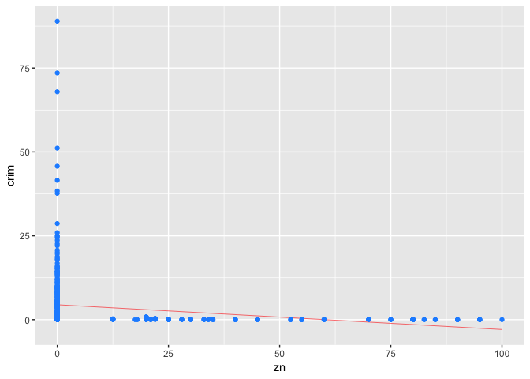<!-- -->

``` r
plt(data.frame(boston), "crim", "indus")
```

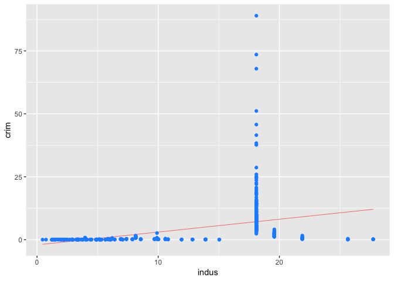<!-- -->

``` r
plt(data.frame(boston), "crim", "chas")
```

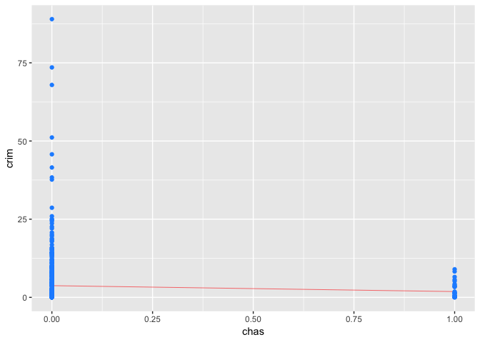<!-- -->

``` r
plt(data.frame(boston), "crim", "nox")
```

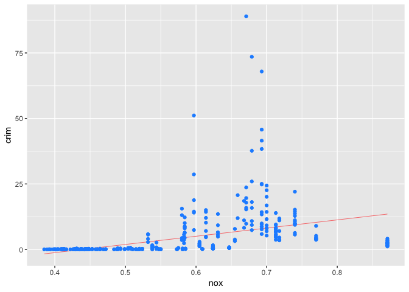<!-- -->

``` r
plt(data.frame(boston), "crim", "rm")
```

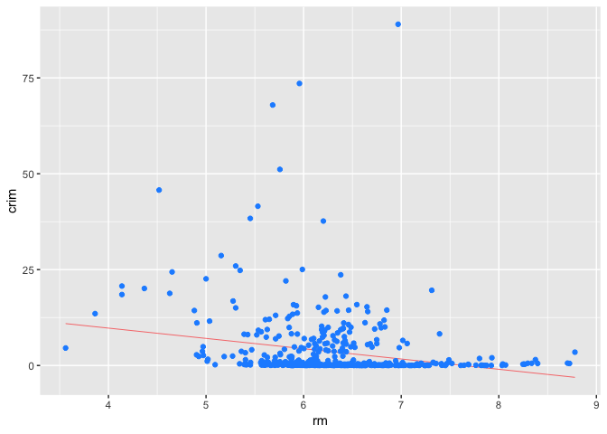<!-- -->

``` r
plt(data.frame(boston), "crim", "age")
```

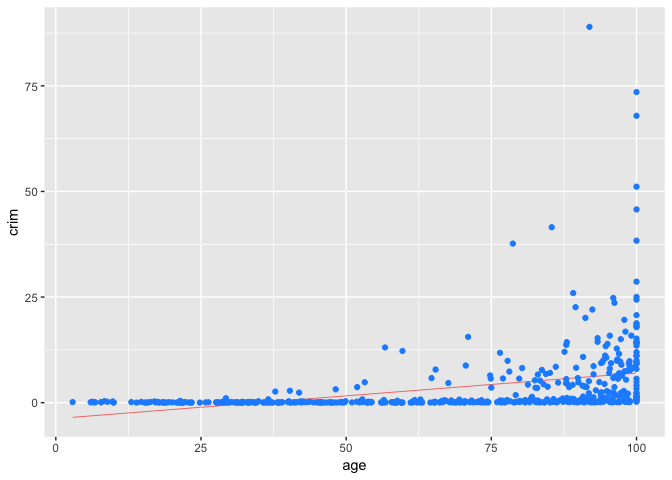<!-- -->

``` r
plt(data.frame(boston), "crim", "dis")
```

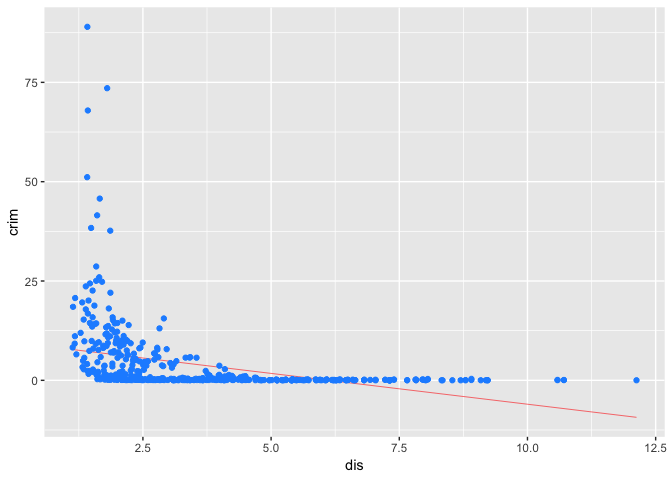<!-- -->

``` r
plt(data.frame(boston), "crim", "rad")
```

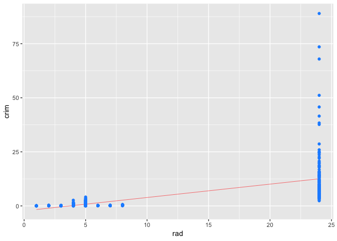<!-- -->

``` r
plt(data.frame(boston), "crim", "tax")
```

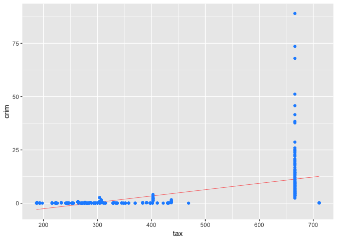<!-- -->

``` r
plt(data.frame(boston), "crim", "ptratio")
```

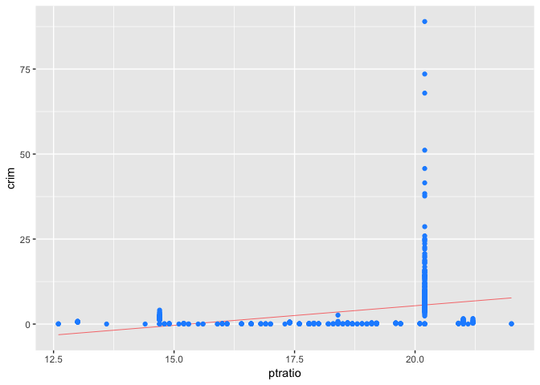<!-- -->

``` r
plt(data.frame(boston), "crim", "black")
```

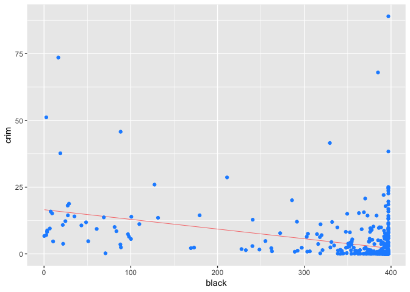<!-- -->

``` r
plt(data.frame(boston), "crim", "lstat")
```

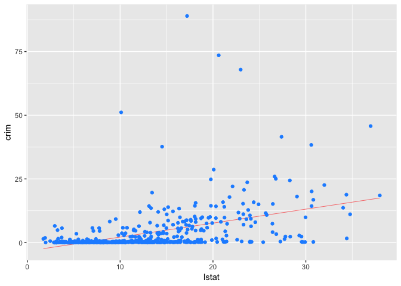<!-- -->

``` r
plt(data.frame(boston), "crim", "medv")
```

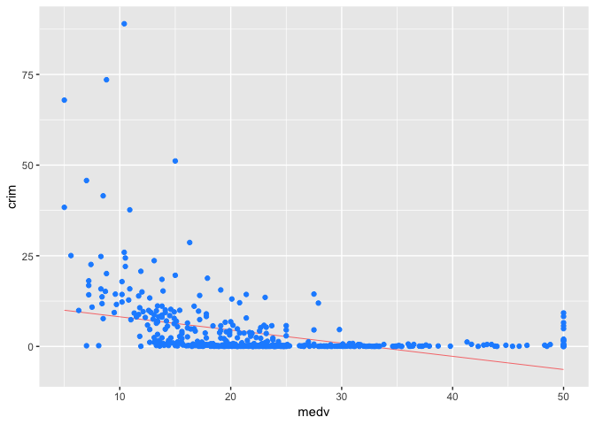<!-- -->

While chas is the only variable that is not statistically significant at
conventional levels, the figures above show that some of the variables
may not suitable for inclusion in a linear model. Individual diagnostic
plots show violations of assumptions of linear
models.

###### (b) Fit a multiple regression model to predict the response using all of the predictors.

``` r
model_full <- lm(crim ~., data = boston)
tidy(model_full)
```

    ## # A tibble: 14 x 5
    ##    term         estimate std.error statistic  p.value
    ##    <chr>           <dbl>     <dbl>     <dbl>    <dbl>
    ##  1 (Intercept)  17.0       7.23       2.35   1.89e- 2
    ##  2 zn            0.0449    0.0187     2.39   1.70e- 2
    ##  3 indus        -0.0639    0.0834    -0.766  4.44e- 1
    ##  4 chas         -0.749     1.18      -0.635  5.26e- 1
    ##  5 nox         -10.3       5.28      -1.95   5.12e- 2
    ##  6 rm            0.430     0.613      0.702  4.83e- 1
    ##  7 age           0.00145   0.0179     0.0810 9.35e- 1
    ##  8 dis          -0.987     0.282     -3.50   5.02e- 4
    ##  9 rad           0.588     0.0880     6.68   6.46e-11
    ## 10 tax          -0.00378   0.00516   -0.733  4.64e- 1
    ## 11 ptratio      -0.271     0.186     -1.45   1.47e- 1
    ## 12 black        -0.00754   0.00367   -2.05   4.07e- 2
    ## 13 lstat         0.126     0.0757     1.67   9.62e- 2
    ## 14 medv         -0.199     0.0605    -3.29   1.09e- 3

``` r
glance(model_full)
```

    ## # A tibble: 1 x 11
    ##   r.squared adj.r.squared sigma statistic  p.value    df logLik   AIC   BIC
    ##       <dbl>         <dbl> <dbl>     <dbl>    <dbl> <int>  <dbl> <dbl> <dbl>
    ## 1     0.454         0.440  6.44      31.5 1.57e-56    14 -1653. 3337. 3400.
    ## # … with 2 more variables: deviance <dbl>, df.residual <int>

We can reject the null hypothesis \(H_{0}\): \(\beta_{j}\) = 0 for zn,
dis, rad, black and medv.

###### (c)

Comparing the results from (a) and (b), we can see that a number of
predictors are no longer statistically significant in the latter case.

Create a plot displaying the univariate regression coefficients from (a)
on the x-axis, and the multiple regression coefficients from (b) on the
y-axis.

``` r
uni_coef_vals = subset(model_coefs, 
                       term != "(Intercept)")[1:13, c("term", "estimate")]
full_coef_vals = tidy(model_full)[2:14, c("term", "estimate")]
# join the tables
coef_table <- uni_coef_vals %>% inner_join(full_coef_vals, by = "term")
coef_table
```

    ## # A tibble: 13 x 3
    ##    term    estimate.x estimate.y
    ##    <chr>        <dbl>      <dbl>
    ##  1 zn         -0.0739    0.0449 
    ##  2 indus       0.510    -0.0639 
    ##  3 chas       -1.89     -0.749  
    ##  4 nox        31.2     -10.3    
    ##  5 rm         -2.68      0.430  
    ##  6 age         0.108     0.00145
    ##  7 dis        -1.55     -0.987  
    ##  8 rad         0.618     0.588  
    ##  9 tax         0.0297   -0.00378
    ## 10 ptratio     1.15     -0.271  
    ## 11 black      -0.0363   -0.00754
    ## 12 lstat       0.549     0.126  
    ## 13 medv       -0.363    -0.199

###### (d) Is there evidence of non-linear association between any of the predictors and the response?

``` r
features <- names(boston[-c(1,4)]) # remove crim and chas
models_poly = map(features, 
                  ~ lm(reformulate(paste0("poly(", .x, ", ", 3, ")"), "crim"), data = boston))
model_coefs_poly = map_df(models_poly, tidy, .id = "Model")
model_performance_poly = map_df(models_poly, glance, .id = "Model")
model_coefs_poly %>% print(n = nrow(.))
```

    ## # A tibble: 48 x 6
    ##    Model term              estimate std.error statistic  p.value
    ##    <chr> <chr>                <dbl>     <dbl>     <dbl>    <dbl>
    ##  1 1     (Intercept)           3.61     0.372     9.71  1.55e-20
    ##  2 1     poly(zn, 3)1        -38.7      8.37     -4.63  4.70e- 6
    ##  3 1     poly(zn, 3)2         23.9      8.37      2.86  4.42e- 3
    ##  4 1     poly(zn, 3)3        -10.1      8.37     -1.20  2.30e- 1
    ##  5 2     (Intercept)           3.61     0.330    11.0   3.61e-25
    ##  6 2     poly(indus, 3)1      78.6      7.42     10.6   8.85e-24
    ##  7 2     poly(indus, 3)2     -24.4      7.42     -3.29  1.09e- 3
    ##  8 2     poly(indus, 3)3     -54.1      7.42     -7.29  1.20e-12
    ##  9 3     (Intercept)           3.61     0.322    11.2   2.74e-26
    ## 10 3     poly(nox, 3)1        81.4      7.23     11.2   2.46e-26
    ## 11 3     poly(nox, 3)2       -28.8      7.23     -3.99  7.74e- 5
    ## 12 3     poly(nox, 3)3       -60.4      7.23     -8.34  6.96e-16
    ## 13 4     (Intercept)           3.61     0.370     9.76  1.03e-20
    ## 14 4     poly(rm, 3)1        -42.4      8.33     -5.09  5.13e- 7
    ## 15 4     poly(rm, 3)2         26.6      8.33      3.19  1.51e- 3
    ## 16 4     poly(rm, 3)3         -5.51     8.33     -0.662 5.09e- 1
    ## 17 5     (Intercept)           3.61     0.349    10.4   5.92e-23
    ## 18 5     poly(age, 3)1        68.2      7.84      8.70  4.88e-17
    ## 19 5     poly(age, 3)2        37.5      7.84      4.78  2.29e- 6
    ## 20 5     poly(age, 3)3        21.4      7.84      2.72  6.68e- 3
    ## 21 6     (Intercept)           3.61     0.326    11.1   1.06e-25
    ## 22 6     poly(dis, 3)1       -73.4      7.33    -10.0   1.25e-21
    ## 23 6     poly(dis, 3)2        56.4      7.33      7.69  7.87e-14
    ## 24 6     poly(dis, 3)3       -42.6      7.33     -5.81  1.09e- 8
    ## 25 7     (Intercept)           3.61     0.297    12.2   5.15e-30
    ## 26 7     poly(rad, 3)1       121.       6.68     18.1   1.05e-56
    ## 27 7     poly(rad, 3)2        17.5      6.68      2.62  9.12e- 3
    ## 28 7     poly(rad, 3)3         4.70     6.68      0.703 4.82e- 1
    ## 29 8     (Intercept)           3.61     0.305    11.9   8.96e-29
    ## 30 8     poly(tax, 3)1       113.       6.85     16.4   6.98e-49
    ## 31 8     poly(tax, 3)2        32.1      6.85      4.68  3.67e- 6
    ## 32 8     poly(tax, 3)3        -8.00     6.85     -1.17  2.44e- 1
    ## 33 9     (Intercept)           3.61     0.361    10.0   1.27e-21
    ## 34 9     poly(ptratio, 3)1    56.0      8.12      6.90  1.57e-11
    ## 35 9     poly(ptratio, 3)2    24.8      8.12      3.05  2.41e- 3
    ## 36 9     poly(ptratio, 3)3   -22.3      8.12     -2.74  6.30e- 3
    ## 37 10    (Intercept)           3.61     0.354    10.2   2.14e-22
    ## 38 10    poly(black, 3)1     -74.4      7.95     -9.36  2.73e-19
    ## 39 10    poly(black, 3)2       5.93     7.95      0.745 4.57e- 1
    ## 40 10    poly(black, 3)3      -4.83     7.95     -0.608 5.44e- 1
    ## 41 11    (Intercept)           3.61     0.339    10.7   4.94e-24
    ## 42 11    poly(lstat, 3)1      88.1      7.63     11.5   1.68e-27
    ## 43 11    poly(lstat, 3)2      15.9      7.63      2.08  3.78e- 2
    ## 44 11    poly(lstat, 3)3     -11.6      7.63     -1.52  1.30e- 1
    ## 45 12    (Intercept)           3.61     0.292    12.4   7.02e-31
    ## 46 12    poly(medv, 3)1      -75.1      6.57    -11.4   4.93e-27
    ## 47 12    poly(medv, 3)2       88.1      6.57     13.4   2.93e-35
    ## 48 12    poly(medv, 3)3      -48.0      6.57     -7.31  1.05e-12

The quadratic and cubic terms for black are not statistically
significant while they are statistically significant for indus, nox,
age, dis, ptratio, medv. The quadratic term is significant for zn, rm,
rad, tax, lstat. Thus, except for black there is evidence of non-linear
association between the predictors and the response.
