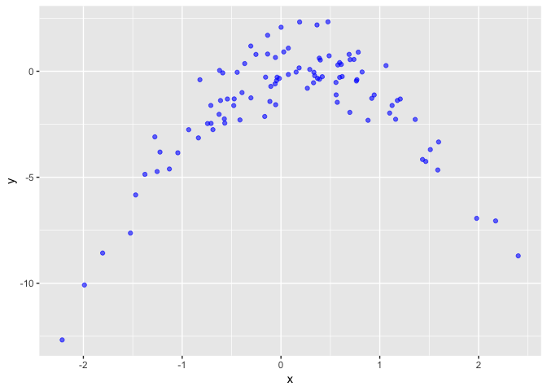
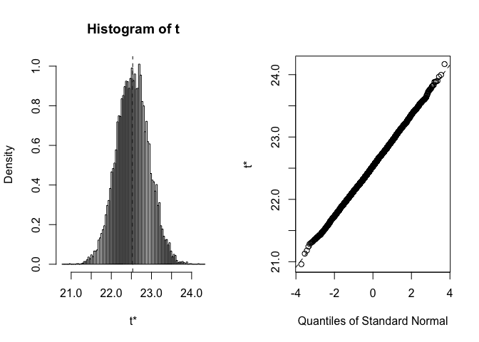
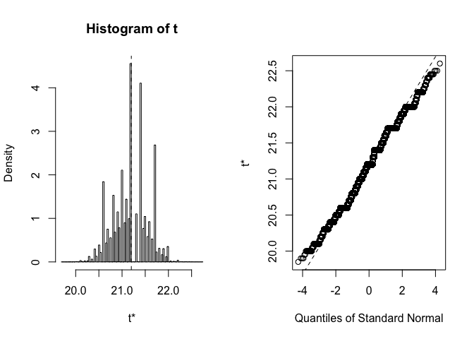
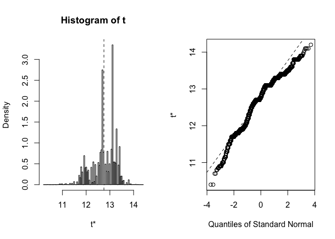

Resampling
================
KS
2019-06-08

``` r
library("MASS")
library("tidyverse")
library("broom")
library("ISLR")
library("boot")
#library("GGally")
library("glue")
#library("class")
#library("scales")
```

##### (5) Logistic regression using the validation set approach.

``` r
set.seed(1)
defaults <- as_tibble(Default)
glimpse(defaults)
```

    ## Observations: 10,000
    ## Variables: 4
    ## $ default <fct> No, No, No, No, No, No, No, No, No, No, No, No, No, No, …
    ## $ student <fct> No, Yes, No, No, No, Yes, No, Yes, No, No, Yes, Yes, No,…
    ## $ balance <dbl> 729.5265, 817.1804, 1073.5492, 529.2506, 785.6559, 919.5…
    ## $ income  <dbl> 44361.625, 12106.135, 31767.139, 35704.494, 38463.496, 7…

###### (a) Fit a logistic regression model that uses income and balance to predict default.

``` r
glm.fit <- glm(default ~ income + balance, data = defaults, family = binomial)
```

###### (b) Using the validation set approach, estimate the test error of this model.

``` r
train_idx <- sample(1:nrow(defaults), nrow(defaults) %/% 2)
train <- defaults[train_idx,]
test <- defaults[-train_idx,]
    
glm.fit.train <- glm(default ~ income + balance, data = train, 
                    family = binomial)
test.probs <- predict(glm.fit.train, test, type = "response")
test.preds <- rep("No", length(test.probs))
test.preds[test.probs >= 0.5] <- "Yes"
valid_err <- mean(test.preds != test$default)
glue("Validation set error = {valid_err}")
```

    ## Validation set error = 0.0286

3)  Repeat the process in (b) three times, using three different splits
    of the observations into a training set and a validation set.

<!-- end list -->

``` r
# function returns error (misclassification)
test_performance <- function(vars) {
    train_idx <- sample(1:nrow(defaults), nrow(defaults) %/% 2)
    train <- defaults[train_idx,]
    test <- defaults[-train_idx,]
    
    glm.fit.train <- glm(reformulate(vars, "default"), 
                         data = train, family = binomial)
    
    test.probs <- predict(glm.fit.train, test, type = "response")
    test.preds <- rep("No", length(test.probs))
    test.preds[test.probs >= 0.5] <- "Yes"

    return(mean(test.preds != test$default))
}

set.seed(1)
features <- c("income", "balance")
valid_errors <- replicate(3, test_performance(features))
mean_valid_errors <- mean(valid_errors)
sd_valid_errors <- sd(valid_errors)
glue("Average validation error = {mean_valid_errors}")
```

    ## Average validation error = 0.0267333333333333

The average validation error is slightly lower than the one obtained
with the single
split.

###### (d) Consider a logistic regression model that predicts the prob- ability of default using income, balance, and a dummy variable for student.

``` r
set.seed(1)
features <- c("income", "balance", "student")
valid_errors <- replicate(3, test_performance(features))
mean_valid_errors <- mean(valid_errors)
sd_valid_errors <- sd(valid_errors)
glue("Average validation error = {mean_valid_errors}")
```

    ## Average validation error = 0.0267333333333333

The average validation error is the same as the model with just income
and
balance.

##### (6) Compute estimates for the standard errors of the income and balance logistic regression co- efficients in two different ways: (1) using the bootstrap, and (2) using the standard formula.

###### (a) SE from glm

``` r
glm.fit <- glm(default ~ income + balance, data = defaults, family = binomial)
tidy(glm.fit)
```

    ## # A tibble: 3 x 5
    ##   term           estimate  std.error statistic   p.value
    ##   <chr>             <dbl>      <dbl>     <dbl>     <dbl>
    ## 1 (Intercept) -11.5       0.435         -26.5  2.96e-155
    ## 2 income        0.0000208 0.00000499      4.17 2.99e-  5
    ## 3 balance       0.00565   0.000227       24.8  3.64e-136

###### (b) Write a function, boot.fn(), that takes as input the Default data set as well as an index of the observations, and that outputs the coefficient estimates for income and balance.

``` r
boot.fn <- function(data, index) 
    return(coef(glm(default ~ income + balance, 
                    data = data, family = binomial)))
```

###### (c) Use the boot() function together with your boot.fn() function to estimate the standard errors of the logistic regression coefficients for income and balance.

``` r
set.seed(1)
boot(defaults, boot.fn, 100)
```

    ## 
    ## ORDINARY NONPARAMETRIC BOOTSTRAP
    ## 
    ## 
    ## Call:
    ## boot(data = defaults, statistic = boot.fn, R = 100)
    ## 
    ## 
    ## Bootstrap Statistics :
    ##          original  bias    std. error
    ## t1* -1.154047e+01       0           0
    ## t2*  2.080898e-05       0           0
    ## t3*  5.647103e-03       0           0

The SE estimates from the bootstrap are slightly different from ones
from the obtained from the glm method - especially the intercept.
Overall they are tighter than the values obtained from glm
method.

##### (7) The cv.glm() function can be used in order to compute the LOOCV test error estimate. Alternatively, one could compute those quantities using just the glm() and predict.glm() functions, and a for loop. Use the latter approach to compute the LOOCV error for a simple logistic regression model on the Weekly data set.

``` r
weekly <- as_tibble(Weekly)
names(weekly) <- tolower(names(weekly))
names(weekly)
```

    ## [1] "year"      "lag1"      "lag2"      "lag3"      "lag4"      "lag5"     
    ## [7] "volume"    "today"     "direction"

###### (a) Fit a logistic regression model that predicts Direction using Lag1 and Lag2.

``` r
glm.fit.a <-  glm(direction ~ lag1 + lag2, data = weekly, family = binomial)
tidy(glm.fit.a)
```

    ## # A tibble: 3 x 5
    ##   term        estimate std.error statistic  p.value
    ##   <chr>          <dbl>     <dbl>     <dbl>    <dbl>
    ## 1 (Intercept)   0.221     0.0615      3.60 0.000319
    ## 2 lag1         -0.0387    0.0262     -1.48 0.140   
    ## 3 lag2          0.0602    0.0265      2.27 0.0232

###### (b) Fit a logistic regression model that predicts Direction using Lag1 and Lag2 using all but the first observation.

``` r
glm.fit.b <-  glm(direction ~ lag1 + lag2, data = weekly[-1,], 
                family = binomial)
tidy(glm.fit.b)
```

    ## # A tibble: 3 x 5
    ##   term        estimate std.error statistic  p.value
    ##   <chr>          <dbl>     <dbl>     <dbl>    <dbl>
    ## 1 (Intercept)   0.223     0.0615      3.63 0.000283
    ## 2 lag1         -0.0384    0.0262     -1.47 0.143   
    ## 3 lag2          0.0608    0.0266      2.29 0.0220

###### (c) Use the model from (b) to predict the direction of the first obser- vation.

``` r
prob_1 <- predict(glm.fit.b, newdata = weekly[1,], type = "response")
pred_1 <- if_else(prob_1 >= 0.5, "Up", "Down")
pred_1 == weekly[1, 9]
```

    ##      direction
    ## [1,]     FALSE

No, the observation was not correctly
classified.

###### (d) Write a for loop from i=1 to i=n, where n is the number of observations in the data set and fit a logistic regressio model using all but the ith observation to predict direction using lag1 and lag2.

``` r
set.seed(1)
fit_model <- function(i) {
    # i is the observation being held out
    glm.fit <-  glm(direction ~ lag1 + lag2, data = weekly, family = binomial,
                   subset = -(i))
    prob_obs <- predict(glm.fit, weekly[i,], type = "response")
    pred_obs <- if_else(prob_obs >= 0.5, "Up", "Down")
    errors <- if_else(pred_obs != weekly$direction[i], 1, 0) # check if error was made
    return(errors)
}
```

###### (e) Take the average of the n numbers obtained in (d) in order to obtain the LOOCV estimate for the test error.

``` r
loocv_err <- mean(unlist(map(1:nrow(weekly), fit_model)))
loocv_err
```

    ## [1] 0.4499541

Check with value obtained from the cv.glm() function.

``` r
cost <- function(r, pi = 0) mean(abs(r - pi) > 0.5)
glm.fit = glm(direction ~ lag1 + lag2, data = weekly, family = binomial)
loocv.err = cv.glm(weekly, glm.fit, cost = cost)
loocv.err$delta[1]
```

    ## [1] 0.4499541

##### (8) Cross-validation on a simulated data set.

###### (a) Generate a simulated data set.

``` r
set.seed(1)
x <- rnorm(100)
y <- x - (2 * x^2) + rnorm(100)
```

n = 100, p = 2

###### (b) Scatterplot of x and y.

``` r
xy <- tibble(x = x, y = y)
ggplot(data = xy, aes(x = x, y = y)) + 
    geom_point(color = "blue", alpha = 0.6)
```

<!-- -->

There is a curvilinear relationship between the response y and the
predictor
x.

###### (c) Set a random seed, and then compute the LOOCV errors that result from fitting the following four models using least squares.

``` r
set.seed(1)
```

Y = β0 + β1X + ε

``` r
m1.fit <- glm(y ~ poly(x, 1), data = xy)
cv.err.m1 <- cv.glm(xy, m1.fit)
cv.err.m1$delta[1]
```

    ## [1] 7.288162

Y = β0 + β1X + β2X2 + ε

``` r
m2.fit <- glm(y ~ poly(x, 2), data = xy)
cv.err.m2 <- cv.glm(xy, m2.fit)
cv.err.m2$delta[1]
```

    ## [1] 0.9374236

Y = β0 +β1X +β2X2 +β3X3 +ε

``` r
m3.fit <- glm(y ~ poly(x, 3), data = xy)
cv.err.m3 <- cv.glm(xy, m3.fit)
cv.err.m3$delta[1]
```

    ## [1] 0.9566218

Y = β0 +β1X +β2X2 +β3X3 +β4X4 +ε

``` r
m4.fit <- glm(y ~ poly(x, 4), data = xy)
cv.err.m4 <- cv.glm(xy, m4.fit)
cv.err.m4$delta[1]
```

    ## [1] 0.9539049

``` r
set.seed(42)
```

Y = β0 + β1X + ε

``` r
m1.fit <- glm(y ~ poly(x, 1), data = xy)
cv.err.m1 <- cv.glm(xy, m1.fit)
cv.err.m1$delta[1]
```

    ## [1] 7.288162

Y = β0 + β1X + β2X2 + ε

``` r
m2.fit <- glm(y ~ poly(x, 2), data = xy)
cv.err.m2 <- cv.glm(xy, m2.fit)
cv.err.m2$delta[1]
```

    ## [1] 0.9374236

Y = β0 +β1X +β2X2 +β3X3 +ε

``` r
m3.fit <- glm(y ~ poly(x, 3), data = xy)
cv.err.m3 <- cv.glm(xy, m3.fit)
cv.err.m3$delta[1]
```

    ## [1] 0.9566218

Y = β0 +β1X +β2X2 +β3X3 +β4X4 +ε

``` r
m4.fit <- glm(y ~ poly(x, 4), data = xy)
cv.err.m4 <- cv.glm(xy, m4.fit)
cv.err.m4$delta[1]
```

    ## [1] 0.9539049

The values are the same because in both cases cross validation is done
by holding out one observation; the partitions are identical.

###### (e) Which of the models in (c) had the smallest LOOCV error?

The second model with the quadratic term gave the smallest LOOCV error.
This was expected after examining the scatterplot which suggested a
quadratic function would be
appropriate.

###### (f) Comment on the statistical significance of the coefficient esti- mates that results from fitting each of the models in (c) using least squares.

``` r
lm1.fit <- lm(y ~ poly(x, 1), data = xy)
tidy(lm1.fit)
```

    ## # A tibble: 2 x 5
    ##   term        estimate std.error statistic      p.value
    ##   <chr>          <dbl>     <dbl>     <dbl>        <dbl>
    ## 1 (Intercept)    -1.55     0.260     -5.96 0.0000000395
    ## 2 poly(x, 1)      6.19     2.60       2.38 0.0192

``` r
glance(lm1.fit)
```

    ## # A tibble: 1 x 11
    ##   r.squared adj.r.squared sigma statistic p.value    df logLik   AIC   BIC
    ##       <dbl>         <dbl> <dbl>     <dbl>   <dbl> <int>  <dbl> <dbl> <dbl>
    ## 1    0.0547        0.0450  2.60      5.67  0.0192     2  -236.  479.  487.
    ## # … with 2 more variables: deviance <dbl>, df.residual <int>

``` r
lm2.fit <- lm(y ~ poly(x, 2), data = xy)
tidy(lm2.fit)
```

    ## # A tibble: 3 x 5
    ##   term        estimate std.error statistic  p.value
    ##   <chr>          <dbl>     <dbl>     <dbl>    <dbl>
    ## 1 (Intercept)    -1.55    0.0958    -16.2  2.66e-29
    ## 2 poly(x, 2)1     6.19    0.958       6.46 4.18e- 9
    ## 3 poly(x, 2)2   -23.9     0.958     -25.0  4.58e-44

``` r
glance(lm2.fit)
```

    ## # A tibble: 1 x 11
    ##   r.squared adj.r.squared sigma statistic  p.value    df logLik   AIC   BIC
    ##       <dbl>         <dbl> <dbl>     <dbl>    <dbl> <int>  <dbl> <dbl> <dbl>
    ## 1     0.873         0.870 0.958      333. 3.46e-44     3  -136.  280.  291.
    ## # … with 2 more variables: deviance <dbl>, df.residual <int>

``` r
lm3.fit <- lm(y ~ poly(x, 3), data = xy)
tidy(lm3.fit)
```

    ## # A tibble: 4 x 5
    ##   term        estimate std.error statistic  p.value
    ##   <chr>          <dbl>     <dbl>     <dbl>    <dbl>
    ## 1 (Intercept)   -1.55     0.0963   -16.1   5.00e-29
    ## 2 poly(x, 3)1    6.19     0.963      6.43  4.97e- 9
    ## 3 poly(x, 3)2  -23.9      0.963    -24.9   1.22e-43
    ## 4 poly(x, 3)3    0.264    0.963      0.274 7.84e- 1

``` r
glance(lm3.fit)
```

    ## # A tibble: 1 x 11
    ##   r.squared adj.r.squared sigma statistic  p.value    df logLik   AIC   BIC
    ##       <dbl>         <dbl> <dbl>     <dbl>    <dbl> <int>  <dbl> <dbl> <dbl>
    ## 1     0.873         0.869 0.963      220. 6.90e-43     4  -136.  282.  295.
    ## # … with 2 more variables: deviance <dbl>, df.residual <int>

``` r
lm4.fit <- lm(y ~ poly(x, 4), data = xy)
tidy(lm4.fit)
```

    ## # A tibble: 5 x 5
    ##   term        estimate std.error statistic  p.value
    ##   <chr>          <dbl>     <dbl>     <dbl>    <dbl>
    ## 1 (Intercept)   -1.55     0.0959   -16.2   5.17e-29
    ## 2 poly(x, 4)1    6.19     0.959      6.45  4.59e- 9
    ## 3 poly(x, 4)2  -23.9      0.959    -25.0   1.59e-43
    ## 4 poly(x, 4)3    0.264    0.959      0.275 7.84e- 1
    ## 5 poly(x, 4)4    1.26     0.959      1.31  1.93e- 1

``` r
glance(lm4.fit)
```

    ## # A tibble: 1 x 11
    ##   r.squared adj.r.squared sigma statistic  p.value    df logLik   AIC   BIC
    ##       <dbl>         <dbl> <dbl>     <dbl>    <dbl> <int>  <dbl> <dbl> <dbl>
    ## 1     0.875         0.870 0.959      167. 4.77e-42     5  -135.  282.  298.
    ## # … with 2 more variables: deviance <dbl>, df.residual <int>

The coefficient on the quadratic term is large and highly statistically
significant. The second model is most appropriate which is in agreement
with the results from the cross validation. We can also look at the RSE
values which show that the one obtained from the second model is the
lowest.

###### (9) Consider the Boston housing data set, from the MASS library.

``` r
boston <- as_tibble(Boston)
names(boston)
```

    ##  [1] "crim"    "zn"      "indus"   "chas"    "nox"     "rm"      "age"    
    ##  [8] "dis"     "rad"     "tax"     "ptratio" "black"   "lstat"   "medv"

###### (a), (b) Provide an estimate for the population mean of medv and the standard error.

``` r
mu <- mean(boston$medv)
mu
```

    ## [1] 22.53281

``` r
se <- sd(boston$medv)/sqrt(nrow(boston))
se
```

    ## [1] 0.4088611

###### (c) Estimate the standard error of mu using the bootstrap.

``` r
set.seed(1)
boot.fn <- function(data, index) {
    X <-  data$medv[index]
    return(mean(X))
}

bs <- boot(boston, boot.fn, R = 10000)
bs
```

    ## 
    ## ORDINARY NONPARAMETRIC BOOTSTRAP
    ## 
    ## 
    ## Call:
    ## boot(data = boston, statistic = boot.fn, R = 10000)
    ## 
    ## 
    ## Bootstrap Statistics :
    ##     original       bias    std. error
    ## t1* 22.53281 0.0005436561   0.4054831

``` r
plot(bs) # plot estimates from bootstrap
```

<!-- -->

The estimate from the bootstrap is slightly
smaller.

###### (d) Based on your bootstrap estimate from (c), provide a 95 % confidence interval for the mean of medv. Compare it to the results obtained using t.test(Boston$medv).

``` r
CI.bs <- bs$t0 + c(-1, 1) * 2 * sd(bs$t)
print("Confidence Interval from bootstrap")
```

    ## [1] "Confidence Interval from bootstrap"

``` r
CI.bs
```

    ## [1] 21.72184 23.34377

``` r
ttestCI <- t.test(boston$medv)
print("Confidence Interval from t test")
```

    ## [1] "Confidence Interval from t test"

``` r
c(ttestCI$conf.int[1], ttestCI$conf.int[2])
```

    ## [1] 21.72953 23.33608

The confidence intervals are almost
identical.

###### (e) Provide an estimate, μ (med), for the median value of medv in the population. Estimate the standard error of the median using the bootstrap.

``` r
med <- median(boston$medv)
med
```

    ## [1] 21.2

``` r
boot.med.fn <- function(data, index) {
    X <- data$medv[index]
    return(median(X))
}

bs.med <- boot(boston, boot.med.fn, R = 100000)
bs.med
```

    ## 
    ## ORDINARY NONPARAMETRIC BOOTSTRAP
    ## 
    ## 
    ## Call:
    ## boot(data = boston, statistic = boot.med.fn, R = 1e+05)
    ## 
    ## 
    ## Bootstrap Statistics :
    ##     original     bias    std. error
    ## t1*     21.2 -0.0136145   0.3771376

``` r
plot(bs.med)
```

<!-- -->

The estimated median value from the data is identical to the one
obtained from the bootstrap. It has a small standard error of 0.377
which is about 1.7% of the
estimate.

###### (g) Based on this data set, provide an estimate for the tenth percentile of medv in Boston suburbs. Use the bootstrap to estimate its standard error.

``` r
set.seed(1)
q10 <- quantile(boston$medv, 0.10)
q10
```

    ##   10% 
    ## 12.75

``` r
boot.q10.fn <- function(data, index) {
    X <- data$medv[index]
    return(quantile(X, 0.10))
}

bs.q10 <- boot(boston, boot.q10.fn, R = 10000)
bs.q10
```

    ## 
    ## ORDINARY NONPARAMETRIC BOOTSTRAP
    ## 
    ## 
    ## Call:
    ## boot(data = boston, statistic = boot.q10.fn, R = 10000)
    ## 
    ## 
    ## Bootstrap Statistics :
    ##     original  bias    std. error
    ## t1*    12.75 0.00756   0.5048077

``` r
plot(bs.q10)
```

<!-- -->

The value estimated from the data is identical to the one obtained from
the bootstrap procedure. The standard error is 0.505 which is about 4%
of the estimate.
