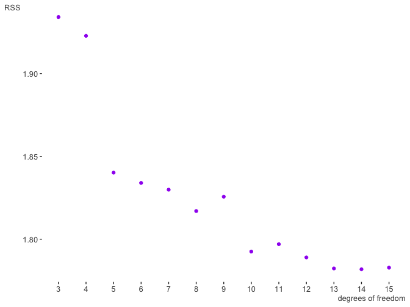

Beyond Linearity
================
KS
17/06/2019

``` r
library("tidyverse")
library("broom")
library("ISLR")
library("boot")
library("glue")
library("gam")
library("viridis")
library("visibly")
library("MASS")
library("gridExtra")
library("leaps")
library("reshape2")
```

##### (6) Analyze the Wage data set.

``` r
data(Wage)
wages <- as_tibble(Wage)

# create a grid for age to be used for predictions
agelims <- range(wages$age)
age.grid <- seq(from = agelims[1], to = agelims[2])
```

###### (a) Perform polynomial regression to predict wage using age. Use cross-validation to select the optimal degree d for the polynomial.

``` r
set.seed(1)

cv.errors.deg <- function(deg) {
    ## input = degree of polynomial
    ## returns the object$delta[1] = cv errors 
    cv.glm(wages, glm(wage ~ poly(age, deg), data = wages), K = 10)$delta[1]
}

# map call the function cv.errors.deg with degree 1:15
# errors are saved in cv.errors
cv.errors <- unlist(map(1:15, cv.errors.deg))

# plot of cv errors versus polynomial degree

ggplot(data = NULL, aes(x = 1:15, y = cv.errors)) + 
    geom_line(color = "dodger blue") +
    xlab("Degree") + ylab("CV Errors (folds = 10)") + 
    theme_minimal()
```


``` r
order(cv.errors)
```

``` 
 [1]  9  7  5  4 10  6 14 12  8 11  3 15 13  2  1
```

``` r
cv.errors[order(cv.errors)]
```

``` 
 [1] 1593.913 1594.298 1594.977 1595.651 1595.950 1596.061 1597.397 1597.399 1598.134 1598.368 1598.399 1598.424 1598.879 1600.763 1676.826
```

``` r
# Although a polynomial of degree 9 gives the lowest CV error, we choose the one with degree 5 which has a slightly higher CV error.
selected_deg = 5

# fit the model with degree = 9
poly.min.fit <- glm(wage ~ poly(age, selected_deg), data = wages)
pred.poly <- predict(poly.min.fit, newdata = list(age = age.grid), se = TRUE)

se.bands <- cbind(pred.poly$fit + 2 * pred.poly$se.fit, 
                  pred.poly$fit - 2 * pred.poly$se.fit)

gg_wages <- ggplot() +
    geom_point(data = wages, aes(x = age, y = wage),
               color = "darksalmon", alpha = 0.8) + 
    theme_minimal()
gg_wages + 
    geom_line(aes(x = age.grid, y = pred.poly$fit), 
                     color = "turquoise2") +
    geom_ribbon(aes(x = age.grid, 
                    ymin = se.bands[,2], ymax = se.bands[,1]), alpha = 0.2) +
    ggtitle("Polynomial of degree = 5 fit to Wage data")
```


Comparing with ANOVA

``` r
model_fit <- function(deg) {
    lm(wage ~ poly(age, deg), data = wages)
}

anova(model_fit(1), model_fit(2), model_fit(3), model_fit(4), model_fit(5))
```

    Analysis of Variance Table
    
    Model 1: wage ~ poly(age, deg)
    Model 2: wage ~ poly(age, deg)
    Model 3: wage ~ poly(age, deg)
    Model 4: wage ~ poly(age, deg)
    Model 5: wage ~ poly(age, deg)
      Res.Df     RSS Df Sum of Sq        F    Pr(>F)    
    1   2998 5022216                                    
    2   2997 4793430  1    228786 143.5931 < 2.2e-16 ***
    3   2996 4777674  1     15756   9.8888  0.001679 ** 
    4   2995 4771604  1      6070   3.8098  0.051046 .  
    5   2994 4770322  1      1283   0.8050  0.369682    
    ---
    Signif. codes:  0 '***' 0.001 '**' 0.01 '*' 0.05 '.' 0.1 ' ' 1

Examination of the results from ANOVA shows that the terms after the
cubic are not significant. We can also take a look at the ANOVA
including nine terms.

``` r
anova(model_fit(1), model_fit(2), model_fit(3), model_fit(4), model_fit(5), model_fit(6), model_fit(7), model_fit(8), model_fit(9))
```

    Analysis of Variance Table
    
    Model 1: wage ~ poly(age, deg)
    Model 2: wage ~ poly(age, deg)
    Model 3: wage ~ poly(age, deg)
    Model 4: wage ~ poly(age, deg)
    Model 5: wage ~ poly(age, deg)
    Model 6: wage ~ poly(age, deg)
    Model 7: wage ~ poly(age, deg)
    Model 8: wage ~ poly(age, deg)
    Model 9: wage ~ poly(age, deg)
      Res.Df     RSS Df Sum of Sq        F    Pr(>F)    
    1   2998 5022216                                    
    2   2997 4793430  1    228786 143.8118 < 2.2e-16 ***
    3   2996 4777674  1     15756   9.9038  0.001666 ** 
    4   2995 4771604  1      6070   3.8156  0.050870 .  
    5   2994 4770322  1      1283   0.8062  0.369318    
    6   2993 4766389  1      3932   2.4718  0.116014    
    7   2992 4763834  1      2555   1.6062  0.205123    
    8   2991 4763707  1       127   0.0796  0.777829    
    9   2990 4756703  1      7004   4.4028  0.035963 *  
    ---
    Signif. codes:  0 '***' 0.001 '**' 0.01 '*' 0.05 '.' 0.1 ' ' 1

In fact, the ninth degree is significant at conventional levels. This is
in agreement with the result we obtained from the cross validation.

###### (b) Fit a step function to predict wage using age, and perform cross- validation to choose the optimal number of cuts.

``` r
set.seed(1)
cv.opt.cuts <- function(ncuts) {
    wages$age.cut <- cut(wages$age, ncuts)
    cv.glm(wages, glm(wage ~ age.cut, data = wages), K = 10)$delta[1]
}

cv.errors <- unlist(map(2:10, cv.opt.cuts))
glue("Selected number of cuts by CV = {which.min(cv.errors) + 1}") # count starts at 2
```

    Selected number of cuts by CV = 8

``` r
ggplot(data = NULL, aes(x = 2:10, y = cv.errors)) + 
    geom_line(color = "dodger blue") +
    xlab("Number of Cuts") + ylab("CV Errors (folds = 10)") + 
    theme_minimal()
```


``` r
# fit model with selected number of cuts
fit.cut <- lm(wage ~ cut(age, which.min(cv.errors) + 1), data = wages)
# fitted values using age.grid
wages.aug <- augment(fit.cut, newdata = tibble(age = age.grid))
se.bands <- cbind(wages.aug$.fitted + 2 * wages.aug$.se.fit,
                  wages.aug$.fitted - 2 * wages.aug$.se.fit)

ggplot() +
    geom_point(data = wages, aes(x = age, y = wage), 
               color = "darkseagreen2") +
    geom_line(aes(x = wages.aug$age, wages.aug$.fitted), 
              color = "dodgerblue4") +
    geom_ribbon(aes(x = wages.aug$age, ymin = se.bands[,2], ymax = se.bands[,1]),
                fill = "ivory", alpha = 0.7) +
    ggtitle("Step function fitted to Wage data (8 cuts)") + 
    theme_minimal()
```


##### (7) The Wage data set contains a number of other features not explored in this chapter, such as marital status (maritl), job class (jobclass), and others. Explore the relationships between some of these other predictors and wage, and use non-linear fitting techniques in order to fit flexible models to the data.

We can examine some descriptive statistics and some plots of the other
variables in the data set.

``` r
# keep only numeric columns
num_wages <- wages %>% select_if(is.numeric)
# use apply to get correlations of wage against numeric variables
apply(num_wages, 2, function(colms) cor(colms, num_wages$wage))
```

``` 
      year        age    logwage       wage 
0.06554428 0.19563720 0.95068337 1.00000000 
```

``` r
# mean wage by marital status
wages %>% group_by(maritl) %>% summarise(mean(wage))
```

    # A tibble: 5 x 2
      maritl           `mean(wage)`
      <fct>                   <dbl>
    1 1. Never Married         92.7
    2 2. Married              119. 
    3 3. Widowed               99.5
    4 4. Divorced             103. 
    5 5. Separated            101. 

``` r
gg_maritl <- wages %>% ggplot(aes(x = maritl, y = wage)) +
    geom_boxplot(fill = "yellowgreen") + theme_minimal()
gg_maritl
```


``` r
gg_maritl +  geom_jitter(width = 0.3, alpha = 0.3)
```


``` r
# collapse all categories other than Married and plot

wages %>%
    mutate(maritlx = recode_factor(maritl, 
                                   "1. Never Married" = "0. Other",
                                   "3. Widowed" = "0. Other", 
                                   "4. Divorced" = "0. Other", 
                                   "5. Separated" = "0. Other")) %>%
    ggplot(aes(x = maritlx, y = wage)) +
    geom_violin(scale = "count", fill = "gold", alpha = 0.5) +
    theme_minimal()
```


``` r
wages %>% group_by(race) %>% summarise(mean(wage))
```

    # A tibble: 4 x 2
      race     `mean(wage)`
      <fct>           <dbl>
    1 1. White        113. 
    2 2. Black        102. 
    3 3. Asian        120. 
    4 4. Other         90.0

``` r
gg_race <- wages %>% ggplot(aes(x = race, y = wage)) + theme_minimal()
gg_race + geom_boxplot(fill = "salmon")
```


``` r
gg_race + geom_violin(scale = "count", fill = "salmon") 
```


``` r
wages %>% group_by(education) %>% summarise(mean(wage))
```

    # A tibble: 5 x 2
      education          `mean(wage)`
      <fct>                     <dbl>
    1 1. < HS Grad               84.1
    2 2. HS Grad                 95.8
    3 3. Some College           108. 
    4 4. College Grad           124. 
    5 5. Advanced Degree        151. 

``` r
gg_educ <- wages %>% ggplot(aes(x = education, y = wage)) + theme_minimal()
gg_educ + geom_boxplot(fill = "steelblue1")
```


``` r
gg_educ + geom_violin(scale = "count", fill = "steelblue1")
```


``` r
# recode maritl
wagesx <- wages %>%
    mutate(maritlx = recode_factor(maritl, 
                                   "1. Never Married" = "0. Other",
                                   "3. Widowed" = "0. Other", 
                                   "4. Divorced" = "0. Other", 
                                   "5. Separated" = "0. Other"))

# wage vs education faceted by marital status
gg_educ <- wagesx %>% ggplot(aes(x = education, y = wage)) + theme_minimal()
gg_educ + geom_violin(aes(fill = factor(maritlx)), scale = "count")
```


``` r
wages %>% group_by(jobclass) %>% summarise(mean(wage))
```

    # A tibble: 2 x 2
      jobclass       `mean(wage)`
      <fct>                 <dbl>
    1 1. Industrial          103.
    2 2. Information         121.

``` r
# wage vs job class
gg_jclass <- wages %>% ggplot(aes(x = jobclass, y = wage)) + theme_minimal()
gg_jclass + geom_boxplot(fill = "paleturquoise")
```


``` r
gg_jclass + geom_violin(scale = "count", fill = "paleturquoise")
```


``` r
# wage vs job class faceted by education
gg_jclass + geom_violin(aes(fill = factor(education)), scale = "count")
```


``` r
wages %>% group_by(health) %>% summarise(mean(wage))
```

    # A tibble: 2 x 2
      health         `mean(wage)`
      <fct>                 <dbl>
    1 1. <=Good              102.
    2 2. >=Very Good         116.

``` r
# wage vs health
gg_health <- wages %>% ggplot(aes(x = health, y = wage)) + theme_minimal()
gg_health + geom_boxplot(fill = "aliceblue")
```


``` r
wages %>% group_by(health_ins) %>% summarise(mean(wage))
```

    # A tibble: 2 x 2
      health_ins `mean(wage)`
      <fct>             <dbl>
    1 1. Yes            120. 
    2 2. No              92.3

``` r
# wage vs health insurance status
gg_ins <- wages %>% ggplot(aes(x = health_ins, y = wage)) + theme_minimal()
gg_ins + geom_boxplot(fill = "blanchedalmond")
```


``` r
gg_ins + geom_violin(scale = "count", fill = "blanchedalmond")
```


``` r
gg_health + geom_violin(scale = "count", fill = "aliceblue")
```


``` r
wages %>% group_by(jobclass, education) %>% summarise(mean(wage))
```

    # A tibble: 10 x 3
    # Groups:   jobclass [2]
       jobclass       education          `mean(wage)`
       <fct>          <fct>                     <dbl>
     1 1. Industrial  1. < HS Grad               82.7
     2 1. Industrial  2. HS Grad                 94.9
     3 1. Industrial  3. Some College           106. 
     4 1. Industrial  4. College Grad           121. 
     5 1. Industrial  5. Advanced Degree        136. 
     6 2. Information 1. < HS Grad               87.5
     7 2. Information 2. HS Grad                 97.4
     8 2. Information 3. Some College           109. 
     9 2. Information 4. College Grad           127. 
    10 2. Information 5. Advanced Degree        156. 

From the various plots above we can see that being married appears to be
associated with higher wages as do having an advanced degree, working in
the information sector, having health insurance and being in good
health.

We can now fit some non-linear models to the data. Consider natural
splines first with degree 5 on the age variable. We also include the
marital status variable.

``` r
# natural spline with 5 degrees of freedom
gam.fit.m1 <- lm(wage ~ ns(age, 5) + maritl, data = wages)
tidy(gam.fit.m1)
```

    # A tibble: 10 x 5
       term               estimate std.error statistic  p.value
       <chr>                 <dbl>     <dbl>     <dbl>    <dbl>
     1 (Intercept)          62.3        4.66   13.4    1.31e-39
     2 ns(age, 5)1          48.8        5.14    9.49   4.42e-21
     3 ns(age, 5)2          44.0        6.03    7.29   3.90e-13
     4 ns(age, 5)3          37.3        5.19    7.19   8.10e-13
     5 ns(age, 5)4          62.2       12.4     5.03   5.07e- 7
     6 ns(age, 5)5           0.622      9.48    0.0656 9.48e- 1
     7 maritl2. Married     13.7        2.10    6.51   8.61e-11
     8 maritl3. Widowed     -4.84       9.29   -0.522  6.02e- 1
     9 maritl4. Divorced    -3.00       3.41   -0.880  3.79e- 1
    10 maritl5. Separated   -3.54       5.64   -0.627  5.31e- 1

``` r
par(mfrow = c(1, 2))
plot.Gam(gam.fit.m1, se = TRUE, col = "dodgerblue2")
```


The error bars on the marital status variable especially for those who
are widowed are not informative possibly because there are very few
observations. We can use the recoded marital status variable - married
vs not-married- and fit again.

``` r
# fit again on recoded factor
gam.fit.m2 <- lm(wage ~ ns(age, 5) + maritlx, data = wagesx)
tidy(gam.fit.m2)
```

    # A tibble: 7 x 5
      term              estimate std.error statistic  p.value
      <chr>                <dbl>     <dbl>     <dbl>    <dbl>
    1 (Intercept)         62.5        4.66   13.4    6.08e-40
    2 ns(age, 5)1         47.3        4.93    9.60   1.69e-21
    3 ns(age, 5)2         42.4        5.84    7.26   4.81e-13
    4 ns(age, 5)3         36.0        5.04    7.15   1.08e-12
    5 ns(age, 5)4         59.5       12.1     4.92   8.91e- 7
    6 ns(age, 5)5         -0.565      9.40   -0.0600 9.52e- 1
    7 maritlx2. Married   15.0        1.71    8.77   2.93e-18

``` r
par(mfrow = c(1, 2))
plot.Gam(gam.fit.m2, se = TRUE, col = "dodgerblue2")
```


We can see that there is a relationship between marital status and
wages: holding age fixed, wage tends to increase on average for those
who are married. Examining the p-values on the coefficients, we can see
that we do not need 5 degrees of freedom.

We can fit a smoothing spline to the same set of variables. Here we fit
one with 5 degrees of freedom.

``` r
# smoothing splines
gam.fit.m3 <- gam(wage ~ s(age, 5) + maritlx, data = wagesx)
par(mfrow = c(1, 2))
plot(gam.fit.m3, se = TRUE, col = "dodgerblue2")
```


``` r
summary(gam.fit.m3)
```

``` 

Call: gam(formula = wage ~ s(age, 5) + maritlx, data = wagesx)
Deviance Residuals:
     Min       1Q   Median       3Q      Max 
-102.784  -23.389   -4.155   14.335  208.884 

(Dispersion Parameter for gaussian family taken to be 1551.772)

    Null Deviance: 5222086 on 2999 degrees of freedom
Residual Deviance: 4644453 on 2993 degrees of freedom
AIC: 30564.08 

Number of Local Scoring Iterations: 2 

Anova for Parametric Effects
            Df  Sum Sq Mean Sq F value    Pr(>F)    
s(age, 5)    1  199870  199870 128.801 < 2.2e-16 ***
maritlx      1  133054  133054  85.743 < 2.2e-16 ***
Residuals 2993 4644453    1552                      
---
Signif. codes:  0 '***' 0.001 '**' 0.01 '*' 0.05 '.' 0.1 ' ' 1

Anova for Nonparametric Effects
            Npar Df Npar F     Pr(F)    
(Intercept)                             
s(age, 5)         4 25.423 < 2.2e-16 ***
maritlx                                 
---
Signif. codes:  0 '***' 0.001 '**' 0.01 '*' 0.05 '.' 0.1 ' ' 1
```

The figures are almost identical to the ones from the model with the
natural splines.

Try a smoothing spline model with race instead of marital status.

``` r
gam.fit.m4 <- gam(wage ~ s(age, 5) + race, data = wagesx)
par(mfrow = c(1, 2))
plot(gam.fit.m4, se = TRUE, col = "darkorange")
```


``` r
summary(gam.fit.m4)
```

``` 

Call: gam(formula = wage ~ s(age, 5) + race, data = wagesx)
Deviance Residuals:
     Min       1Q   Median       3Q      Max 
-100.106  -24.081   -4.653   15.285  211.543 

(Dispersion Parameter for gaussian family taken to be 1576.756)

    Null Deviance: 5222086 on 2999 degrees of freedom
Residual Deviance: 4716079 on 2991 degrees of freedom
AIC: 30613.99 

Number of Local Scoring Iterations: 2 

Anova for Parametric Effects
            Df  Sum Sq Mean Sq F value    Pr(>F)    
s(age, 5)    1  199870  199870  126.76 < 2.2e-16 ***
race         3   49240   16413   10.41 8.209e-07 ***
Residuals 2991 4716079    1577                      
---
Signif. codes:  0 '***' 0.001 '**' 0.01 '*' 0.05 '.' 0.1 ' ' 1

Anova for Nonparametric Effects
            Npar Df Npar F     Pr(F)    
(Intercept)                             
s(age, 5)         4 38.278 < 2.2e-16 ***
race                                    
---
Signif. codes:  0 '***' 0.001 '**' 0.01 '*' 0.05 '.' 0.1 ' ' 1
```

There are relatively few observations in the categories not reporting as
White (0.8266667).

Try a model with education and a smoothing spline on age.

``` r
gam.fit.m5 <- gam(wage ~ s(age, 5) + education, data = wagesx)
par(mfrow = c(1, 2))
plot(gam.fit.m5, se = TRUE, col = "salmon")
```


``` r
summary(gam.fit.m5)
```

``` 

Call: gam(formula = wage ~ s(age, 5) + education, data = wagesx)
Deviance Residuals:
     Min       1Q   Median       3Q      Max 
-116.020  -20.105   -3.249   14.216  215.032 

(Dispersion Parameter for gaussian family taken to be 1241.381)

    Null Deviance: 5222086 on 2999 degrees of freedom
Residual Deviance: 3711731 on 2990 degrees of freedom
AIC: 29897.55 

Number of Local Scoring Iterations: 2 

Anova for Parametric Effects
            Df  Sum Sq Mean Sq F value    Pr(>F)    
s(age, 5)    1  199870  199870  161.01 < 2.2e-16 ***
education    4 1073789  268447  216.25 < 2.2e-16 ***
Residuals 2990 3711731    1241                      
---
Signif. codes:  0 '***' 0.001 '**' 0.01 '*' 0.05 '.' 0.1 ' ' 1

Anova for Nonparametric Effects
            Npar Df Npar F     Pr(F)    
(Intercept)                             
s(age, 5)         4 31.472 < 2.2e-16 ***
education                               
---
Signif. codes:  0 '***' 0.001 '**' 0.01 '*' 0.05 '.' 0.1 ' ' 1
```

Being more educated is associated with having higher wages on average.
This is especially the case with having an advanced degree.

Look at ANOVA to check whether adding more variables is useful.

``` r
gam.fit.m6 <- gam(wage ~ s(age, 5), data = wagesx)
gam.fit.m7 <- gam(wage ~ s(age, 5) + education + race, data = wagesx)
gam.fit.m8 <- gam(wage ~ s(age, 5) + education + race + maritlx, data = wagesx)
gam.fit.m9 <- gam(wage ~ s(age, 5) + education + race + maritlx + jobclass, 
                  data = wagesx)
anova(gam.fit.m6, gam.fit.m5, gam.fit.m7, gam.fit.m8, gam.fit.m9)
```

    Analysis of Deviance Table
    
    Model 1: wage ~ s(age, 5)
    Model 2: wage ~ s(age, 5) + education
    Model 3: wage ~ s(age, 5) + education + race
    Model 4: wage ~ s(age, 5) + education + race + maritlx
    Model 5: wage ~ s(age, 5) + education + race + maritlx + jobclass
      Resid. Df Resid. Dev Df Deviance  Pr(>Chi)    
    1      2994    4764268                          
    2      2990    3711731  4  1052538 < 2.2e-16 ***
    3      2987    3699874  3    11856  0.020003 *  
    4      2986    3613826  1    86048 < 2.2e-16 ***
    5      2985    3597759  1    16068  0.000261 ***
    ---
    Signif. codes:  0 '***' 0.001 '**' 0.01 '*' 0.05 '.' 0.1 ' ' 1

``` r
summary(gam.fit.m9)
```

``` 

Call: gam(formula = wage ~ s(age, 5) + education + race + maritlx + 
    jobclass, data = wagesx)
Deviance Residuals:
     Min       1Q   Median       3Q      Max 
-113.299  -19.863   -2.991   14.254  213.222 

(Dispersion Parameter for gaussian family taken to be 1205.279)

    Null Deviance: 5222086 on 2999 degrees of freedom
Residual Deviance: 3597759 on 2985 degrees of freedom
AIC: 29813.99 

Number of Local Scoring Iterations: 2 

Anova for Parametric Effects
            Df  Sum Sq Mean Sq  F value    Pr(>F)    
s(age, 5)    1  199870  199870 165.8285 < 2.2e-16 ***
education    4 1094205  273551 226.9610 < 2.2e-16 ***
race         3   12840    4280   3.5512 0.0138640 *  
maritlx      1   94807   94807  78.6598 < 2.2e-16 ***
jobclass     1   16166   16166  13.4130 0.0002542 ***
Residuals 2985 3597759    1205                       
---
Signif. codes:  0 '***' 0.001 '**' 0.01 '*' 0.05 '.' 0.1 ' ' 1

Anova for Nonparametric Effects
            Npar Df Npar F     Pr(F)    
(Intercept)                             
s(age, 5)         4 18.769 2.998e-15 ***
education                               
race                                    
maritlx                                 
jobclass                                
---
Signif. codes:  0 '***' 0.001 '**' 0.01 '*' 0.05 '.' 0.1 ' ' 1
```

``` r
par(mfrow = c(3, 3))
plot(gam.fit.m9, se = TRUE, col = "salmon")
```


Results from the ANOVA show that the model with several variables -
education, race, maritlx, jobclass - should be preferred. Race appears
to be the weakest predictor and we can try a fit without it. Doing so
shows a slight increas in AIC.

Finally, we can fit a local regression.

``` r
# use local regression
# gam.fit.m10 <- gam(wage ~ s(year, df = 4) + lo(age, 0.7) + education + race + # # maritlx + jobclass, data = wagesx)
# plot(gam.fit.m10)
par(mfrow = c(1, 3))
gam.fit.m11 <- gam(wage ~ lo(year, age, span = 0.5) + education + maritlx + jobclass, data = wagesx) 
plot(gam.fit.m11, se = TRUE, col = "salmon")
```


``` r
par(mfrow = c(1, 3))
```


``` r
gam.fit.m12 <- gam(wage ~ s(year, df = 4) + lo(age, span = 0.7) + education + maritlx + jobclass, data = wagesx)
plot(gam.fit.m12, se = TRUE, col = "darkorange")
```


##### (8) Fit some of the non-linear models investigated in this chapter to the Auto data set.

``` r
data(Auto)
auto <- as_tibble(Auto)
# convert origin and cylinders to factors; recode cylinders
auto <- auto %>% 
    mutate(origin = as.factor(origin), 
           cylinders = as.factor(cylinders),
           cylindersx = recode_factor(cylinders,
                                      "3" = 34,
                                      "4" = 34,
                                      "5" = 568,
                                      "6" = 568,
                                      "8" = 568))
```

We can examine some descriptive statistics and plots.

``` r
ggplot(aes(x = displacement, y = mpg, color = cylindersx), data = auto) + geom_point() + theme_minimal()
```


``` r
ggplot(aes(x = horsepower, y = mpg, color = cylindersx), data = auto) + geom_point() + theme_minimal()
```


``` r
ggplot(aes(x = weight, y = mpg, color = cylindersx), data = auto) + geom_point() + theme_minimal()
```


``` r
ggplot(aes(x = acceleration, y = mpg, color = cylindersx), data = auto) + geom_point() + theme_minimal()
```


We can see that except for acceleration, the other variables are clearly
negatively correlated with mpg. In fact these are highly correlated with
one another.

``` r
select_if(auto, is.numeric) %>% cor()
```

``` 
                    mpg displacement horsepower     weight acceleration       year
mpg           1.0000000   -0.8051269 -0.7784268 -0.8322442    0.4233285  0.5805410
displacement -0.8051269    1.0000000  0.8972570  0.9329944   -0.5438005 -0.3698552
horsepower   -0.7784268    0.8972570  1.0000000  0.8645377   -0.6891955 -0.4163615
weight       -0.8322442    0.9329944  0.8645377  1.0000000   -0.4168392 -0.3091199
acceleration  0.4233285   -0.5438005 -0.6891955 -0.4168392    1.0000000  0.2903161
year          0.5805410   -0.3698552 -0.4163615 -0.3091199    0.2903161  1.0000000
```

We can look some plots with cylinders as a facet.

``` r
ggplot(aes(x = displacement, y = mpg), data = auto) + 
    geom_point(color = "dodger blue") +
    facet_grid(cols = vars(cylindersx)) + theme_minimal()
```


``` r
ggplot(aes(x = horsepower, y = mpg), data = auto) + 
    geom_point(color = "dodger blue") +
    facet_grid(cols = vars(cylindersx)) + theme_minimal()
```


``` r
ggplot(aes(x = weight, y = mpg), data = auto) + 
    geom_point(color = "dodger blue") +
    facet_grid(cols = vars(cylindersx)) + theme_minimal()
```


In each case, the relationship with mpg is slightly modified if we look
across different number of cylinders.

Fit a polynomial regression model with weight as the predictor with the
degree chosen by cross validation.

``` r
#function returns error for a polynomial regression with degree = deg
cv.auto.deg <- function(deg) {
    cv.glm(auto, glm(mpg ~ poly(weight, deg), data = auto))$delta[1]
}

# Try polynomial regression for degrees 1 to 5 and record the one with the minimum error. Plot the errors.
set.seed(1)
cv.auto.err1 <- unlist(map(1:5, cv.auto.deg))
min.deg <- which.min(cv.auto.err1) 
glue("Polynomial of degree {min.deg} was chosen")
```

    Polynomial of degree 2 was chosen

``` r
ggplot(data = NULL, aes(x = c(1:5), y = cv.auto.err1)) +
    geom_line(color = "dodger blue") + 
    labs(x = "degree", y = "CV error") +
    theme_minimal()
```


Create a grid of values and predict using the model selected by
crossvalidation.

``` r
wgt.lims <- range(auto$weight)
wgt.grid <- seq(from = wgt.lims[1], to = wgt.lims[2])

# fit poly with deg chosen by cv
poly.fit.min.wgt <- glm(mpg ~ poly(weight, min.deg), data = auto)

# predict at grid values
preds.poly.wgt <- predict(poly.fit.min.wgt, newdata = list(weight = wgt.grid), 
                          se = TRUE)
se.bands <- cbind(preds.poly.wgt$fit + 2 * preds.poly.wgt$se.fit,
                  preds.poly.wgt$fit - 2 * preds.poly.wgt$se.fit)
ggplot() +
    geom_point(data = auto, aes(x = weight, y = mpg), 
               alpha = 0.5, color = "purple") +
    geom_line(aes(x = wgt.grid, y = preds.poly.wgt$fit)) +
    geom_ribbon(aes(x = wgt.grid, ymin = se.bands[,2], ymax = se.bands[,1]),
                alpha = 0.3) +
    theme_minimal()
```


We can do the same with the other two variables, but recall that these
variables have a similar relationship with the target.

Next we fit a regression spline - cubic is the default - with six
degrees of freedom to the weight variable. R will choose the knots for
us.

``` r
fit.rgspl.wgt <- lm(mpg ~ bs(weight, df = 6), data = auto)
tidy(fit.rgspl.wgt)
```

    # A tibble: 7 x 5
      term                estimate std.error statistic  p.value
      <chr>                  <dbl>     <dbl>     <dbl>    <dbl>
    1 (Intercept)            31.4       2.73     11.5  1.28e-26
    2 bs(weight, df = 6)1     5.63      3.84      1.47 1.43e- 1
    3 bs(weight, df = 6)2    -3.49      2.58     -1.35 1.77e- 1
    4 bs(weight, df = 6)3    -7.93      3.11     -2.55 1.12e- 2
    5 bs(weight, df = 6)4   -17.0       3.01     -5.63 3.53e- 8
    6 bs(weight, df = 6)5   -17.9       3.55     -5.04 7.18e- 7
    7 bs(weight, df = 6)6   -20.2       3.59     -5.64 3.35e- 8

``` r
glance(fit.rgspl.wgt)
```

    # A tibble: 1 x 11
      r.squared adj.r.squared sigma statistic   p.value    df logLik   AIC   BIC deviance df.residual
          <dbl>         <dbl> <dbl>     <dbl>     <dbl> <int>  <dbl> <dbl> <dbl>    <dbl>       <int>
    1     0.719         0.714  4.17      164. 9.48e-103     7 -1113. 2241. 2273.    6702.         385

``` r
# predictions using grid
pred.rgspl.wgt <- predict(fit.rgspl.wgt, newdata = list(weight = wgt.grid), 
                          se = TRUE)
se.bands <- cbind(pred.rgspl.wgt$fit + 2 * pred.rgspl.wgt$se.fit,
                  pred.rgspl.wgt$fit - 2 * pred.rgspl.wgt$se.fit)
ggplot() +
    geom_point(data = auto, aes(x = weight, y = mpg), 
               alpha = 0.5, color = "cornflowerblue") +
    geom_line(aes(x = wgt.grid, y = pred.rgspl.wgt$fit)) +
    geom_ribbon(aes(x = wgt.grid, ymin = se.bands[,2], ymax = se.bands[,1]),
                alpha = 0.3) +
    theme_clean()
```


The knots selected by R are at:

``` r
attr(bs(auto$weight, df = 6), "knots")
```

``` 
    25%     50%     75% 
2225.25 2803.50 3614.75 
```

Above the degrees of freedom were arbitrarily fixed at 4. Instead we can
also use cross validation to select the number.

We can see that there is greater variance at the ends of the range of
weight when it takes either low or high values which is an issue with
using splines. A natural spline attempts to fix this problem by
enforcing additional constraints at the boundaries; the function is
required to be linear in these regions. We fit a natural spline on
weight with four degrees of freedom.

``` r
fit.ns.wgt <- glm(mpg ~ ns(weight, df = 4), data = auto)
tidy(fit.ns.wgt)
```

    # A tibble: 5 x 5
      term                estimate std.error statistic  p.value
      <chr>                  <dbl>     <dbl>     <dbl>    <dbl>
    1 (Intercept)             36.4      1.35     26.9  1.81e-90
    2 ns(weight, df = 4)1    -13.8      1.31    -10.5  7.73e-23
    3 ns(weight, df = 4)2    -18.7      1.35    -13.9  6.38e-36
    4 ns(weight, df = 4)3    -29.2      3.13     -9.33 8.58e-19
    5 ns(weight, df = 4)4    -21.5      1.49    -14.5  3.53e-38

``` r
glance(fit.ns.wgt)
```

    # A tibble: 1 x 7
      null.deviance df.null logLik   AIC   BIC deviance df.residual
              <dbl>   <int>  <dbl> <dbl> <dbl>    <dbl>       <int>
    1        23819.     391 -1115. 2242. 2266.    6779.         387

``` r
pred.ns.wgt <- predict(fit.ns.wgt, 
                         newdata = list(weight = wgt.grid), 
                         se = TRUE)
se.bands <- cbind(pred.ns.wgt$fit + 2 * pred.ns.wgt$se.fit,
                  pred.ns.wgt$fit - 2 * pred.ns.wgt$se.fit)
ggplot() +
    geom_point(data = auto, aes(x = weight, y = mpg), 
               alpha = 0.5, color = "cornflowerblue") +
    geom_line(aes(x = wgt.grid, y = pred.ns.wgt$fit)) +
    geom_ribbon(aes(x = wgt.grid, ymin = se.bands[,2], ymax = se.bands[,1]),
                alpha = 0.3) + 
    theme_trueMinimal()
```


We can see that the confidence intervals are now smaller at the ends of
the range. We can do the same for horsepower and displacement (not
shown).

Above the degrees of freedom were arbitrarily set at 4. Instead we can
find a value using cross validation.

``` r
#function returns the error from fitting a natural spline with degrees of freedom = dfree
cv.auto.df <- function(dfree) {
    cv.glm(auto, 
           glm(mpg ~ ns(weight, df = dfree), data = auto), K = 5)$delta[1]
}

set.seed(1)
#fit natural splines with degrees of freedom from 1 to 15.
ns.wgt.err <- unlist(map(1:15, cv.auto.df))
ns.min.deg <- which.min(ns.wgt.err)
glue("Polynomial of degree {ns.min.deg} was chosen")
```

    Polynomial of degree 7 was chosen

``` r
ggplot(data = NULL, aes(x = c(1:15), y = ns.wgt.err), color = ns.min.deg) +
    geom_line(color = "cornflowerblue") + 
    labs(x = "degrees of freedom", y = "CV error") +
    theme_minimal()
```


Fit the model with degrees of freedom selected by cross validation and
predict.

``` r
fit.ns.wgt <- glm(mpg ~ ns(weight, df = ns.min.deg), data = auto)
tidy(fit.ns.wgt)
```

    # A tibble: 8 x 5
      term                         estimate std.error statistic  p.value
      <chr>                           <dbl>     <dbl>     <dbl>    <dbl>
    1 (Intercept)                     31.6       2.04     15.5  2.09e-42
    2 ns(weight, df = ns.min.deg)1    -6.25      1.93     -3.23 1.33e- 3
    3 ns(weight, df = ns.min.deg)2    -4.60      2.51     -1.83 6.81e- 2
    4 ns(weight, df = ns.min.deg)3   -10.7       2.25     -4.73 3.19e- 6
    5 ns(weight, df = ns.min.deg)4   -13.3       2.38     -5.59 4.39e- 8
    6 ns(weight, df = ns.min.deg)5   -19.0       1.73    -11.0  1.14e-24
    7 ns(weight, df = ns.min.deg)6   -15.4       4.63     -3.32 9.82e- 4
    8 ns(weight, df = ns.min.deg)7   -22.3       1.96    -11.4  3.94e-26

``` r
pred.ns.wgt <- predict(fit.ns.wgt, 
                       newdata = list(weight = wgt.grid), 
                       se = TRUE)
se.bands <- cbind(pred.ns.wgt$fit + 2 * pred.ns.wgt$se.fit,
                  pred.ns.wgt$fit - 2 * pred.ns.wgt$se.fit)
ggplot() +
    geom_point(data = auto, aes(x = weight, y = mpg), 
               alpha = 0.5, color = "mediumvioletred") +
    geom_line(aes(x = wgt.grid, y = pred.ns.wgt$fit)) +
    geom_ribbon(aes(x = wgt.grid, ymin = se.bands[,2], ymax = se.bands[,1]),
                alpha = 0.3) +
    theme_minimal()
```


The confidence intervals around the values at the boundaries are wider
with 7 of freedom. We can repeat the analysis for horsepower and
displacement (not shown).

We can try smoothing splines which are essentially natural cubic splines
with a penalty that controls the roughness of the smoothing spline.
Below we use cross validation to select λ. We then fit the model using
the correponding degrees of freedom and predict.

``` r
x <- auto$weight
y <- auto$mpg
fit.smth.wgt <- smooth.spline(x, y, cv = TRUE)
glue("Effective degrees of freedom corresponding to λ chosen by CV = {fit.smth.wgt$df}")
```

    Effective degrees of freedom corresponding to λ chosen by CV = 10.3556102293819

``` r
fit.smth.df <- smooth.spline(x, y, df = fit.smth.wgt$df)

preds.smth <- predict(fit.smth.df, x = wgt.grid)

ggplot() + 
    geom_point(data = auto, aes(x = weight, y = mpg), 
                      color = "cornsilk4") +
    geom_line(aes(wgt.grid, preds.smth$y), color = "green") +
    theme_minimal() +
    labs(title = "Smoothing spline with λ chosen by CV")
```


A comparison with a model with lower degrees of freedom, 7 for example
(not shown), results in a similar plot except for a straighter line for
the lower values of weight (\< 3000).

Next, we try local regression.

``` r
# try different spans
lo.fit.wgt1 <- loess(mpg ~ weight, span = 0.2, data = auto)
lo.fit.wgt2 <- loess(mpg ~ weight, span = 0.5, data = auto)


preds.lo.wgt1 <- predict(lo.fit.wgt1, newdata = wgt.grid, se = TRUE)
preds.lo.wgt2 <- predict(lo.fit.wgt2, newdata = wgt.grid, se = TRUE)

ggplot() + 
    geom_point(data = auto, aes(x = weight, y = mpg), 
               color = "cornsilk4") +
    geom_line(aes(wgt.grid, preds.lo.wgt1$fit), color = "green") +
    geom_line(aes(wgt.grid, preds.lo.wgt2$fit), color = "purple") +
    theme_minimal()
```


As expected the green line (span = 0.2) is more wiggly because it uses
fewer neighbors for the local fit.

We will now fit some models with more predictors using GAMs. We start
with fitting natural splines on weight and acceleration.

``` r
gam0 <- lm(mpg ~ ns(weight, 5) + ns(acceleration, 5) + cylindersx, data = auto)
tidy(gam0)
```

    # A tibble: 12 x 5
       term                 estimate std.error statistic  p.value
       <chr>                   <dbl>     <dbl>     <dbl>    <dbl>
     1 (Intercept)            33.7       2.51     13.4   6.46e-34
     2 ns(weight, 5)1        -10.3       1.55     -6.67  8.85e-11
     3 ns(weight, 5)2        -13.3       2.22     -6.01  4.41e- 9
     4 ns(weight, 5)3        -16.7       1.67     -9.97  6.04e-21
     5 ns(weight, 5)4        -24.3       3.72     -6.55  1.92e-10
     6 ns(weight, 5)5        -18.7       1.93     -9.67  6.18e-20
     7 ns(acceleration, 5)1    1.52      1.85      0.820 4.13e- 1
     8 ns(acceleration, 5)2    2.20      2.13      1.04  3.01e- 1
     9 ns(acceleration, 5)3    0.978     1.56      0.625 5.32e- 1
    10 ns(acceleration, 5)4    6.56      4.36      1.50  1.33e- 1
    11 ns(acceleration, 5)5    7.49      2.24      3.35  8.97e- 4
    12 cylindersx568          -2.14      0.942    -2.27  2.38e- 2

``` r
glance(gam0)
```

    # A tibble: 1 x 11
      r.squared adj.r.squared sigma statistic   p.value    df logLik   AIC   BIC deviance df.residual
          <dbl>         <dbl> <dbl>     <dbl>     <dbl> <int>  <dbl> <dbl> <dbl>    <dbl>       <int>
    1     0.734         0.726  4.09      95.1 6.98e-102    12 -1102. 2230. 2282.    6348.         380

``` r
par(mfrow = c(1, 3))
plot.Gam(gam0, se = TRUE, col = "chocolate")
```


Next we refit the model using smoothing splines.

``` r
gam2 <- gam(mpg ~ s(weight, 5) + s(acceleration, 5) + cylindersx, data = auto)
summary(gam2)
```

``` 

Call: gam(formula = mpg ~ s(weight, 5) + s(acceleration, 5) + cylindersx, 
    data = auto)
Deviance Residuals:
     Min       1Q   Median       3Q      Max 
-12.0161  -2.4150  -0.2753   1.7899  16.6417 

(Dispersion Parameter for gaussian family taken to be 16.4751)

    Null Deviance: 23818.99 on 391 degrees of freedom
Residual Deviance: 6260.519 on 379.9999 degrees of freedom
AIC: 2224.584 

Number of Local Scoring Iterations: 2 

Anova for Parametric Effects
                    Df  Sum Sq Mean Sq   F value    Pr(>F)    
s(weight, 5)         1 16830.6 16830.6 1021.5814 < 2.2e-16 ***
s(acceleration, 5)   1   208.5   208.5   12.6582 0.0004212 ***
cylindersx           1   134.8   134.8    8.1794 0.0044707 ** 
Residuals          380  6260.5    16.5                        
---
Signif. codes:  0 '***' 0.001 '**' 0.01 '*' 0.05 '.' 0.1 ' ' 1

Anova for Nonparametric Effects
                   Npar Df Npar F     Pr(F)    
(Intercept)                                    
s(weight, 5)             4 6.3883 5.531e-05 ***
s(acceleration, 5)       4 1.7913    0.1298    
cylindersx                                     
---
Signif. codes:  0 '***' 0.001 '**' 0.01 '*' 0.05 '.' 0.1 ' ' 1
```

``` r
par(mfrow = c(1, 3))
plot(gam2, se = TRUE, col = "dodgerblue2")
```


Is adding acceleration useful? We can fit a model without acceleration,
one with a linear function of acceleration and one with a smoothing term
on it.

``` r
gam1 <- gam(mpg ~ s(weight, 5) + cylindersx, data = auto)
gam2 <- gam(mpg ~ s(weight, 5) + acceleration + cylindersx, data = auto)
gam3 <- gam(mpg ~ s(weight, 5) + s(acceleration, 5) + cylindersx, data = auto)
anova(gam1, gam2, gam3, test = "F")
```

    Analysis of Deviance Table
    
    Model 1: mpg ~ s(weight, 5) + cylindersx
    Model 2: mpg ~ s(weight, 5) + acceleration + cylindersx
    Model 3: mpg ~ s(weight, 5) + s(acceleration, 5) + cylindersx
      Resid. Df Resid. Dev Df Deviance       F  Pr(>F)    
    1       385     6563.9                                
    2       384     6378.7  1   185.21 11.2420 0.00088 ***
    3       380     6260.5  4   118.20  1.7937 0.12935    
    ---
    Signif. codes:  0 '***' 0.001 '**' 0.01 '*' 0.05 '.' 0.1 ' ' 1

We can see that the model with acceleration is better than the one
without it but introducing a non-linear function on acceleration is not
needed. We can look at the summary for the second model (gam2).

``` r
summary(gam2)
```

``` 

Call: gam(formula = mpg ~ s(weight, 5) + acceleration + cylindersx, 
    data = auto)
Deviance Residuals:
     Min       1Q   Median       3Q      Max 
-11.8969  -2.3745  -0.3268   1.8368  16.5771 

(Dispersion Parameter for gaussian family taken to be 16.6113)

    Null Deviance: 23818.99 on 391 degrees of freedom
Residual Deviance: 6378.724 on 384 degrees of freedom
AIC: 2223.917 

Number of Local Scoring Iterations: 2 

Anova for Parametric Effects
              Df  Sum Sq Mean Sq  F value    Pr(>F)    
s(weight, 5)   1 16497.8 16497.8 993.1671 < 2.2e-16 ***
acceleration   1   226.2   226.2  13.6179 0.0002564 ***
cylindersx     1   152.3   152.3   9.1664 0.0026313 ** 
Residuals    384  6378.7    16.6                       
---
Signif. codes:  0 '***' 0.001 '**' 0.01 '*' 0.05 '.' 0.1 ' ' 1

Anova for Nonparametric Effects
             Npar Df Npar F    Pr(F)    
(Intercept)                             
s(weight, 5)       4 6.4306 5.12e-05 ***
acceleration                            
cylindersx                              
---
Signif. codes:  0 '***' 0.001 '**' 0.01 '*' 0.05 '.' 0.1 ' ' 1
```

``` r
plot(gam2, se = TRUE, col = "chocolate")
```


##### (9) This question uses the variables dis (the weighted mean of distances to five Boston employment centers) and nox (nitrogen oxides concen- tration in parts per 10 million) from the Boston data. We will treat dis as the predictor and nox as the response.

``` r
data(Boston)
boston <- as_tibble(Boston[,c("nox", "dis")])
glimpse(boston)
```

    Observations: 506
    Variables: 2
    $ nox <dbl> 0.5380, 0.4690, 0.4690, 0.4580, 0.4580, 0.4580, 0.5240, 0.5240, 0.5240, 0.5240, 0.5240, 0.5240, 0.5240, 0.5380, 0.5380, 0.5380, 0.5380, 0.5380, 0.5380, 0.5380, 0.5380, 0.5380, 0.5380, 0.5380, 0.5380, 0.538…
    $ dis <dbl> 4.0900, 4.9671, 4.9671, 6.0622, 6.0622, 6.0622, 5.5605, 5.9505, 6.0821, 6.5921, 6.3467, 6.2267, 5.4509, 4.7075, 4.4619, 4.4986, 4.4986, 4.2579, 3.7965, 3.7965, 3.7979, 4.0123, 3.9769, 4.0952, 4.3996, 4.454…

###### (a) Use the poly() function to fit a cubic polynomial regression to predict nox using dis

``` r
fit.dis3 <- lm(nox ~ poly(dis, 3), data = boston)
tidy(fit.dis3)
```

    # A tibble: 4 x 5
      term          estimate std.error statistic   p.value
      <chr>            <dbl>     <dbl>     <dbl>     <dbl>
    1 (Intercept)      0.555   0.00276    201.   0.       
    2 poly(dis, 3)1   -2.00    0.0621     -32.3  1.60e-124
    3 poly(dis, 3)2    0.856   0.0621      13.8  6.13e- 37
    4 poly(dis, 3)3   -0.318   0.0621      -5.12 4.27e-  7

``` r
glance(fit.dis3)
```

    # A tibble: 1 x 11
      r.squared adj.r.squared  sigma statistic   p.value    df logLik    AIC    BIC deviance df.residual
          <dbl>         <dbl>  <dbl>     <dbl>     <dbl> <int>  <dbl>  <dbl>  <dbl>    <dbl>       <int>
    1     0.715         0.713 0.0621      419. 2.71e-136     4   690. -1371. -1350.     1.93         502

``` r
pred.fit.dis3 <- predict(fit.dis3, se = TRUE)
se <- 2 * pred.fit.dis3$se.fit
se.bands <- cbind(pred.fit.dis3$fit + se, pred.fit.dis3$fit - se)

ggplot(data = boston) +
    geom_point(aes(x = dis, y = nox), colour = "cornsilk4") +
    geom_line(aes(x = dis, y = pred.fit.dis3$fit), colour = "purple3") +
    geom_ribbon(aes(x = dis, ymin = se.bands[, 2], ymax = se.bands[, 1]),
                fill = "yellow", alpha = 0.7) +
    labs(title = "Cubic Polynomial Regression") +
    theme_minimal()
```


###### (b) Plot the polynomial fits for a range of different polynomial degrees (say, from 1 to 10), and report the associated residual sum of squares.

``` r
# function returns the rss and a list with fitted values corresponding to the polynomial degree.
rss.poly <- function(deg) {
    poly.deg <- lm(nox ~ poly(dis, degree = deg), data = boston)
    pred.poly <- predict(poly.deg)
    resids.poly <- boston$nox - pred.poly
    return(list("rss" = sum(resids.poly^2), "fitted" = pred.poly))
}

rss_fits <- map(1:10, rss.poly)
# extract rss values into a vector
rss_values <- unlist(map(1:10, f <- function(x) rss_fits[[x]]$rss))

ggplot(data = NULL, aes(x = 1:10, y = rss_values)) +
    geom_point(color = "purple") +
    labs(x = "Degree", y = "RSS") +
    scale_x_continuous(breaks = c(1:10)) +
    theme_trueMinimal()
```


``` r
fitted_values <- map(1:10, f <- function(x) rss_fits[[x]]$fitted)

for (i in 1:10) {
    g <- ggplot(data = boston) + 
        geom_point(aes(x = dis, y = nox), colour = "cornsilk4") + 
        geom_line(aes(x = dis, fitted_values[[i]]), color = "purple4") +
        labs(title = glue("degree: {i}")) +
        theme_minimal()
}
```

###### (c) Perform cross-validation or another approach to select the optimal degree for the polynomial.

``` r
cv.poly <- function(deg) {
    cv.glm(boston, 
           glm(nox ~ poly(dis, degree = deg), data = boston))$delta[1]
}

set.seed(1)
cv_mse_vals <- unlist(map(1:10, cv.poly))
glue("Degree of polynomial with lowest error = {which.min(cv_mse_vals)}")
```

    Degree of polynomial with lowest error = 3

``` r
min.deg <- which.min(cv_mse_vals)
# cv_mse_vals[which.min(cv_mse_vals)]

ggplot(data = NULL, aes(x = 1:10, y = cv_mse_vals)) +
    geom_line(color = "salmon") +
    geom_point(color = "orange", size = 3) +
    scale_x_continuous(breaks = 1:10) +
    labs(x = "degree", y = "CV errors", title = "CV errors by polynomial degree") +
    theme_trueMinimal()
```


The degree of polynomial with the lowest CV error is 3. Anything higher
or lower gives a worse fit - however, a degree 4 polynomial is only
slighlty worse. We can also see this in the plots from section (b). A
degree three polynomial allows the line to curve back at higher values
of ‘dis’.

###### (d) Use the bs() function to fit a regression spline to predict nox using dis.

``` r
bs.fit <- lm(nox ~ bs(dis, df = 4), data = boston)
k <- attr(bs(boston$dis, df = 4),"knots")
k
```

``` 
    50% 
3.20745 
```

``` r
tidy(bs.fit)
```

    # A tibble: 5 x 5
      term             estimate std.error statistic   p.value
      <chr>               <dbl>     <dbl>     <dbl>     <dbl>
    1 (Intercept)        0.734     0.0146     50.3  5.49e-198
    2 bs(dis, df = 4)1  -0.0581    0.0219     -2.66 8.12e-  3
    3 bs(dis, df = 4)2  -0.464     0.0237    -19.6  6.78e- 64
    4 bs(dis, df = 4)3  -0.200     0.0431     -4.63 4.58e-  6
    5 bs(dis, df = 4)4  -0.389     0.0455     -8.54 1.57e- 16

``` r
glance(bs.fit)
```

    # A tibble: 1 x 11
      r.squared adj.r.squared  sigma statistic   p.value    df logLik    AIC    BIC deviance df.residual
          <dbl>         <dbl>  <dbl>     <dbl>     <dbl> <int>  <dbl>  <dbl>  <dbl>    <dbl>       <int>
    1     0.716         0.714 0.0620      316. 1.39e-135     5   692. -1372. -1346.     1.92         501

``` r
pred.spl <- predict(bs.fit, se = TRUE)
se <- 2 * pred.spl$se
se.bands <- cbind(pred.spl$fit + se, pred.spl$fit - se)

ggplot(data = boston) + 
    geom_point(aes(x = dis, y = nox), color = "cornsilk4") +
    geom_line(aes(x = dis, y = pred.spl$fit), color = "gold4") +
    geom_ribbon(aes(x = dis, 
                    ymin = se.bands[, 2], 
                    ymax = se.bands[, 1]),
                fill = "grey1", alpha = 0.1) +
    labs(title = "Splines with df = 4") +
    theme_trueMinimal()
```


A single knot was chosen by R automatically at 3.20745.

###### (e) Now fit a regression spline for a range of degrees of freedom, and plot the resulting fits.

``` r
spl.df <- function(df) return(
    lm(nox ~ bs(dis, df = df), data = boston))

# create a plot for a polynomial at degree = df
spl.plot <- function(df) {
    ggplot(data = boston) + 
        geom_point(aes(x = dis, y = nox), color = "cornsilk3") +
        geom_line(aes(x = dis, y = pred.all[, df]), color = "dodgerblue4") +
        labs(title = glue("degree = {df}")) +
        theme_minimal()
}
# apply model with df 3 to 15 and generate array with predictions for each df with (rows = observations, cols = predictions)
pred.all <- sapply(map(3:15, spl.df), predict)
# calculate residuals and square them
resids.all <- boston$nox - pred.all
resids.sq.all <- resids.all^2
# add up the squared residuals in each column (= df)
rss_all <- apply(resids.sq.all, 2, sum)
min.deg <- which.min(rss_all) + 2

dimnames(pred.all)[[2]] <- seq(3,15) #rename columns to show degree
plots <- map(3:15, function(df) spl.plot(as.character(df)))

grid.arrange(plots[[1]], plots[[2]], plots[[3]],
             plots[[4]], plots[[5]], plots[[6]], 
             plots[[7]], plots[[8]], plots[[9]],
             plots[[10]], plots[[11]], plots[[12]], 
             plots[[13]], ncol = 4, nrow = 4)
```


``` r
ggplot(data = NULL, aes(x = 3:15, y = rss_all)) +
    geom_point(color = "purple") + 
    labs(x = "degrees of freedom", y = "RSS") +
    scale_x_continuous(breaks = c(3:15)) + 
    theme_trueMinimal()
```



The polynomial degree with the lowest error is \`r min.deg’.

###### (f) Perform cross-validation or another approach in order to select the best degrees of freedom for a regression spline on this data.

``` r
#function returns errors
spl.cv.df <- function(df) {
    cv.glm(boston, glm(nox ~ bs(dis, df = df), data = boston), K = 10)$delta[1]
}

set.seed(1)
cv.mse.spl.vals <- unlist(map(3:10, spl.cv.df))

ggplot(data = NULL, aes(x = 3:10, y = cv.mse.spl.vals)) +
    geom_line(color = "dodger blue") +
    labs(x = "degree", y = "CV errors") +
    theme_minimal()
```


``` r
min.deg <- which.min(cv.mse.spl.vals) + 2
```

A polynomial of degree 6 is chosen by cross validation which is much
lower than the one that was selected by trying different polynomial
degrees and assessing the error. This suggests that we were overfitting
in the latter case.

##### (10) This question relates to the College data set.

``` r
data(College)
college <- as_tibble(College)
names(college) <- tolower(names(college))
glimpse(college)
```

    Observations: 777
    Variables: 18
    $ private     <fct> Yes, Yes, Yes, Yes, Yes, Yes, Yes, Yes, Yes, Yes, Yes, Yes, Yes, Yes, Yes, Yes, Yes, Yes, Yes, No, Yes, No, Yes, No, Yes, No, Yes, No, Yes, Yes, Yes, Yes, Yes, Yes, Yes, Yes, Yes, Yes, Yes, Yes, Ye…
    $ apps        <dbl> 1660, 2186, 1428, 417, 193, 587, 353, 1899, 1038, 582, 1732, 2652, 1179, 1267, 494, 1420, 4302, 1216, 1130, 3540, 713, 7313, 619, 12809, 708, 1734, 2135, 7548, 662, 1879, 761, 948, 627, 602, 1690, …
    $ accept      <dbl> 1232, 1924, 1097, 349, 146, 479, 340, 1720, 839, 498, 1425, 1900, 780, 1080, 313, 1093, 992, 908, 704, 2001, 661, 4664, 516, 10308, 334, 1729, 1700, 6791, 513, 1658, 725, 798, 556, 483, 1366, 192, …
    $ enroll      <dbl> 721, 512, 336, 137, 55, 158, 103, 489, 227, 172, 472, 484, 290, 385, 157, 220, 418, 423, 322, 1016, 252, 1910, 219, 3761, 166, 951, 491, 3070, 257, 497, 306, 295, 172, 206, 662, 111, 285, 531, 279,…
    $ top10perc   <dbl> 23, 16, 22, 60, 16, 38, 17, 37, 30, 21, 37, 44, 38, 44, 23, 9, 83, 19, 14, 24, 25, 20, 20, 24, 46, 12, 23, 25, 12, 36, 21, 42, 16, 21, 30, 15, 50, 53, 18, 34, 23, 39, 17, 28, 26, 12, 14, 25, 20, 37…
    $ top25perc   <dbl> 52, 29, 50, 89, 44, 62, 45, 68, 63, 44, 75, 77, 64, 73, 46, 22, 96, 40, 23, 54, 44, 63, 51, 49, 74, 52, 59, 57, 30, 69, 58, 74, 40, 47, 61, 36, 85, 95, 45, 66, 56, 63, 36, 67, 54, 36, 24, 53, 60, 6…
    $ f.undergrad <dbl> 2885, 2683, 1036, 510, 249, 678, 416, 1594, 973, 799, 1830, 1707, 1130, 1306, 1317, 1018, 1593, 1819, 1586, 4190, 712, 9940, 1251, 22593, 530, 3602, 1708, 16262, 2074, 1950, 1337, 1120, 777, 958, 2…
    $ p.undergrad <dbl> 537, 1227, 99, 63, 869, 41, 230, 32, 306, 78, 110, 44, 638, 28, 1235, 287, 5, 281, 326, 1512, 23, 1035, 767, 7585, 182, 939, 689, 1716, 726, 38, 300, 15, 538, 466, 1460, 266, 15, 69, 3144, 484, 519…
    $ outstate    <dbl> 7440, 12280, 11250, 12960, 7560, 13500, 13290, 13868, 15595, 10468, 16548, 17080, 9690, 12572, 8352, 8700, 19760, 10100, 9996, 5130, 15476, 6806, 11208, 7434, 8644, 3460, 12000, 6300, 11902, 13353,…
    $ room.board  <dbl> 3300, 6450, 3750, 5450, 4120, 3335, 5720, 4826, 4400, 3380, 5406, 4440, 4785, 4552, 3640, 4780, 5300, 3520, 3090, 3592, 3336, 2540, 4124, 4850, 3922, 2650, 5920, 3933, 4372, 4173, 3244, 4342, 4135,…
    $ books       <dbl> 450, 750, 400, 450, 800, 500, 500, 450, 300, 660, 500, 400, 600, 400, 650, 450, 660, 550, 900, 500, 400, 96, 350, 700, 500, 450, 500, 600, 540, 540, 600, 400, 750, 400, 1000, 500, 750, 600, 600, 60…
    $ personal    <dbl> 2200, 1500, 1165, 875, 1500, 675, 1500, 850, 500, 1800, 600, 600, 1000, 400, 2449, 1400, 1598, 1100, 1320, 2000, 1100, 2000, 1615, 2100, 800, 1000, 500, 1908, 950, 821, 1021, 1150, 1350, 2250, 1000…
    $ phd         <dbl> 70, 29, 53, 92, 76, 67, 90, 89, 79, 40, 82, 73, 60, 79, 36, 78, 93, 48, 62, 60, 69, 83, 55, 88, 79, 57, 93, 85, 65, 78, 66, 81, 59, 58, 68, 57, 98, 83, 76, 71, 78, 74, 78, 61, 87, 57, 64, 35, 87, 8…
    $ terminal    <dbl> 78, 30, 66, 97, 72, 73, 93, 100, 84, 41, 88, 91, 84, 87, 69, 84, 98, 61, 66, 62, 82, 96, 65, 93, 88, 60, 93, 91, 65, 83, 70, 95, 67, 68, 74, 77, 98, 93, 78, 76, 89, 82, 85, 61, 95, 62, 84, 59, 87, …
    $ s.f.ratio   <dbl> 18.1, 12.2, 12.9, 7.7, 11.9, 9.4, 11.5, 13.7, 11.3, 11.5, 11.3, 9.9, 13.3, 15.3, 11.1, 14.7, 8.4, 12.1, 11.5, 23.1, 11.3, 18.3, 12.7, 18.9, 12.6, 19.6, 13.8, 16.7, 12.8, 12.7, 10.4, 13.0, 22.4, 11.…
    $ perc.alumni <dbl> 12, 16, 30, 37, 2, 11, 26, 37, 23, 15, 31, 41, 21, 32, 26, 19, 63, 14, 18, 5, 35, 14, 25, 5, 24, 5, 30, 18, 31, 40, 30, 33, 11, 21, 20, 35, 30, 33, 11, 38, 30, 31, 10, 19, 26, 16, 18, 33, 20, 17, 2…
    $ expend      <dbl> 7041, 10527, 8735, 19016, 10922, 9727, 8861, 11487, 11644, 8991, 10932, 11711, 7940, 9305, 8127, 7355, 21424, 7994, 10908, 4010, 42926, 5854, 6584, 4602, 14579, 4739, 7100, 6642, 7836, 9220, 6871, …
    $ grad.rate   <dbl> 60, 56, 54, 59, 15, 55, 63, 73, 80, 52, 73, 76, 74, 68, 55, 69, 100, 59, 46, 34, 48, 70, 65, 48, 54, 48, 88, 69, 58, 71, 69, 71, 48, 65, 85, 71, 79, 91, 72, 72, 73, 84, 52, 49, 69, 46, 58, 55, 82, …

###### (a) Split the data into a training set and a test set. Using out-of-state tuition as the response and the other variables as the predictors, perform forward stepwise selection on the training set in order to identify a satisfactory model that uses just a subset of the predictors.

``` r
source("subsets-plots.R")

set.seed(1)
train <- sample(c(TRUE, FALSE), nrow(college), replace = TRUE)
test <- !train
table(train, test)
```

``` 
       test
train   FALSE TRUE
  FALSE     0  384
  TRUE    393    0
```

``` r
regfit.best <- regsubsets(outstate ~., 
                          data = college[train,],
                          method = "forward",
                          nvmax = 17)
summary.fit <- summary(regfit.best)
subsets_plots(summary.fit, length(college) - 1)
```


``` r
min.var <- which.min(summary.fit$bic)
```

The BIC identifies a model with 6 variables as the best model from
forward stepwise selection. The coefficients are:

``` r
coef(regfit.best, 6)
```

``` 
  (Intercept)    privateYes    room.board           phd   perc.alumni        expend     grad.rate 
-3568.3921900  2677.7388762     1.0303215    35.4440107    53.3238079     0.2057088    26.3975261 
```

###### (b) Fit a GAM on the training data, using out-of-state tuition as the response and the features selected in the previous step as the predictors. Plot the results, and explain your findings.

``` r
# the factor variable 'private' gets renamed by the forward subset method as 'privateYes'. Rename it as 'private'.
vars_selected <- names(coef(regfit.best, min.var))[2:(min.var + 1)] %>% 
str_replace(., "privateYes", "private")

college.gam <- college %>% dplyr::select(vars_selected, outstate)
head(college.gam)
```

    # A tibble: 6 x 7
      private room.board   phd perc.alumni expend grad.rate outstate
      <fct>        <dbl> <dbl>       <dbl>  <dbl>     <dbl>    <dbl>
    1 Yes           3300    70          12   7041        60     7440
    2 Yes           6450    29          16  10527        56    12280
    3 Yes           3750    53          30   8735        54    11250
    4 Yes           5450    92          37  19016        59    12960
    5 Yes           4120    76           2  10922        15     7560
    6 Yes           3335    67          11   9727        55    13500

``` r
gam.fit10i <- gam(outstate ~ s(expend, 3) +
                 s(room.board, 2) +
                 s(grad.rate, 2) +
                 s(perc.alumni, 2) +
                 s(phd, 2) +
                 private, data = college.gam[train,])
par(mfrow = c(3, 3))
plot(gam.fit10i, se = TRUE, col = "chocolate")

summary(gam.fit10i)
```

``` 

Call: gam(formula = outstate ~ s(expend, 3) + s(room.board, 2) + s(grad.rate, 
    2) + s(perc.alumni, 2) + s(phd, 2) + private, data = college.gam[train, 
    ])
Deviance Residuals:
    Min      1Q  Median      3Q     Max 
-7261.7 -1168.4   143.8  1291.9  5031.9 

(Dispersion Parameter for gaussian family taken to be 3619519)

    Null Deviance: 6262049699 on 392 degrees of freedom
Residual Deviance: 1375418070 on 380.0002 degrees of freedom
AIC: 7065.093 

Number of Local Scoring Iterations: 2 

Anova for Parametric Effects
                   Df     Sum Sq    Mean Sq  F value    Pr(>F)    
s(expend, 3)        1 2678792286 2678792286 740.0961 < 2.2e-16 ***
s(room.board, 2)    1  646386510  646386510 178.5835 < 2.2e-16 ***
s(grad.rate, 2)     1  314892258  314892258  86.9984 < 2.2e-16 ***
s(perc.alumni, 2)   1  217973100  217973100  60.2216  7.91e-14 ***
s(phd, 2)           1    2092548    2092548   0.5781    0.4475    
private             1  279896419  279896419  77.3297 < 2.2e-16 ***
Residuals         380 1375418070    3619519                       
---
Signif. codes:  0 '***' 0.001 '**' 0.01 '*' 0.05 '.' 0.1 ' ' 1

Anova for Nonparametric Effects
                  Npar Df  Npar F     Pr(F)    
(Intercept)                                    
s(expend, 3)            2 28.5133 2.899e-12 ***
s(room.board, 2)        1  1.1972   0.27457    
s(grad.rate, 2)         1  4.7712   0.02955 *  
s(perc.alumni, 2)       1  0.7346   0.39195    
s(phd, 2)               1  0.3744   0.54095    
private                                        
---
Signif. codes:  0 '***' 0.001 '**' 0.01 '*' 0.05 '.' 0.1 ' ' 1
```


From the results it does not look like we need a smoothing term on
room.board, perc.alumni and phd. We repeat the analysis with the
modified model which results in a slight decrease in the AIC.

``` r
gam.fit10ii <- gam(outstate ~ s(expend, 3) +
                 room.board +
                 s(grad.rate, 2) +
                 perc.alumni +
                 phd +
                 private, data = college.gam[train,])
par(mfrow = c(3, 3))
plot(gam.fit10ii, se = TRUE, col = "chocolate")

summary(gam.fit10ii)
```

``` 

Call: gam(formula = outstate ~ s(expend, 3) + room.board + s(grad.rate, 
    2) + perc.alumni + phd + private, data = college.gam[train, 
    ])
Deviance Residuals:
    Min      1Q  Median      3Q     Max 
-7163.7 -1199.5   142.2  1259.8  5152.5 

(Dispersion Parameter for gaussian family taken to be 3612144)

    Null Deviance: 6262049699 on 392 degrees of freedom
Residual Deviance: 1383451064 on 383 degrees of freedom
AIC: 7061.382 

Number of Local Scoring Iterations: 2 

Anova for Parametric Effects
                 Df     Sum Sq    Mean Sq F value    Pr(>F)    
s(expend, 3)      1 2692768301 2692768301 745.476 < 2.2e-16 ***
room.board        1  647565936  647565936 179.275 < 2.2e-16 ***
s(grad.rate, 2)   1  318789979  318789979  88.255 < 2.2e-16 ***
perc.alumni       1  217138688  217138688  60.114 8.163e-14 ***
phd               1    2766942    2766942   0.766     0.382    
private           1  283410466  283410466  78.460 < 2.2e-16 ***
Residuals       383 1383451064    3612144                      
---
Signif. codes:  0 '***' 0.001 '**' 0.01 '*' 0.05 '.' 0.1 ' ' 1

Anova for Nonparametric Effects
                Npar Df  Npar F     Pr(F)    
(Intercept)                                  
s(expend, 3)          2 29.1517 1.641e-12 ***
room.board                                   
s(grad.rate, 2)       1  4.8228   0.02869 *  
perc.alumni                                  
phd                                          
private                                      
---
Signif. codes:  0 '***' 0.001 '**' 0.01 '*' 0.05 '.' 0.1 ' ' 1
```


###### (c-d) Evaluate the model obtained on the test set, and explain the results obtained. For which variables, if any, is there evidence of a non-linear relationship with the response?

``` r
# predictions on test set
preds.gam = predict(gam.fit10ii, newdata = college[test,])
resid.gam = college.gam$outstate[test] - preds.gam
rss.gam = mean(resid.gam^2)

# fit the model on the full dataset
gam.full <- gam(outstate ~ s(expend, 3) + 
                 s(room.board, 1) + 
                 s(grad.rate, 2) +
                 s(perc.alumni, 2) +
                 private, data = college.gam)
par(mfrow = c(3, 3))
plot(gam.full, se = TRUE, col = "gold4")
```


The estimated test error is 3.502370410^{6}. Only the expenditure
variable has a non-linear relationship with the response: it rises
steadily but eventually flattens out.

We refit the model on the entire dataset and check the residuals. The
plot shows a good fit to the data. We can also look at a plot of fitted
values versus the observed values of ‘outstate’.

``` r
preds.gam = predict(gam.full, se = TRUE)
resid.gam = college.gam$outstate - preds.gam$fit

ggplot(data = NULL, aes(preds.gam$fit, resid.gam)) +
    geom_point(color = "purple", alpha = 0.3) +
    geom_hline(yintercept = 0, color = "lightgrey") +
    labs(x = "fitted", y = "residuals") + 
    theme_trueMinimal()
```


``` r
ggplot(data = NULL, aes(college.gam$outstate, preds.gam$fit)) +
    geom_point(color = "purple", alpha = 0.3) +
    geom_abline(intercept = 0, slope = 1, color = "lightgrey") +
    labs(x = "observed", y = "fitted") + 
    theme_trueMinimal()
```


##### (11) We will now explore backfitting in the context of multiple linear regression.

###### (a-d) Generate a response Y and two predictors X1 and X2, with n = 100.

``` r
#b0 <- -0.5
#b1 <- 2.0
#b2 <- -5.2

set.seed(1)
x1 <- rnorm(100)
x2 <- runif(100)
#y <- rnorm(100)
y <- -0.5 + 2.0 * x1 - 5.2 * x2 + rnorm(100)

b1 <- 50.0 # initialize beta1

#part (c)
#a <-  y - b1 * x1 # what is left over after accounting for x1
#b2 <- lm(a ~ x2)$coef[2] # how much of that can be explained by x2
a <-  y - b1 * x1
b2 <- lm(a ~ x2)$coef[2]

#part (d)
#a <- y - b2 * x2 # what is left over after accounting for x2
#b1 <- lm(a ~ x1)$coef[2] # how much of that can be explained by x1
a <- y - b2 * x2
b1 <- lm(a ~ x1)$coef[2]
```

###### (e) Write a for loop to repeat (c) and (d) 1,000 times. Report the estimates of βˆ0, βˆ1, and βˆ2 at each iteration of the for loop. Create a plot in which each of these values is displayed, with βˆ0, βˆ1, and βˆ2 each shown in a different color.

``` r
vals <- rep(NA, 30)
dim(vals) <- c(10, 3)

b1 <- -15
for (i in 1:10) {
    a <- y - b1 * x1
    b2 <- lm(a ~ x2)$coef[2]
    print(b2)
    
    #b0 <- lm(a ~ x2)$coef[1]
    #print(b0)
    
    a <- y - b2 * x2
    b1 <- lm(a ~ x1)$coef[2]
    print(b1)
    
    b0 <- lm(a ~ x1)$coef[1]
    print(b0)
    print("---------")
    
    vals[i, 1] <- b0
    vals[i, 2] <- b1
    vals[i, 3] <- b2
}
```

``` 
        x2 
-0.6321763 
      x1 
1.767505 
(Intercept) 
  -2.438979 
[1] "---------"
       x2 
-5.128895 
      x1 
1.883647 
(Intercept) 
 -0.4954837 
[1] "---------"
       x2 
-5.160042 
      x1 
1.884452 
(Intercept) 
 -0.4820218 
[1] "---------"
       x2 
-5.160258 
      x1 
1.884457 
(Intercept) 
 -0.4819286 
[1] "---------"
       x2 
-5.160259 
      x1 
1.884457 
(Intercept) 
 -0.4819279 
[1] "---------"
       x2 
-5.160259 
      x1 
1.884457 
(Intercept) 
 -0.4819279 
[1] "---------"
       x2 
-5.160259 
      x1 
1.884457 
(Intercept) 
 -0.4819279 
[1] "---------"
       x2 
-5.160259 
      x1 
1.884457 
(Intercept) 
 -0.4819279 
[1] "---------"
       x2 
-5.160259 
      x1 
1.884457 
(Intercept) 
 -0.4819279 
[1] "---------"
       x2 
-5.160259 
      x1 
1.884457 
(Intercept) 
 -0.4819279 
[1] "---------"
```

``` r
dimnames(vals)[[2]] <- c("b0", "b1", "b2")
vals <- as_tibble(vals)
vals
```

    # A tibble: 10 x 3
           b0    b1     b2
        <dbl> <dbl>  <dbl>
     1 -2.44   1.77 -0.632
     2 -0.495  1.88 -5.13 
     3 -0.482  1.88 -5.16 
     4 -0.482  1.88 -5.16 
     5 -0.482  1.88 -5.16 
     6 -0.482  1.88 -5.16 
     7 -0.482  1.88 -5.16 
     8 -0.482  1.88 -5.16 
     9 -0.482  1.88 -5.16 
    10 -0.482  1.88 -5.16 

``` r
backfit.plt <- ggplot(data = vals) +
    geom_line(aes(x = 1:10, y = b0), color = "steelblue1") +
    geom_line(aes(x = 1:10, y = b1), color = "turquoise") +
    geom_line(aes(x = 1:10, y = b2), color = "orange") +
    theme_minimal() +
    labs(x = "iterations", y = "coefficient estimates" )
backfit.plt
```


One can see that convergence to the true paramater values is quite
rapid.

###### (f) Compare your answer in (e) to the results of simply performing multiple linear regression to predict Y using X1 and X2.

``` r
lm.fit <- lm(y ~ cbind(x1, x2))
backfit.plt +
    geom_hline(yintercept = lm.fit$coef[1], alpha = 0.5) +
    geom_hline(yintercept = lm.fit$coef[2], alpha = 0.5) +
    geom_hline(yintercept = lm.fit$coef[3], alpha = 0.5)
```


The values from the multiple regression model are shown in black. The
estimates from the backfitting algorithm are shown in color (b0 in blue,
b1 in turquoise, b3 in orange). Only three iterations were required to
get a good approximation to the multiple regression coefficient
estimates.
