ISL-chp2
================
KS
2018-11-06

### Question 8

Exercise on College data set.

``` r
college <- as.tibble(College)
```

    ## Warning: `as.tibble()` is deprecated, use `as_tibble()` (but mind the new semantics).
    ## This warning is displayed once per session.

``` r
names(college) <- tolower(names(college))
glimpse(college)
```

    ## Observations: 777
    ## Variables: 18
    ## $ private     <fct> Yes, Yes, Yes, Yes, Yes, Yes, Yes, Yes, Yes, Yes, Ye…
    ## $ apps        <dbl> 1660, 2186, 1428, 417, 193, 587, 353, 1899, 1038, 58…
    ## $ accept      <dbl> 1232, 1924, 1097, 349, 146, 479, 340, 1720, 839, 498…
    ## $ enroll      <dbl> 721, 512, 336, 137, 55, 158, 103, 489, 227, 172, 472…
    ## $ top10perc   <dbl> 23, 16, 22, 60, 16, 38, 17, 37, 30, 21, 37, 44, 38, …
    ## $ top25perc   <dbl> 52, 29, 50, 89, 44, 62, 45, 68, 63, 44, 75, 77, 64, …
    ## $ f.undergrad <dbl> 2885, 2683, 1036, 510, 249, 678, 416, 1594, 973, 799…
    ## $ p.undergrad <dbl> 537, 1227, 99, 63, 869, 41, 230, 32, 306, 78, 110, 4…
    ## $ outstate    <dbl> 7440, 12280, 11250, 12960, 7560, 13500, 13290, 13868…
    ## $ room.board  <dbl> 3300, 6450, 3750, 5450, 4120, 3335, 5720, 4826, 4400…
    ## $ books       <dbl> 450, 750, 400, 450, 800, 500, 500, 450, 300, 660, 50…
    ## $ personal    <dbl> 2200, 1500, 1165, 875, 1500, 675, 1500, 850, 500, 18…
    ## $ phd         <dbl> 70, 29, 53, 92, 76, 67, 90, 89, 79, 40, 82, 73, 60, …
    ## $ terminal    <dbl> 78, 30, 66, 97, 72, 73, 93, 100, 84, 41, 88, 91, 84,…
    ## $ s.f.ratio   <dbl> 18.1, 12.2, 12.9, 7.7, 11.9, 9.4, 11.5, 13.7, 11.3, …
    ## $ perc.alumni <dbl> 12, 16, 30, 37, 2, 11, 26, 37, 23, 15, 31, 41, 21, 3…
    ## $ expend      <dbl> 7041, 10527, 8735, 19016, 10922, 9727, 8861, 11487, …
    ## $ grad.rate   <dbl> 60, 56, 54, 59, 15, 55, 63, 73, 80, 52, 73, 76, 74, …

### Summary

You can also embed plots, for example:

``` r
summary(college)
```

    ##  private        apps           accept          enroll       top10perc    
    ##  No :212   Min.   :   81   Min.   :   72   Min.   :  35   Min.   : 1.00  
    ##  Yes:565   1st Qu.:  776   1st Qu.:  604   1st Qu.: 242   1st Qu.:15.00  
    ##            Median : 1558   Median : 1110   Median : 434   Median :23.00  
    ##            Mean   : 3002   Mean   : 2019   Mean   : 780   Mean   :27.56  
    ##            3rd Qu.: 3624   3rd Qu.: 2424   3rd Qu.: 902   3rd Qu.:35.00  
    ##            Max.   :48094   Max.   :26330   Max.   :6392   Max.   :96.00  
    ##    top25perc      f.undergrad     p.undergrad         outstate    
    ##  Min.   :  9.0   Min.   :  139   Min.   :    1.0   Min.   : 2340  
    ##  1st Qu.: 41.0   1st Qu.:  992   1st Qu.:   95.0   1st Qu.: 7320  
    ##  Median : 54.0   Median : 1707   Median :  353.0   Median : 9990  
    ##  Mean   : 55.8   Mean   : 3700   Mean   :  855.3   Mean   :10441  
    ##  3rd Qu.: 69.0   3rd Qu.: 4005   3rd Qu.:  967.0   3rd Qu.:12925  
    ##  Max.   :100.0   Max.   :31643   Max.   :21836.0   Max.   :21700  
    ##    room.board       books           personal         phd        
    ##  Min.   :1780   Min.   :  96.0   Min.   : 250   Min.   :  8.00  
    ##  1st Qu.:3597   1st Qu.: 470.0   1st Qu.: 850   1st Qu.: 62.00  
    ##  Median :4200   Median : 500.0   Median :1200   Median : 75.00  
    ##  Mean   :4358   Mean   : 549.4   Mean   :1341   Mean   : 72.66  
    ##  3rd Qu.:5050   3rd Qu.: 600.0   3rd Qu.:1700   3rd Qu.: 85.00  
    ##  Max.   :8124   Max.   :2340.0   Max.   :6800   Max.   :103.00  
    ##     terminal       s.f.ratio      perc.alumni        expend     
    ##  Min.   : 24.0   Min.   : 2.50   Min.   : 0.00   Min.   : 3186  
    ##  1st Qu.: 71.0   1st Qu.:11.50   1st Qu.:13.00   1st Qu.: 6751  
    ##  Median : 82.0   Median :13.60   Median :21.00   Median : 8377  
    ##  Mean   : 79.7   Mean   :14.09   Mean   :22.74   Mean   : 9660  
    ##  3rd Qu.: 92.0   3rd Qu.:16.50   3rd Qu.:31.00   3rd Qu.:10830  
    ##  Max.   :100.0   Max.   :39.80   Max.   :64.00   Max.   :56233  
    ##    grad.rate     
    ##  Min.   : 10.00  
    ##  1st Qu.: 53.00  
    ##  Median : 65.00  
    ##  Mean   : 65.46  
    ##  3rd Qu.: 78.00  
    ##  Max.   :118.00

### Plot ‘outstate versus private’ (boxplot)

Plot shows that outstate tuition is higher at private colleges.

``` r
p1 <- ggplot(data = college, aes(x = private, y = outstate)) + 
    geom_boxplot()
```

### Create new factor variable ‘elite’

(‘Yes’ if Top10perc \> 50 else ‘No’)

``` r
college <- college %>% 
    mutate(elite = as_factor(if_else(top10perc > 50, "Yes", "No")))
#select(college, top10perc, elite)
```

### Plot ‘outstate versus elite’ (boxplot)

Plot shows that outstate tuition is higher at elite institutions.

``` r
p2 <- ggplot(data = college, aes(x = elite, y = outstate)) +
    geom_boxplot()
```

### Plot grid

``` r
p1 <- ggplot(data = college, aes(x = f.undergrad)) +
    geom_histogram(bins = 50)
p2 <- ggplot(data = college, aes(x = expend, fill = private)) + 
    geom_histogram(bins = 50)
p3 <- ggplot(data = college, aes(x = accept/apps, fill = elite)) + 
    geom_histogram(bins = 50)
p4 <- ggplot(data = college, aes(x = room.board, fill = private)) + 
    geom_histogram(bins = 30)
grid.arrange(p1, p2, p3, p4, nrow = 2, ncol = 2)
```

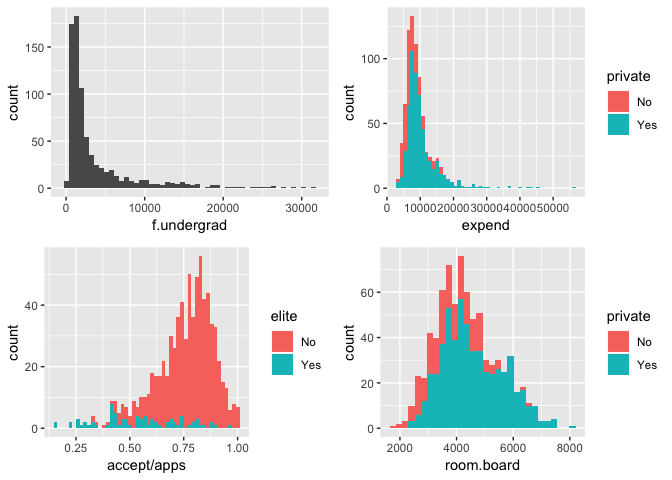<!-- -->

### 

``` r
ggplot(data = college, aes(x = private, y = accept/apps)) +
    geom_boxplot()
```

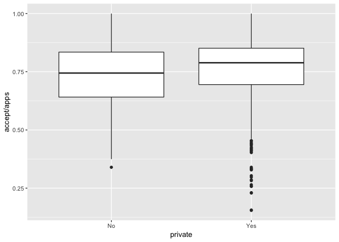<!-- -->

``` r
ggplot(data = college, aes(x = room.board, y = outstate, colour = private)) +
    geom_point()
```

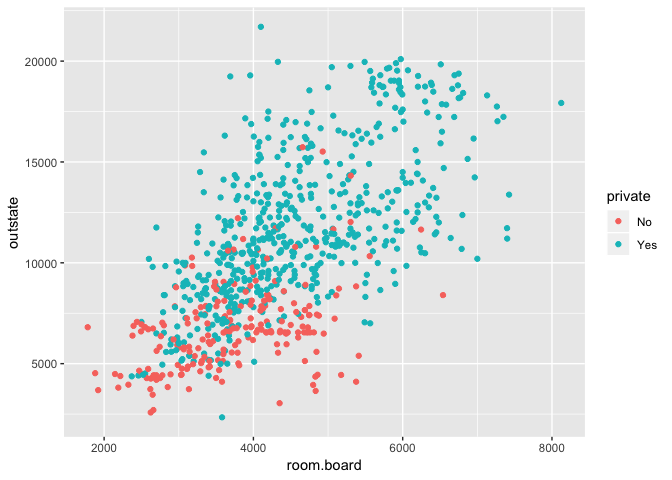<!-- -->

Graduation rate at elite universities is higher.

``` r
college %>% 
    filter(grad.rate <= 100) %>% 
    ggplot(aes(x = elite, y = grad.rate)) +
    geom_boxplot()
```

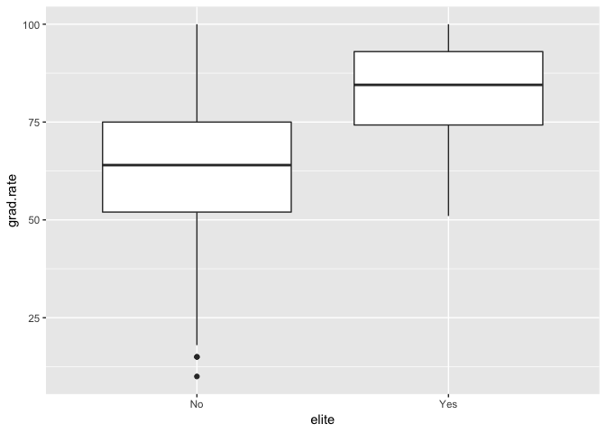<!-- -->

Graduation rate is higher at private colleges

``` r
college %>%
    filter(grad.rate <= 100) %>% 
    ggplot(aes(x = private, y = grad.rate)) +
    geom_boxplot()
```

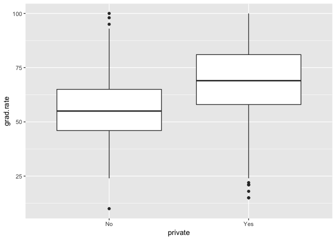<!-- -->

Slightly more students from top 10% of high school class go to private
colleges

``` r
ggplot(data = college, aes(x = private, y = top10perc)) +
    geom_boxplot()
```

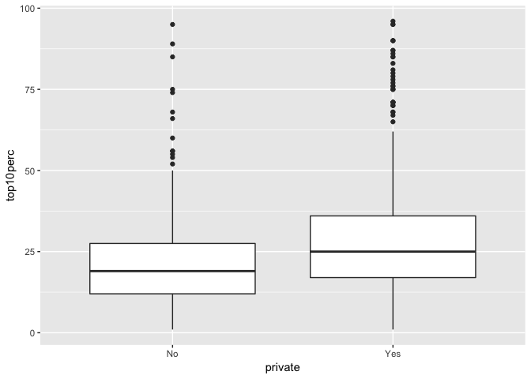<!-- -->

Student - faculty ratio is lower at private colleges

``` r
ggplot(data = college, aes(x = private, y = s.f.ratio)) +
    geom_boxplot()
```

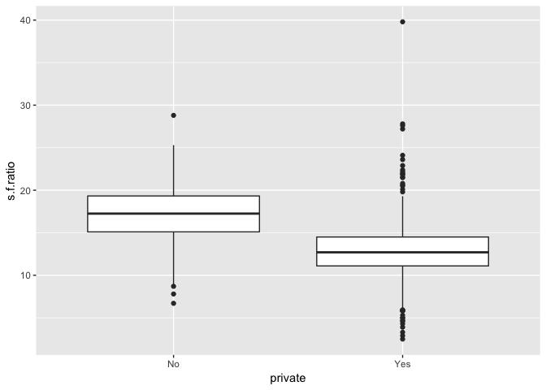<!-- -->

Student - faculty ratio is lower at private colleges

``` r
ggplot(data = college, aes(x = elite, y = s.f.ratio)) +
    geom_boxplot()
```

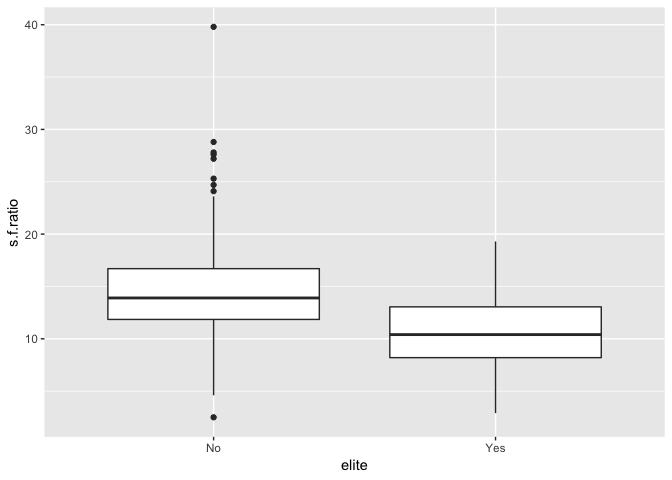<!-- -->

### Question 9

Exercise on Auto data set.

``` r
auto <- as_tibble(Auto)
glimpse(auto)
```

    ## Observations: 392
    ## Variables: 9
    ## $ mpg          <dbl> 18, 15, 18, 16, 17, 15, 14, 14, 14, 15, 15, 14, 15,…
    ## $ cylinders    <dbl> 8, 8, 8, 8, 8, 8, 8, 8, 8, 8, 8, 8, 8, 8, 4, 6, 6, …
    ## $ displacement <dbl> 307, 350, 318, 304, 302, 429, 454, 440, 455, 390, 3…
    ## $ horsepower   <dbl> 130, 165, 150, 150, 140, 198, 220, 215, 225, 190, 1…
    ## $ weight       <dbl> 3504, 3693, 3436, 3433, 3449, 4341, 4354, 4312, 442…
    ## $ acceleration <dbl> 12.0, 11.5, 11.0, 12.0, 10.5, 10.0, 9.0, 8.5, 10.0,…
    ## $ year         <dbl> 70, 70, 70, 70, 70, 70, 70, 70, 70, 70, 70, 70, 70,…
    ## $ origin       <dbl> 1, 1, 1, 1, 1, 1, 1, 1, 1, 1, 1, 1, 1, 1, 3, 1, 1, …
    ## $ name         <fct> chevrolet chevelle malibu, buick skylark 320, plymo…

``` r
summary(auto)
```

    ##       mpg          cylinders      displacement     horsepower   
    ##  Min.   : 9.00   Min.   :3.000   Min.   : 68.0   Min.   : 46.0  
    ##  1st Qu.:17.00   1st Qu.:4.000   1st Qu.:105.0   1st Qu.: 75.0  
    ##  Median :22.75   Median :4.000   Median :151.0   Median : 93.5  
    ##  Mean   :23.45   Mean   :5.472   Mean   :194.4   Mean   :104.5  
    ##  3rd Qu.:29.00   3rd Qu.:8.000   3rd Qu.:275.8   3rd Qu.:126.0  
    ##  Max.   :46.60   Max.   :8.000   Max.   :455.0   Max.   :230.0  
    ##                                                                 
    ##      weight      acceleration        year           origin     
    ##  Min.   :1613   Min.   : 8.00   Min.   :70.00   Min.   :1.000  
    ##  1st Qu.:2225   1st Qu.:13.78   1st Qu.:73.00   1st Qu.:1.000  
    ##  Median :2804   Median :15.50   Median :76.00   Median :1.000  
    ##  Mean   :2978   Mean   :15.54   Mean   :75.98   Mean   :1.577  
    ##  3rd Qu.:3615   3rd Qu.:17.02   3rd Qu.:79.00   3rd Qu.:2.000  
    ##  Max.   :5140   Max.   :24.80   Max.   :82.00   Max.   :3.000  
    ##                                                                
    ##                  name    
    ##  amc matador       :  5  
    ##  ford pinto        :  5  
    ##  toyota corolla    :  5  
    ##  amc gremlin       :  4  
    ##  amc hornet        :  4  
    ##  chevrolet chevette:  4  
    ##  (Other)           :365

name: qualitative. cylinders, origin: may also be treated as ordered
qualitative variables.

use sapply to apply the function to the data by columns.

``` r
sapply(auto[,1:8], range, na.rm = TRUE)
```

    ##       mpg cylinders displacement horsepower weight acceleration year
    ## [1,]  9.0         3           68         46   1613          8.0   70
    ## [2,] 46.6         8          455        230   5140         24.8   82
    ##      origin
    ## [1,]      1
    ## [2,]      3

``` r
round(sapply(auto[,1:8], mean, na.rm = TRUE), 2)
```

    ##          mpg    cylinders displacement   horsepower       weight 
    ##        23.45         5.47       194.41       104.47      2977.58 
    ## acceleration         year       origin 
    ##        15.54        75.98         1.58

``` r
round(sapply(auto[,1:8], sd, na.rm = TRUE), 2)
```

    ##          mpg    cylinders displacement   horsepower       weight 
    ##         7.81         1.71       104.64        38.49       849.40 
    ## acceleration         year       origin 
    ##         2.76         3.68         0.81

Using map\_dbl instead of sapply

``` r
map(auto[,1:8], range)
```

    ## $mpg
    ## [1]  9.0 46.6
    ## 
    ## $cylinders
    ## [1] 3 8
    ## 
    ## $displacement
    ## [1]  68 455
    ## 
    ## $horsepower
    ## [1]  46 230
    ## 
    ## $weight
    ## [1] 1613 5140
    ## 
    ## $acceleration
    ## [1]  8.0 24.8
    ## 
    ## $year
    ## [1] 70 82
    ## 
    ## $origin
    ## [1] 1 3

``` r
round(map_dbl(auto[,1:8], mean), 3)
```

    ##          mpg    cylinders displacement   horsepower       weight 
    ##       23.446        5.472      194.412      104.469     2977.584 
    ## acceleration         year       origin 
    ##       15.541       75.980        1.577

``` r
round(map_dbl(auto[,1:8], sd), 3)
```

    ##          mpg    cylinders displacement   horsepower       weight 
    ##        7.805        1.706      104.644       38.491      849.403 
    ## acceleration         year       origin 
    ##        2.759        3.684        0.806

``` r
auto_reduced <- auto[-(10:85),]
sapply(auto_reduced[,1:8], range)
```

    ##       mpg cylinders displacement horsepower weight acceleration year
    ## [1,] 11.0         3           68         46   1649          8.5   70
    ## [2,] 46.6         8          455        230   4997         24.8   82
    ##      origin
    ## [1,]      1
    ## [2,]      3

``` r
#map(auto_reduced[,1:8], range)
round(map_dbl(auto_reduced[,1:8], mean), 3)
```

    ##          mpg    cylinders displacement   horsepower       weight 
    ##       24.404        5.373      187.241      100.722     2935.972 
    ## acceleration         year       origin 
    ##       15.727       77.146        1.601

``` r
round(map_dbl(auto_reduced[,1:8], sd), 3)
```

    ##          mpg    cylinders displacement   horsepower       weight 
    ##        7.867        1.654       99.678       35.709      811.300 
    ## acceleration         year       origin 
    ##        2.694        3.106        0.820

``` r
png(filename = "figures/pairs_auto.png")
pairs(auto[,1:8])
dev.off()
```

    ## quartz_off_screen 
    ##                 2

``` r
auto$cylinders <- as.factor(auto$cylinders)
auto$origin <- as.factor(auto$origin)
```

### Question 10

``` r
boston <- as.tibble(Boston)
glimpse(boston)
```

    ## Observations: 506
    ## Variables: 14
    ## $ crim    <dbl> 0.00632, 0.02731, 0.02729, 0.03237, 0.06905, 0.02985, 0.…
    ## $ zn      <dbl> 18.0, 0.0, 0.0, 0.0, 0.0, 0.0, 12.5, 12.5, 12.5, 12.5, 1…
    ## $ indus   <dbl> 2.31, 7.07, 7.07, 2.18, 2.18, 2.18, 7.87, 7.87, 7.87, 7.…
    ## $ chas    <int> 0, 0, 0, 0, 0, 0, 0, 0, 0, 0, 0, 0, 0, 0, 0, 0, 0, 0, 0,…
    ## $ nox     <dbl> 0.538, 0.469, 0.469, 0.458, 0.458, 0.458, 0.524, 0.524, …
    ## $ rm      <dbl> 6.575, 6.421, 7.185, 6.998, 7.147, 6.430, 6.012, 6.172, …
    ## $ age     <dbl> 65.2, 78.9, 61.1, 45.8, 54.2, 58.7, 66.6, 96.1, 100.0, 8…
    ## $ dis     <dbl> 4.0900, 4.9671, 4.9671, 6.0622, 6.0622, 6.0622, 5.5605, …
    ## $ rad     <int> 1, 2, 2, 3, 3, 3, 5, 5, 5, 5, 5, 5, 5, 4, 4, 4, 4, 4, 4,…
    ## $ tax     <dbl> 296, 242, 242, 222, 222, 222, 311, 311, 311, 311, 311, 3…
    ## $ ptratio <dbl> 15.3, 17.8, 17.8, 18.7, 18.7, 18.7, 15.2, 15.2, 15.2, 15…
    ## $ black   <dbl> 396.90, 396.90, 392.83, 394.63, 396.90, 394.12, 395.60, …
    ## $ lstat   <dbl> 4.98, 9.14, 4.03, 2.94, 5.33, 5.21, 12.43, 19.15, 29.93,…
    ## $ medv    <dbl> 24.0, 21.6, 34.7, 33.4, 36.2, 28.7, 22.9, 27.1, 16.5, 18…

``` r
dim(boston)
```

    ## [1] 506  14

``` r
pairs(boston[,1:7])
```

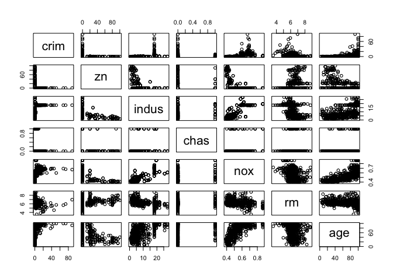<!-- -->

``` r
ggplot(data = boston, mapping = aes(x = age, y = nox)) +
    geom_point()
```

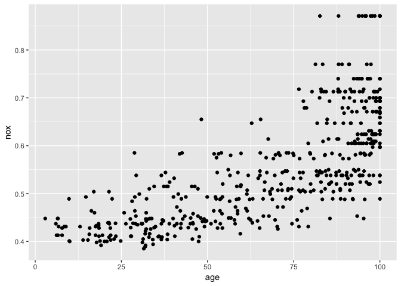<!-- -->

``` r
ggplot(data = boston, mapping = aes(x = medv, y = lstat)) +
    geom_point()
```

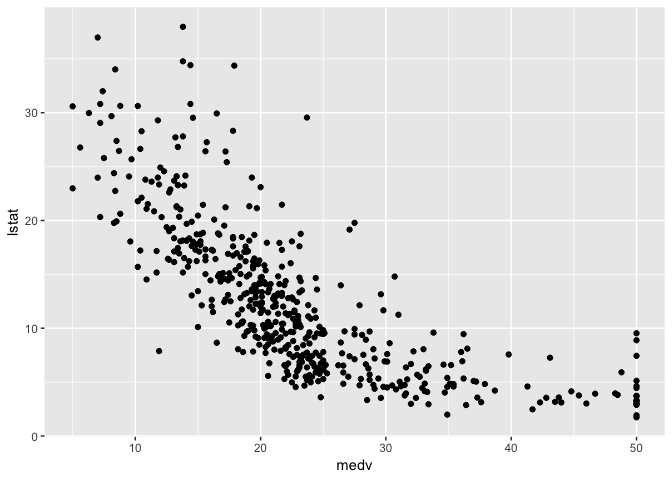<!-- -->

``` r
ggplot(data = boston, mapping = aes(x = black, y = crim)) +
    geom_point()
```

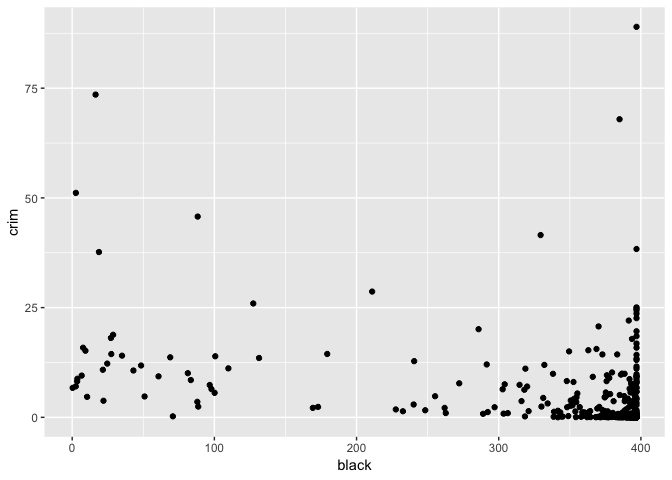<!-- -->

``` r
ggplot(data = boston, mapping = aes(x = crim)) + 
    geom_histogram()
```

    ## `stat_bin()` using `bins = 30`. Pick better value with `binwidth`.

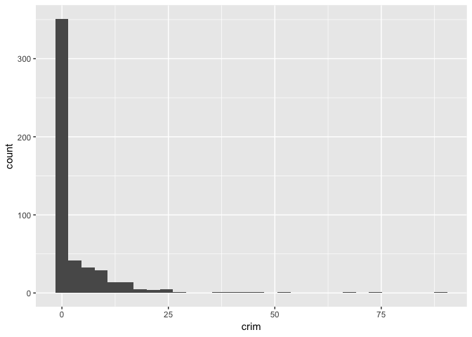<!-- -->

``` r
ggplot(data = boston, mapping = aes(x = tax)) + 
    geom_histogram()
```

    ## `stat_bin()` using `bins = 30`. Pick better value with `binwidth`.

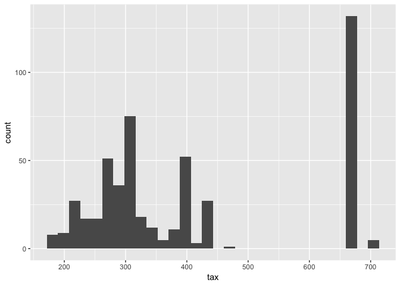<!-- -->

``` r
ggplot(data = boston, mapping = aes(x = ptratio)) + 
    geom_histogram()
```

    ## `stat_bin()` using `bins = 30`. Pick better value with `binwidth`.

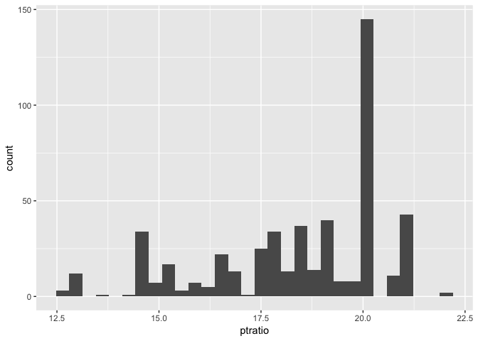<!-- -->

``` r
sum(boston$chas == 1)
```

    ## [1] 35

``` r
median(boston$ptratio)
```

    ## [1] 19.05

``` r
boston[which(boston$medv == min(boston$medv)), ]
```

    ## # A tibble: 2 x 14
    ##    crim    zn indus  chas   nox    rm   age   dis   rad   tax ptratio black
    ##   <dbl> <dbl> <dbl> <int> <dbl> <dbl> <dbl> <dbl> <int> <dbl>   <dbl> <dbl>
    ## 1  38.4     0  18.1     0 0.693  5.45   100  1.49    24   666    20.2  397.
    ## 2  67.9     0  18.1     0 0.693  5.68   100  1.43    24   666    20.2  385.
    ## # … with 2 more variables: lstat <dbl>, medv <dbl>

``` r
summary(boston)
```

    ##       crim                zn             indus            chas        
    ##  Min.   : 0.00632   Min.   :  0.00   Min.   : 0.46   Min.   :0.00000  
    ##  1st Qu.: 0.08204   1st Qu.:  0.00   1st Qu.: 5.19   1st Qu.:0.00000  
    ##  Median : 0.25651   Median :  0.00   Median : 9.69   Median :0.00000  
    ##  Mean   : 3.61352   Mean   : 11.36   Mean   :11.14   Mean   :0.06917  
    ##  3rd Qu.: 3.67708   3rd Qu.: 12.50   3rd Qu.:18.10   3rd Qu.:0.00000  
    ##  Max.   :88.97620   Max.   :100.00   Max.   :27.74   Max.   :1.00000  
    ##       nox               rm             age              dis        
    ##  Min.   :0.3850   Min.   :3.561   Min.   :  2.90   Min.   : 1.130  
    ##  1st Qu.:0.4490   1st Qu.:5.886   1st Qu.: 45.02   1st Qu.: 2.100  
    ##  Median :0.5380   Median :6.208   Median : 77.50   Median : 3.207  
    ##  Mean   :0.5547   Mean   :6.285   Mean   : 68.57   Mean   : 3.795  
    ##  3rd Qu.:0.6240   3rd Qu.:6.623   3rd Qu.: 94.08   3rd Qu.: 5.188  
    ##  Max.   :0.8710   Max.   :8.780   Max.   :100.00   Max.   :12.127  
    ##       rad              tax           ptratio          black       
    ##  Min.   : 1.000   Min.   :187.0   Min.   :12.60   Min.   :  0.32  
    ##  1st Qu.: 4.000   1st Qu.:279.0   1st Qu.:17.40   1st Qu.:375.38  
    ##  Median : 5.000   Median :330.0   Median :19.05   Median :391.44  
    ##  Mean   : 9.549   Mean   :408.2   Mean   :18.46   Mean   :356.67  
    ##  3rd Qu.:24.000   3rd Qu.:666.0   3rd Qu.:20.20   3rd Qu.:396.23  
    ##  Max.   :24.000   Max.   :711.0   Max.   :22.00   Max.   :396.90  
    ##      lstat            medv      
    ##  Min.   : 1.73   Min.   : 5.00  
    ##  1st Qu.: 6.95   1st Qu.:17.02  
    ##  Median :11.36   Median :21.20  
    ##  Mean   :12.65   Mean   :22.53  
    ##  3rd Qu.:16.95   3rd Qu.:25.00  
    ##  Max.   :37.97   Max.   :50.00

``` r
sum(boston$rm > 7)
```

    ## [1] 64

``` r
sum(boston$rm > 8)
```

    ## [1] 13

``` r
boston[(boston$rm > 8),]
```

    ## # A tibble: 13 x 14
    ##      crim    zn indus  chas   nox    rm   age   dis   rad   tax ptratio
    ##     <dbl> <dbl> <dbl> <int> <dbl> <dbl> <dbl> <dbl> <int> <dbl>   <dbl>
    ##  1 0.121      0  2.89     0 0.445  8.07  76    3.50     2   276    18  
    ##  2 1.52       0 19.6      1 0.605  8.38  93.9  2.16     5   403    14.7
    ##  3 0.0201    95  2.68     0 0.416  8.03  31.9  5.12     4   224    14.7
    ##  4 0.315      0  6.2      0 0.504  8.27  78.3  2.89     8   307    17.4
    ##  5 0.527      0  6.2      0 0.504  8.72  83    2.89     8   307    17.4
    ##  6 0.382      0  6.2      0 0.504  8.04  86.5  3.22     8   307    17.4
    ##  7 0.575      0  6.2      0 0.507  8.34  73.3  3.84     8   307    17.4
    ##  8 0.331      0  6.2      0 0.507  8.25  70.4  3.65     8   307    17.4
    ##  9 0.369     22  5.86     0 0.431  8.26   8.4  8.91     7   330    19.1
    ## 10 0.612     20  3.97     0 0.647  8.70  86.9  1.80     5   264    13  
    ## 11 0.520     20  3.97     0 0.647  8.40  91.5  2.29     5   264    13  
    ## 12 0.578     20  3.97     0 0.575  8.30  67    2.42     5   264    13  
    ## 13 3.47       0 18.1      1 0.718  8.78  82.9  1.90    24   666    20.2
    ## # … with 3 more variables: black <dbl>, lstat <dbl>, medv <dbl>
