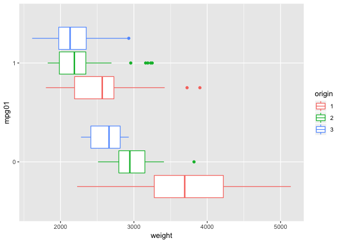
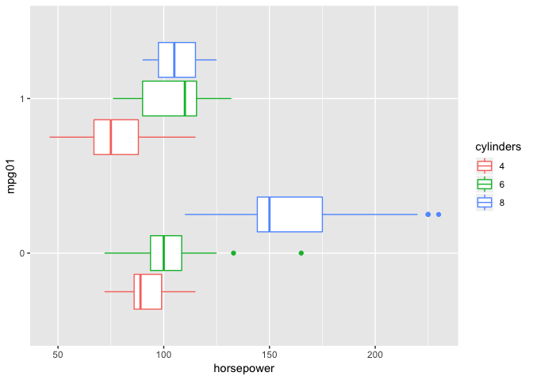

Ch4-classification
================
KS
2019-06-05

``` r
library("MASS")
library("tidyverse")
library("broom")
library("ISLR")
library("GGally")
library("glue")
library("class")
library("scales")
```

### Ch4: Classification

#### Applied Exercises

##### (10) Use the Weekly data set which contains 1,089 weekly returns for 21 years, from the beginning of 1990 to the end of 2010.

``` r
weekly <- as_tibble(Weekly)
names(weekly) <- tolower(names(weekly))
glimpse(weekly)
```

    ## Observations: 1,089
    ## Variables: 9
    ## $ year      <dbl> 1990, 1990, 1990, 1990, 1990, 1990, 1990, 1990, 1990, …
    ## $ lag1      <dbl> 0.816, -0.270, -2.576, 3.514, 0.712, 1.178, -1.372, 0.…
    ## $ lag2      <dbl> 1.572, 0.816, -0.270, -2.576, 3.514, 0.712, 1.178, -1.…
    ## $ lag3      <dbl> -3.936, 1.572, 0.816, -0.270, -2.576, 3.514, 0.712, 1.…
    ## $ lag4      <dbl> -0.229, -3.936, 1.572, 0.816, -0.270, -2.576, 3.514, 0…
    ## $ lag5      <dbl> -3.484, -0.229, -3.936, 1.572, 0.816, -0.270, -2.576, …
    ## $ volume    <dbl> 0.1549760, 0.1485740, 0.1598375, 0.1616300, 0.1537280,…
    ## $ today     <dbl> -0.270, -2.576, 3.514, 0.712, 1.178, -1.372, 0.807, 0.…
    ## $ direction <fct> Down, Down, Up, Up, Up, Down, Up, Up, Up, Down, Down, …

###### (a) Produce some numerical and graphical summaries of the Weekly data.

``` r
summary(weekly)
```

    ##       year           lag1               lag2               lag3         
    ##  Min.   :1990   Min.   :-18.1950   Min.   :-18.1950   Min.   :-18.1950  
    ##  1st Qu.:1995   1st Qu.: -1.1540   1st Qu.: -1.1540   1st Qu.: -1.1580  
    ##  Median :2000   Median :  0.2410   Median :  0.2410   Median :  0.2410  
    ##  Mean   :2000   Mean   :  0.1506   Mean   :  0.1511   Mean   :  0.1472  
    ##  3rd Qu.:2005   3rd Qu.:  1.4050   3rd Qu.:  1.4090   3rd Qu.:  1.4090  
    ##  Max.   :2010   Max.   : 12.0260   Max.   : 12.0260   Max.   : 12.0260  
    ##       lag4               lag5              volume       
    ##  Min.   :-18.1950   Min.   :-18.1950   Min.   :0.08747  
    ##  1st Qu.: -1.1580   1st Qu.: -1.1660   1st Qu.:0.33202  
    ##  Median :  0.2380   Median :  0.2340   Median :1.00268  
    ##  Mean   :  0.1458   Mean   :  0.1399   Mean   :1.57462  
    ##  3rd Qu.:  1.4090   3rd Qu.:  1.4050   3rd Qu.:2.05373  
    ##  Max.   : 12.0260   Max.   : 12.0260   Max.   :9.32821  
    ##      today          direction 
    ##  Min.   :-18.1950   Down:484  
    ##  1st Qu.: -1.1540   Up  :605  
    ##  Median :  0.2410             
    ##  Mean   :  0.1499             
    ##  3rd Qu.:  1.4050             
    ##  Max.   : 12.0260

``` r
weekly %>% 
    mutate_if(is.factor, as.integer) %>% 
    cor()
```

    ##                  year         lag1        lag2        lag3         lag4
    ## year       1.00000000 -0.032289274 -0.03339001 -0.03000649 -0.031127923
    ## lag1      -0.03228927  1.000000000 -0.07485305  0.05863568 -0.071273876
    ## lag2      -0.03339001 -0.074853051  1.00000000 -0.07572091  0.058381535
    ## lag3      -0.03000649  0.058635682 -0.07572091  1.00000000 -0.075395865
    ## lag4      -0.03112792 -0.071273876  0.05838153 -0.07539587  1.000000000
    ## lag5      -0.03051910 -0.008183096 -0.07249948  0.06065717 -0.075675027
    ## volume     0.84194162 -0.064951313 -0.08551314 -0.06928771 -0.061074617
    ## today     -0.03245989 -0.075031842  0.05916672 -0.07124364 -0.007825873
    ## direction -0.02220025 -0.050003804  0.07269634 -0.02291281 -0.020549456
    ##                   lag5      volume        today   direction
    ## year      -0.030519101  0.84194162 -0.032459894 -0.02220025
    ## lag1      -0.008183096 -0.06495131 -0.075031842 -0.05000380
    ## lag2      -0.072499482 -0.08551314  0.059166717  0.07269634
    ## lag3       0.060657175 -0.06928771 -0.071243639 -0.02291281
    ## lag4      -0.075675027 -0.06107462 -0.007825873 -0.02054946
    ## lag5       1.000000000 -0.05851741  0.011012698 -0.01816827
    ## volume    -0.058517414  1.00000000 -0.033077783 -0.01799521
    ## today      0.011012698 -0.03307778  1.000000000  0.72002470
    ## direction -0.018168272 -0.01799521  0.720024704  1.00000000

``` r
pairs_plt <- ggpairs(weekly, aes(colour = direction, alpha = 0.2))
#pairs_plt
```

There does not appear to be any association between the lag terms and
today’s returns. However, volume appears to have increased over time.

Function to calculate various metrics used to evaluate methods in (b) -
(i).

``` r
calc_metrics <- function(cfm, preds, target){

    TP <- cfm[2, 2] # true positives
    TN <- cfm[1, 1] # true negatives
    FP <- cfm[1, 2] # false positives
    FN <- cfm[2, 1] # false negatives
    
    accr <- mean(preds == target) 

    tpr <- TP/(TP + FN) #recall/ sensitivity
    tnr <- TN/(TN + FP) #selectivity/ specificity
    precision <- TP/(TP + FP) #positive predictive value
    
    return(c(accr, tpr, tnr, precision))
}
```

###### (b) Use the full data set to perform a logistic regression with direction as the response and the five lag variables plus volume as predictors.

``` r
glm.fit.full <- glm(direction ~ lag1 + lag2 + lag3 + lag4 + lag5 + volume,
                    data = weekly,
                    family = binomial)
tidy(glm.fit.full)
```

    ## # A tibble: 7 x 5
    ##   term        estimate std.error statistic p.value
    ##   <chr>          <dbl>     <dbl>     <dbl>   <dbl>
    ## 1 (Intercept)   0.267     0.0859     3.11  0.00190
    ## 2 lag1         -0.0413    0.0264    -1.56  0.118  
    ## 3 lag2          0.0584    0.0269     2.18  0.0296 
    ## 4 lag3         -0.0161    0.0267    -0.602 0.547  
    ## 5 lag4         -0.0278    0.0265    -1.05  0.294  
    ## 6 lag5         -0.0145    0.0264    -0.549 0.583  
    ## 7 volume       -0.0227    0.0369    -0.616 0.538

``` r
glance(glm.fit.full)
```

    ## # A tibble: 1 x 7
    ##   null.deviance df.null logLik   AIC   BIC deviance df.residual
    ##           <dbl>   <int>  <dbl> <dbl> <dbl>    <dbl>       <int>
    ## 1         1496.    1088  -743. 1500. 1535.    1486.        1082

Out of all the predictors, only lag2 is statistically
significant.

###### (c) Compute the confusion matrix and overall fraction of correct predictions.

``` r
glm.probs <- predict(glm.fit.full, type = "response")
glm.pred <- rep("Down", length(glm.probs))
glm.pred[glm.probs > 0.5] <- "Up" 
glue("Confusion Matrix")
```

    ## Confusion Matrix

``` r
c_mat <- table(weekly$direction, glm.pred)
c_mat
```

    ##       glm.pred
    ##        Down  Up
    ##   Down   54 430
    ##   Up     48 557

``` r
# calculate various metrics
metrics <- calc_metrics(c_mat, glm.pred, weekly$direction)
glue("Accuracy = {metrics[1]}")
```

    ## Accuracy = 0.561065197428834

``` r
glue("Recall (prop classified correctly when UP) = {metrics[2]}")
```

    ## Recall (prop classified correctly when UP) = 0.920661157024793

``` r
glue("Selectivity (prop classified correctly when DOWN) = {metrics[3]}")
```

    ## Selectivity (prop classified correctly when DOWN) = 0.111570247933884

``` r
glue("Precision (prop classified correctly among those classified as UP = {metrics[4]}")
```

    ## Precision (prop classified correctly among those classified as UP = 0.564336372847011

###### (d) Now fit the logistic regression model using a training data period from 1990 to 2008, with Lag2 as the only predictor.

``` r
train <- weekly$year < 2009
weekly.0910 <- weekly[!train,]
direction.0910 <- weekly$direction[!train]

glm.fits.train <- glm(direction ~ lag2, data = weekly, family = binomial,
                      subset = train)
# predictions using test set (year > 2008)
glm.fits.probs <- predict(glm.fits.train, weekly.0910, type = "response")
glm.pred <- rep("Down", 104)
glm.pred[glm.fits.probs > 0.5] <- "Up"
c_mat <- table(direction.0910, glm.pred)
c_mat
```

    ##               glm.pred
    ## direction.0910 Down Up
    ##           Down    9 34
    ##           Up      5 56

``` r
# calculate various metrics
metrics <- calc_metrics(c_mat, glm.pred, direction.0910)
glue("Accuracy = {metrics[1]}")
```

    ## Accuracy = 0.625

``` r
glue("Recall (prop classified correctly when UP) = {metrics[2]}")
```

    ## Recall (prop classified correctly when UP) = 0.918032786885246

``` r
glue("Selectivity (prop classified correctly when DOWN) = {metrics[3]}")
```

    ## Selectivity (prop classified correctly when DOWN) = 0.209302325581395

``` r
glue("Precision (prop classified correctly among those classified as UP = {metrics[4]}")
```

    ## Precision (prop classified correctly among those classified as UP = 0.622222222222222

###### (e) Repeat (d) using LDA.

``` r
lda.fit <- lda(direction ~ lag2, data = weekly, subset = train)
lda.pred <- predict(lda.fit, weekly.0910) # predict on test set
lda.class <- lda.pred$class

c_mat <- table(direction.0910, lda.class)
c_mat
```

    ##               lda.class
    ## direction.0910 Down Up
    ##           Down    9 34
    ##           Up      5 56

``` r
# calculate various metrics
metrics <- calc_metrics(c_mat, lda.class, direction.0910)
glue("Accuracy = {metrics[1]}")
```

    ## Accuracy = 0.625

``` r
glue("Recall (prop classified correctly when UP) = {metrics[2]}")
```

    ## Recall (prop classified correctly when UP) = 0.918032786885246

``` r
glue("Selectivity (prop classified correctly when DOWN) = {metrics[3]}")
```

    ## Selectivity (prop classified correctly when DOWN) = 0.209302325581395

``` r
glue("Precision (prop classified correctly among those classified as UP = {metrics[4]}")
```

    ## Precision (prop classified correctly among those classified as UP = 0.622222222222222

The results are identical to the one obtained with the logistic model in
(d)

###### (f) Repeat d using QDA.

``` r
qda.fit <- qda(direction ~ lag2, data = weekly,
               subset = train)
qda.pred <- predict(qda.fit, weekly.0910)
qda.class <- qda.pred$class
c_mat <- table(direction.0910, qda.class)
c_mat
```

    ##               qda.class
    ## direction.0910 Down Up
    ##           Down    0 43
    ##           Up      0 61

``` r
# calculate various metrics
metrics <- calc_metrics(c_mat, qda.class, direction.0910)
glue("Accuracy = {metrics[1]}")
```

    ## Accuracy = 0.586538461538462

``` r
glue("Recall (prop classified correctly when UP) = {metrics[2]}")
```

    ## Recall (prop classified correctly when UP) = 1

``` r
glue("Selectivity (prop classified correctly when DOWN) = {metrics[3]}")
```

    ## Selectivity (prop classified correctly when DOWN) = 0

``` r
glue("Precision (prop classified correctly among those classified as UP = {metrics[4]}")
```

    ## Precision (prop classified correctly among those classified as UP = 0.586538461538462

The QDA model behaves like a naive classifier and always assigns UP.

###### (g) Repeat (d) using KNN with K = 1.

``` r
train.X = (weekly$lag1)[train] # convert to matrix
dim(train.X) <-  c(985, 1) # convert to matrix
test.X = (weekly$lag1)[!train]
dim(test.X) = c(104, 1)
train.direction = weekly$direction[train] # class labels

set.seed(1)
knn.pred = knn(train.X, test.X, train.direction, k = 1)
c_mat <- table(knn.pred, direction.0910)
c_mat
```

    ##         direction.0910
    ## knn.pred Down Up
    ##     Down   17 31
    ##     Up     26 30

``` r
# calculate various metrics
metrics <- calc_metrics(c_mat, knn.pred, direction.0910)
glue("Accuracy = {metrics[1]}")
```

    ## Accuracy = 0.451923076923077

``` r
glue("Recall (prop classified correctly when UP) = {metrics[2]}")
```

    ## Recall (prop classified correctly when UP) = 0.535714285714286

``` r
glue("Selectivity (prop classified correctly when DOWN) = {metrics[3]}")
```

    ## Selectivity (prop classified correctly when DOWN) = 0.354166666666667

``` r
glue("Precision (prop classified correctly among those classified as UP = {metrics[4]}")
```

    ## Precision (prop classified correctly among those classified as UP = 0.491803278688525

Comparing logistic, LDA, QDA and KNN(1), logistic and LDA give the best
results. The confusion matrix is identical in both
cases.

###### (i) Experiment with different combinations of predictors, includ- ing possible transformations and interactions, for each of the methods.

KNN with K = 3

``` r
set.seed(1)
knn.pred = knn(train.X, test.X, train.direction, k = 3)
c_mat <- table(knn.pred, direction.0910)
c_mat
```

    ##         direction.0910
    ## knn.pred Down Up
    ##     Down   16 29
    ##     Up     27 32

``` r
# calculate various metrics
metrics <- calc_metrics(c_mat, knn.pred, direction.0910)
glue("Accuracy = {metrics[1]}")
```

    ## Accuracy = 0.461538461538462

``` r
glue("Recall (prop classified correctly when UP) = {metrics[2]}")
```

    ## Recall (prop classified correctly when UP) = 0.542372881355932

``` r
glue("Selectivity (prop classified correctly when DOWN) = {metrics[3]}")
```

    ## Selectivity (prop classified correctly when DOWN) = 0.355555555555556

``` r
glue("Precision (prop classified correctly among those classified as UP = {metrics[4]}")
```

    ## Precision (prop classified correctly among those classified as UP = 0.524590163934426

KNN with K = 5

``` r
set.seed(1)
knn.pred = knn(train.X, test.X, train.direction, k = 5)
c_mat <- table(knn.pred, direction.0910)
c_mat
```

    ##         direction.0910
    ## knn.pred Down Up
    ##     Down   15 27
    ##     Up     28 34

``` r
# calculate various metrics
metrics <- calc_metrics(c_mat, knn.pred, direction.0910)
glue("Accuracy = {metrics[1]}")
```

    ## Accuracy = 0.471153846153846

``` r
glue("Recall (prop classified correctly when UP) = {metrics[2]}")
```

    ## Recall (prop classified correctly when UP) = 0.548387096774194

``` r
glue("Selectivity (prop classified correctly when DOWN) = {metrics[3]}")
```

    ## Selectivity (prop classified correctly when DOWN) = 0.357142857142857

``` r
glue("Precision (prop classified correctly among those classified as UP = {metrics[4]}")
```

    ## Precision (prop classified correctly among those classified as UP = 0.557377049180328

Logistics with lag1 and lag2

``` r
glm.fits.train <- glm(direction ~ lag1 + lag2, data = weekly, 
                      family = binomial, subset = train)
glm.fits.probs <- predict(glm.fits.train, weekly.0910, type = "response")
glm.pred <- rep("Down", 104)
glm.pred[glm.fits.probs > 0.5] <- "Up"
c_mat <- table(glm.pred, direction.0910)
# calculate various metrics
metrics <- calc_metrics(c_mat, knn.pred, direction.0910)
glue("Accuracy = {metrics[1]}")
```

    ## Accuracy = 0.471153846153846

``` r
glue("Recall (prop classified correctly when UP) = {metrics[2]}")
```

    ## Recall (prop classified correctly when UP) = 0.595505617977528

``` r
glue("Selectivity (prop classified correctly when DOWN) = {metrics[3]}")
```

    ## Selectivity (prop classified correctly when DOWN) = 0.466666666666667

``` r
glue("Precision (prop classified correctly among those classified as UP = {metrics[4]}")
```

    ## Precision (prop classified correctly among those classified as UP = 0.868852459016393

Logistic with second order polynomial on lag2 term

``` r
glm.fits.train <- glm(direction ~ poly(lag2, 2), data = weekly, 
                      family = binomial, subset = train)
glm.fits.probs <- predict(glm.fits.train, weekly.0910, type = "response")
glm.pred <- rep("Down", 104)
glm.pred[glm.fits.probs > 0.5] <- "Up"
c_mat <- table(glm.pred, direction.0910)
c_mat
```

    ##         direction.0910
    ## glm.pred Down Up
    ##     Down    8  4
    ##     Up     35 57

``` r
# calculate various metrics
metrics <- calc_metrics(c_mat, glm.pred, direction.0910)
glue("Accuracy = {metrics[1]}")
```

    ## Accuracy = 0.625

``` r
glue("Recall (prop classified correctly when UP) = {metrics[2]}")
```

    ## Recall (prop classified correctly when UP) = 0.619565217391304

``` r
glue("Selectivity (prop classified correctly when DOWN) = {metrics[3]}")
```

    ## Selectivity (prop classified correctly when DOWN) = 0.666666666666667

``` r
glue("Precision (prop classified correctly among those classified as UP = {metrics[4]}")
```

    ## Precision (prop classified correctly among those classified as UP = 0.934426229508197

The accuracy from the model with the polynomial term is identical to the
one obtained from the simple model with the lag2 term. However, the
recall drops and precision goes up in the latter in contrast to the
values in the simple model where the recall is high and precision is
lower.

``` r
qda.fit <- qda(direction ~ poly(lag2, 2), data = weekly,
               subset = train)
qda.pred <- predict(qda.fit, weekly.0910)
qda.class <- qda.pred$class
c_mat <- table(direction.0910, qda.class)
c_mat
```

    ##               qda.class
    ## direction.0910 Down Up
    ##           Down    7 36
    ##           Up      3 58

``` r
# calculate various metrics
metrics <- calc_metrics(c_mat, qda.class, direction.0910)
glue("Accuracy = {metrics[1]}")
```

    ## Accuracy = 0.625

``` r
glue("Recall (prop classified correctly when UP) = {metrics[2]}")
```

    ## Recall (prop classified correctly when UP) = 0.950819672131147

``` r
glue("Selectivity (prop classified correctly when DOWN) = {metrics[3]}")
```

    ## Selectivity (prop classified correctly when DOWN) = 0.162790697674419

``` r
glue("Precision (prop classified correctly among those classified as UP = {metrics[4]}")
```

    ## Precision (prop classified correctly among those classified as UP = 0.617021276595745

The situation is once again reversed in the QDA method with the
polynomial term. It gives high recall with lower precision (lots of
false
positives).

##### (11) Predict whether a given car gets high or low gas mileage based on the Auto data set.

``` r
auto <- as_tibble(Auto)
glimpse(auto)
```

    ## Observations: 392
    ## Variables: 9
    ## $ mpg          <dbl> 18, 15, 18, 16, 17, 15, 14, 14, 14, 15, 15, 14, 15,…
    ## $ cylinders    <dbl> 8, 8, 8, 8, 8, 8, 8, 8, 8, 8, 8, 8, 8, 8, 4, 6, 6, …
    ## $ displacement <dbl> 307, 350, 318, 304, 302, 429, 454, 440, 455, 390, 3…
    ## $ horsepower   <dbl> 130, 165, 150, 150, 140, 198, 220, 215, 225, 190, 1…
    ## $ weight       <dbl> 3504, 3693, 3436, 3433, 3449, 4341, 4354, 4312, 442…
    ## $ acceleration <dbl> 12.0, 11.5, 11.0, 12.0, 10.5, 10.0, 9.0, 8.5, 10.0,…
    ## $ year         <dbl> 70, 70, 70, 70, 70, 70, 70, 70, 70, 70, 70, 70, 70,…
    ## $ origin       <dbl> 1, 1, 1, 1, 1, 1, 1, 1, 1, 1, 1, 1, 1, 1, 3, 1, 1, …
    ## $ name         <fct> chevrolet chevelle malibu, buick skylark 320, plymo…

###### (a) Create a binary variable, mpg01, that contains a 1 if mpg contains a value above its median, and a 0 if mpg contains a value below its median. You can compute the median using the median() function.

``` r
auto %>% 
    filter(cylinders != 3 & cylinders != 5) %>% 
    mutate(mpg01 = as.factor(if_else(mpg >= median(mpg), 1, 0)),
           origin = as.factor(origin),
           cylinders = as.factor(cylinders)) -> auto #assigned to auto dataset
table(auto$mpg01)
```

    ## 
    ##   0   1 
    ## 192 193

###### (b)

``` r
pairs_plt <- ggpairs(auto[,-9], aes(colour = mpg01, alpha = 0.2))
#pairs_plt
```

Table of correlations

``` r
auto %>% 
    dplyr::select(-name) %>% 
    mutate_if(is.factor, as.integer) %>%
    cor()
```

    ##                     mpg  cylinders displacement horsepower     weight
    ## mpg           1.0000000 -0.7948721   -0.8178874 -0.7802588 -0.8426809
    ## cylinders    -0.7948721  1.0000000    0.9507009  0.8510370  0.9007072
    ## displacement -0.8178874  0.9507009    1.0000000  0.9028305  0.9352956
    ## horsepower   -0.7802588  0.8510370    0.9028305  1.0000000  0.8689058
    ## weight       -0.8426809  0.9007072    0.9352956  0.8689058  1.0000000
    ## acceleration  0.4193370 -0.5259446   -0.5606220 -0.6920508 -0.4310667
    ## year          0.5797775 -0.3520613   -0.3739707 -0.4168647 -0.3154243
    ## origin        0.5828806 -0.5571047   -0.6066984 -0.4592499 -0.5852514
    ## mpg01         0.8387056 -0.7816580   -0.7720413 -0.6711038 -0.7728731
    ##              acceleration       year     origin      mpg01
    ## mpg             0.4193370  0.5797775  0.5828806  0.8387056
    ## cylinders      -0.5259446 -0.3520613 -0.5571047 -0.7816580
    ## displacement   -0.5606220 -0.3739707 -0.6066984 -0.7720413
    ## horsepower     -0.6920508 -0.4168647 -0.4592499 -0.6711038
    ## weight         -0.4310667 -0.3154243 -0.5852514 -0.7728731
    ## acceleration    1.0000000  0.2871945  0.2295892  0.3426543
    ## year            0.2871945  1.0000000  0.1849135  0.4262068
    ## origin          0.2295892  0.1849135  1.0000000  0.5354972
    ## mpg01           0.3426543  0.4262068  0.5354972  1.0000000

cylinders, displacement, horsepower and weight are highly correlated
with mpg and with each other. The other variables acceleration are
correlated as well but not so strongly.

``` r
# displacement
ggp1 <- ggplot(auto, mapping = aes(x = mpg01, y = displacement))
ggp1 + geom_boxplot(fill = "lightblue", 
                    colour = "#3366FF", 
                    outlier.colour = "red", 
                    outlier.shape = 1) + coord_flip()
```

<!-- -->

``` r
# displacement (facet = origin)
ggp1 + geom_boxplot(aes(colour = origin)) + coord_flip()
```

<!-- -->

``` r
# displacement (facet = cylinders)
ggp1 + geom_boxplot(aes(colour = cylinders)) + coord_flip()
```

<!-- -->

``` r
# weight
ggp2 <- ggplot(auto, mapping = aes(x = mpg01, y = weight))
ggp2 + geom_boxplot(fill = "lightblue", 
                    colour = "#3366FF", 
                    outlier.colour = "red", 
                    outlier.shape = 1) + coord_flip()
```

<!-- -->

``` r
# weight (facet = origin)
ggp2 + geom_boxplot(aes(colour = origin)) + coord_flip()
```

<!-- -->

``` r
# weight (facet = cylinders)
ggp2 + geom_boxplot(aes(colour = cylinders)) + coord_flip()
```

<!-- -->

``` r
# horsepower
ggp3 <- ggplot(auto, mapping = aes(x = mpg01, y = horsepower))
ggp3 + geom_boxplot(fill = "lightblue", 
                    colour = "#3366FF", 
                    outlier.colour = "red", 
                    outlier.shape = 1) + coord_flip()
```

<!-- -->

``` r
# horsepower (facet = origin)
ggp3 + geom_boxplot(aes(colour = origin)) + coord_flip()
```

<!-- -->

``` r
# horsepower (facet = cylinders)
ggp3 + geom_boxplot(aes(colour = cylinders)) + coord_flip()
```

<!-- -->

``` r
# acceleration
ggp4 <- ggplot(auto, mapping = aes(x = mpg01, y = acceleration))
ggp4 + geom_boxplot(fill = "lightblue", 
                    colour = "#3366FF", 
                    outlier.colour = "red", 
                    outlier.shape = 1) + coord_flip()
```

<!-- -->

``` r
# acceleration (facet = origin)
ggp4 + geom_boxplot(aes(colour = origin)) + coord_flip()
```

<!-- -->

``` r
# acceleration (facet = cylinders)
ggp4 + geom_boxplot(aes(colour = cylinders)) + coord_flip()
```

<!-- -->

Vehicles with higher displacement are tend to have lower mpg. However,
this seems to be entirely driven by the origin. Almost all the autos
with higher displacement are made in the US and these have low mpg.
Weight behaves in a similar way - this is not surprising because
displacement and weight are highly correlated. The same is true for
horsepower.

We can also examine the plots of the above variables against the
continuous measure mpg (with mpg01 highlighted). The plots show that
lower mpg is associated with higher displacement, higher weight and
higher horsepower, respectively. The association with acceleration is
weak.

``` r
# displacement
ggp1s <- ggplot(auto, mapping = aes(x = displacement, y = mpg))
ggp1s + geom_point(aes(color = mpg01)) 
```

<!-- -->

``` r
# weight
ggp2s <- ggplot(auto, mapping = aes(x = weight, y = mpg))
ggp2s + geom_point(aes(color = mpg01)) 
```

<!-- -->

``` r
# horsepower
ggp3s <- ggplot(auto, mapping = aes(x = horsepower, y = mpg))
ggp3s + geom_point(aes(color = mpg01)) 
```

<!-- -->

``` r
# acceleration
ggp4s <- ggplot(auto, mapping = aes(x = acceleration, y = mpg))
ggp4s + geom_point(aes(color = mpg01)) 
```

<!-- -->

The following figures show the factors - cylinders, origin - plotted
against mpg.

``` r
ggp1b <- ggplot(auto, mapping = aes(x = cylinders, y = mpg))
ggp1b + geom_boxplot(fill = "lightblue", 
                    colour = "#3366FF", 
                    outlier.colour = "red", 
                    outlier.shape = 1)
```

<!-- -->

``` r
ggp2b <- ggplot(auto, mapping = aes(x = origin, y = mpg))
ggp2b + geom_boxplot(fill = "lightblue", 
                    colour = "#3366FF", 
                    outlier.colour = "red", 
                    outlier.shape = 1)
```

<!-- -->

Having more cylinders appears to be bad for mpg. Further, autos produced
in the US tend to have poor mpg compared to those produced in Japan.

Some of the predictors like horsepower, weight, displacement are all
strongly correlated with one another. We can examine them visually by
plotting them against one another.

``` r
# displacement and weight
ggp1iv <- ggplot(auto, mapping = aes(x = displacement, y = weight))
ggp1iv + geom_point(aes(color = mpg01)) 
```

<!-- -->

``` r
# displacement and horsepower
ggp2iv <- ggplot(auto, mapping = aes(x = displacement, y = horsepower))
ggp2iv + geom_point(aes(color = mpg01)) 
```

<!-- -->

``` r
# horsepower and weight
ggp3iv <- ggplot(auto, mapping = aes(x = horsepower, y = weight))
ggp3iv + geom_point(aes(color = mpg01)) 
```

<!-- -->

``` r
# horsepower and acceleration
ggp3iv <- ggplot(auto, mapping = aes(x = horsepower, y = acceleration))
ggp3iv + geom_point(aes(color = mpg01)) 
```

<!-- -->

###### (c) Split the data into a training set and a test set.

``` r
set.seed(1)
num_train_obs <- nrow(auto) %/% 2
train_idx <- sample(1:nrow(auto), num_train_obs,replace = FALSE)
train <- auto[train_idx,]
test <- auto[-train_idx,]
```

###### (d) Perform LDA on the training data in order to predict mpg01.

``` r
lda.fit <- lda(mpg01 ~ displacement + cylinders, data = train)
lda.pred <- predict(lda.fit, test)
lda.class <- lda.pred$class
glue("Confusion Matrix")
```

    ## Confusion Matrix

``` r
c_mat <- table(test$mpg01, lda.class)
c_mat
```

    ##    lda.class
    ##      0  1
    ##   0 93  8
    ##   1  5 87

``` r
metrics <- calc_metrics(c_mat, lda.class, test$mpg01)
glue("Accuracy = {metrics[1]}")
```

    ## Accuracy = 0.932642487046632

``` r
glue("Recall (prop classified correctly when 1) = {metrics[2]}")
```

    ## Recall (prop classified correctly when 1) = 0.945652173913043

``` r
glue("Selectivity (prop classified correctly when 0) = {metrics[3]}")
```

    ## Selectivity (prop classified correctly when 0) = 0.920792079207921

``` r
glue("Precision (prop classified correctly among those classified as 1 = {metrics[4]}")
```

    ## Precision (prop classified correctly among those classified as 1 = 0.91578947368421

The test error of the model with displacement and cylinders is 0.067. It
also has high recall and high precision.

###### (d) Perform QDA on the training data in order to predict mpg01.

``` r
qda.fit <- qda(mpg01 ~ displacement + cylinders, data = train)
qda.pred <- predict(qda.fit, test)
qda.class <- qda.pred$class

glue("Confusion Matrix")
```

    ## Confusion Matrix

``` r
c_mat <- table(test$mpg01, qda.class)
c_mat
```

    ##    qda.class
    ##      0  1
    ##   0 93  8
    ##   1  5 87

``` r
metrics <- calc_metrics(c_mat, qda.class, test$mpg01)
glue("Accuracy = {metrics[1]}")
```

    ## Accuracy = 0.932642487046632

``` r
glue("Recall (prop classified correctly when 1) = {metrics[2]}")
```

    ## Recall (prop classified correctly when 1) = 0.945652173913043

``` r
glue("Selectivity (prop classified correctly when 0) = {metrics[3]}")
```

    ## Selectivity (prop classified correctly when 0) = 0.920792079207921

``` r
glue("Precision (prop classified correctly among those classified as 1 = {metrics[4]}")
```

    ## Precision (prop classified correctly among those classified as 1 = 0.91578947368421

The results from QDA are identical to the one from
LDA.

###### (e) Perform logistic on the training data in order to predict mpg01.

``` r
glm.fit <- glm(mpg01 ~ displacement + cylinders, data = train,
               family = binomial)
glm.probs <- predict(glm.fit, test, type = "response")
glm.pred <- rep(0, length(glm.probs))
glm.pred[glm.probs >= 0.5] <- 1

glue("Confusion Matrix")
```

    ## Confusion Matrix

``` r
c_mat <- table(test$mpg01, glm.pred)
c_mat
```

    ##    glm.pred
    ##      0  1
    ##   0 89 12
    ##   1  4 88

``` r
metrics <- calc_metrics(c_mat, glm.pred, test$mpg01)
glue("Accuracy = {metrics[1]}")
```

    ## Accuracy = 0.917098445595855

``` r
glue("Recall (prop classified correctly when 1) = {metrics[2]}")
```

    ## Recall (prop classified correctly when 1) = 0.956521739130435

``` r
glue("Selectivity (prop classified correctly when 0) = {metrics[3]}")
```

    ## Selectivity (prop classified correctly when 0) = 0.881188118811881

``` r
glue("Precision (prop classified correctly among those classified as 1 = {metrics[4]}")
```

    ## Precision (prop classified correctly among those classified as 1 = 0.88

Compared to the LDA and QDA, the test error is higher (0.083). Recall
and precision are also worse.

###### (f) Perform KNN on the training data in order to predict mpg01.

K = 1

``` r
auto %>% 
    mutate_if(is.factor, as.integer) %>% 
    dplyr::select(-c("name", "mpg01")) %>% 
    scale() -> auto.scaled

train.X <- auto.scaled[train_idx,]
test.X <- auto.scaled[-train_idx,]
train.Y <-  auto$mpg01[train_idx]
test.Y <-  auto$mpg01[-train_idx]

set.seed(1)
knn.pred <- knn(train.X, test.X, train.Y, k = 1)
glue("Confusion Matrix")
```

    ## Confusion Matrix

``` r
c_mat <- table(test.Y, knn.pred)
c_mat
```

    ##       knn.pred
    ## test.Y  0  1
    ##      0 97  4
    ##      1  9 83

``` r
metrics <- calc_metrics(c_mat, knn.pred, test.Y)
glue("Accuracy = {metrics[1]}")
```

    ## Accuracy = 0.932642487046632

``` r
glue("Recall (prop classified correctly when 1) = {metrics[2]}")
```

    ## Recall (prop classified correctly when 1) = 0.902173913043478

``` r
glue("Selectivity (prop classified correctly when 0) = {metrics[3]}")
```

    ## Selectivity (prop classified correctly when 0) = 0.96039603960396

``` r
glue("Precision (prop classified correctly among those classified as 1 = {metrics[4]}")
```

    ## Precision (prop classified correctly among those classified as 1 = 0.954022988505747

K = 3

``` r
auto %>% 
    mutate_if(is.factor, as.integer) %>% 
    dplyr::select(-c("name", "mpg01")) %>% 
    scale() -> auto.scaled

train.X <- auto.scaled[train_idx, c(2, 3)]
test.X <- auto.scaled[-train_idx, c(2, 3)]
train.Y <-  auto$mpg01[train_idx]
test.Y <-  auto$mpg01[-train_idx]

set.seed(1)
knn.pred <- knn(train.X, test.X, train.Y, k = 3)
glue("Confusion Matrix")
```

    ## Confusion Matrix

``` r
c_mat <- table(test.Y, knn.pred)
c_mat
```

    ##       knn.pred
    ## test.Y  0  1
    ##      0 90 11
    ##      1  8 84

``` r
metrics <- calc_metrics(c_mat, knn.pred, test.Y)
glue("Accuracy = {metrics[1]}")
```

    ## Accuracy = 0.901554404145078

``` r
glue("Recall (prop classified correctly when 1) = {metrics[2]}")
```

    ## Recall (prop classified correctly when 1) = 0.91304347826087

``` r
glue("Selectivity (prop classified correctly when 0) = {metrics[3]}")
```

    ## Selectivity (prop classified correctly when 0) = 0.891089108910891

``` r
glue("Precision (prop classified correctly among those classified as 1 = {metrics[4]}")
```

    ## Precision (prop classified correctly among those classified as 1 = 0.884210526315789

K = 5

``` r
set.seed(1)
knn.pred <- knn(train.X, test.X, train.Y, k = 5)
glue("Confusion Matrix")
```

    ## Confusion Matrix

``` r
c_mat <- table(test.Y, knn.pred)
c_mat
```

    ##       knn.pred
    ## test.Y  0  1
    ##      0 89 12
    ##      1  6 86

``` r
metrics <- calc_metrics(c_mat, knn.pred, test.Y)
glue("Accuracy = {metrics[1]}")
```

    ## Accuracy = 0.906735751295337

``` r
glue("Recall (prop classified correctly when 1) = {metrics[2]}")
```

    ## Recall (prop classified correctly when 1) = 0.934782608695652

``` r
glue("Selectivity (prop classified correctly when 0) = {metrics[3]}")
```

    ## Selectivity (prop classified correctly when 0) = 0.881188118811881

``` r
glue("Precision (prop classified correctly among those classified as 1 = {metrics[4]}")
```

    ## Precision (prop classified correctly among those classified as 1 = 0.877551020408163

The model with K=1 has the lowest test error (0.067) among the KNN
classifiers. It also has high recall and high precision.

##### (12) Writing functions.

``` r
Power <- function(x) x^3
glue("Power 2^3 = {Power(2)}")
```

    ## Power 2^3 = 8

``` r
Power2 <- function(x, a) x^a
glue("Power 3^8 = {Power2(3, 8)}")
```

    ## Power 3^8 = 6561

``` r
glue("Power 8^17 = {Power2(8, 17)}")
```

    ## Power 8^17 = 2251799813685248

``` r
glue("Power 131^3 = {Power2(131, 3)}")
```

    ## Power 131^3 = 2248091

###### (e) Using the Power3() function, create a plot of f(x) = x2. The x-axis should display a range of integers from 1 to 10, and the y-axis should display x2.

``` r
Power3 <- function(x, a) {
    result = x^a
    return(result)
}

x <- seq(1, 10)
y <- Power3(x, 2)

pltxy <- ggplot(data = NULL, aes(x = x, y = y)) +
    geom_point(color = "dodger blue")

pltxy + 
    xlab("x") +
    ylab("y = square(x)") +
    labs("Graph of response as a square of the predictor") +
    scale_x_continuous(breaks = x)
```

<!-- -->

``` r
pltxy + 
    xlab("x") +
    ylab("y = square(x) on the log2 scale") +
    labs("Graph of response as a square of the predictor (log2 scale)") +
    scale_y_continuous(trans = 'log2') + 
    scale_x_continuous(breaks = x)
```

<!-- -->

###### (f) Create a function, PlotPower(), that allows you to create a plot of x against x^a for a fixed a and for a range of values of x.

``` r
PlotPower <- function(x, p) {
    y = Power3(x, p)
    pltxy <- ggplot(data = NULL, aes(x = x, y = y)) +
    geom_point(color = "dodger blue") +
    xlab("x") +
    ylab("y = f(x)") +
    labs("Graph of response") +
    scale_x_continuous(breaks = x)
    pltxy
}

PlotPower(1:15, 2)
```

<!-- -->

##### (13) Using the Boston data set, fit classification models in order to predict whether a given suburb has a crime rate above or below the median.

``` r
boston <- as_tibble(Boston)
boston
```

    ## # A tibble: 506 x 14
    ##       crim    zn indus  chas   nox    rm   age   dis   rad   tax ptratio
    ##      <dbl> <dbl> <dbl> <int> <dbl> <dbl> <dbl> <dbl> <int> <dbl>   <dbl>
    ##  1 0.00632  18    2.31     0 0.538  6.58  65.2  4.09     1   296    15.3
    ##  2 0.0273    0    7.07     0 0.469  6.42  78.9  4.97     2   242    17.8
    ##  3 0.0273    0    7.07     0 0.469  7.18  61.1  4.97     2   242    17.8
    ##  4 0.0324    0    2.18     0 0.458  7.00  45.8  6.06     3   222    18.7
    ##  5 0.0690    0    2.18     0 0.458  7.15  54.2  6.06     3   222    18.7
    ##  6 0.0298    0    2.18     0 0.458  6.43  58.7  6.06     3   222    18.7
    ##  7 0.0883   12.5  7.87     0 0.524  6.01  66.6  5.56     5   311    15.2
    ##  8 0.145    12.5  7.87     0 0.524  6.17  96.1  5.95     5   311    15.2
    ##  9 0.211    12.5  7.87     0 0.524  5.63 100    6.08     5   311    15.2
    ## 10 0.170    12.5  7.87     0 0.524  6.00  85.9  6.59     5   311    15.2
    ## # … with 496 more rows, and 3 more variables: black <dbl>, lstat <dbl>,
    ## #   medv <dbl>

``` r
boston <- mutate(boston, crim_med = as.factor(if_else(crim >= median(crim), 1, 0)), chas = as.factor(chas))
table(boston$crim_med)
```

    ## 
    ##   0   1 
    ## 253 253

``` r
glimpse(boston)
```

    ## Observations: 506
    ## Variables: 15
    ## $ crim     <dbl> 0.00632, 0.02731, 0.02729, 0.03237, 0.06905, 0.02985, 0…
    ## $ zn       <dbl> 18.0, 0.0, 0.0, 0.0, 0.0, 0.0, 12.5, 12.5, 12.5, 12.5, …
    ## $ indus    <dbl> 2.31, 7.07, 7.07, 2.18, 2.18, 2.18, 7.87, 7.87, 7.87, 7…
    ## $ chas     <fct> 0, 0, 0, 0, 0, 0, 0, 0, 0, 0, 0, 0, 0, 0, 0, 0, 0, 0, 0…
    ## $ nox      <dbl> 0.538, 0.469, 0.469, 0.458, 0.458, 0.458, 0.524, 0.524,…
    ## $ rm       <dbl> 6.575, 6.421, 7.185, 6.998, 7.147, 6.430, 6.012, 6.172,…
    ## $ age      <dbl> 65.2, 78.9, 61.1, 45.8, 54.2, 58.7, 66.6, 96.1, 100.0, …
    ## $ dis      <dbl> 4.0900, 4.9671, 4.9671, 6.0622, 6.0622, 6.0622, 5.5605,…
    ## $ rad      <int> 1, 2, 2, 3, 3, 3, 5, 5, 5, 5, 5, 5, 5, 4, 4, 4, 4, 4, 4…
    ## $ tax      <dbl> 296, 242, 242, 222, 222, 222, 311, 311, 311, 311, 311, …
    ## $ ptratio  <dbl> 15.3, 17.8, 17.8, 18.7, 18.7, 18.7, 15.2, 15.2, 15.2, 1…
    ## $ black    <dbl> 396.90, 396.90, 392.83, 394.63, 396.90, 394.12, 395.60,…
    ## $ lstat    <dbl> 4.98, 9.14, 4.03, 2.94, 5.33, 5.21, 12.43, 19.15, 29.93…
    ## $ medv     <dbl> 24.0, 21.6, 34.7, 33.4, 36.2, 28.7, 22.9, 27.1, 16.5, 1…
    ## $ crim_med <fct> 0, 0, 0, 0, 0, 0, 0, 0, 0, 0, 0, 0, 0, 1, 1, 1, 1, 1, 1…

Create train and test sets.

``` r
set.seed(1)
train_idx <- sample(1:nrow(boston), 350, replace = FALSE)
train <- boston[train_idx,]
test <- boston[-train_idx,]
test.labels <- test$crim_med
dim(train)
```

    ## [1] 350  15

``` r
dim(test)
```

    ## [1] 156  15

Correlations between pairs and graphs of pairs.

``` r
boston %>% 
    mutate_if(is.factor, as.integer) %>% 
    cor()
```

    ##                 crim          zn       indus         chas         nox
    ## crim      1.00000000 -0.20046922  0.40658341 -0.055891582  0.42097171
    ## zn       -0.20046922  1.00000000 -0.53382819 -0.042696719 -0.51660371
    ## indus     0.40658341 -0.53382819  1.00000000  0.062938027  0.76365145
    ## chas     -0.05589158 -0.04269672  0.06293803  1.000000000  0.09120281
    ## nox       0.42097171 -0.51660371  0.76365145  0.091202807  1.00000000
    ## rm       -0.21924670  0.31199059 -0.39167585  0.091251225 -0.30218819
    ## age       0.35273425 -0.56953734  0.64477851  0.086517774  0.73147010
    ## dis      -0.37967009  0.66440822 -0.70802699 -0.099175780 -0.76923011
    ## rad       0.62550515 -0.31194783  0.59512927 -0.007368241  0.61144056
    ## tax       0.58276431 -0.31456332  0.72076018 -0.035586518  0.66802320
    ## ptratio   0.28994558 -0.39167855  0.38324756 -0.121515174  0.18893268
    ## black    -0.38506394  0.17552032 -0.35697654  0.048788485 -0.38005064
    ## lstat     0.45562148 -0.41299457  0.60379972 -0.053929298  0.59087892
    ## medv     -0.38830461  0.36044534 -0.48372516  0.175260177 -0.42732077
    ## crim_med  0.40939545 -0.43615103  0.60326017  0.070096774  0.72323480
    ##                   rm         age         dis          rad         tax
    ## crim     -0.21924670  0.35273425 -0.37967009  0.625505145  0.58276431
    ## zn        0.31199059 -0.56953734  0.66440822 -0.311947826 -0.31456332
    ## indus    -0.39167585  0.64477851 -0.70802699  0.595129275  0.72076018
    ## chas      0.09125123  0.08651777 -0.09917578 -0.007368241 -0.03558652
    ## nox      -0.30218819  0.73147010 -0.76923011  0.611440563  0.66802320
    ## rm        1.00000000 -0.24026493  0.20524621 -0.209846668 -0.29204783
    ## age      -0.24026493  1.00000000 -0.74788054  0.456022452  0.50645559
    ## dis       0.20524621 -0.74788054  1.00000000 -0.494587930 -0.53443158
    ## rad      -0.20984667  0.45602245 -0.49458793  1.000000000  0.91022819
    ## tax      -0.29204783  0.50645559 -0.53443158  0.910228189  1.00000000
    ## ptratio  -0.35550149  0.26151501 -0.23247054  0.464741179  0.46085304
    ## black     0.12806864 -0.27353398  0.29151167 -0.444412816 -0.44180801
    ## lstat    -0.61380827  0.60233853 -0.49699583  0.488676335  0.54399341
    ## medv      0.69535995 -0.37695457  0.24992873 -0.381626231 -0.46853593
    ## crim_med -0.15637178  0.61393992 -0.61634164  0.619786249  0.60874128
    ##             ptratio       black      lstat       medv    crim_med
    ## crim      0.2899456 -0.38506394  0.4556215 -0.3883046  0.40939545
    ## zn       -0.3916785  0.17552032 -0.4129946  0.3604453 -0.43615103
    ## indus     0.3832476 -0.35697654  0.6037997 -0.4837252  0.60326017
    ## chas     -0.1215152  0.04878848 -0.0539293  0.1752602  0.07009677
    ## nox       0.1889327 -0.38005064  0.5908789 -0.4273208  0.72323480
    ## rm       -0.3555015  0.12806864 -0.6138083  0.6953599 -0.15637178
    ## age       0.2615150 -0.27353398  0.6023385 -0.3769546  0.61393992
    ## dis      -0.2324705  0.29151167 -0.4969958  0.2499287 -0.61634164
    ## rad       0.4647412 -0.44441282  0.4886763 -0.3816262  0.61978625
    ## tax       0.4608530 -0.44180801  0.5439934 -0.4685359  0.60874128
    ## ptratio   1.0000000 -0.17738330  0.3740443 -0.5077867  0.25356836
    ## black    -0.1773833  1.00000000 -0.3660869  0.3334608 -0.35121093
    ## lstat     0.3740443 -0.36608690  1.0000000 -0.7376627  0.45326273
    ## medv     -0.5077867  0.33346082 -0.7376627  1.0000000 -0.26301673
    ## crim_med  0.2535684 -0.35121093  0.4532627 -0.2630167  1.00000000

``` r
pairs_plt <- ggpairs(boston, aes(colour = crim_med, alpha = 0.2))
#pairs_plt
```

The variables rad and tax appear to be correlated with crim.

We can try logistic regressions with different variables and calculate
test errors.

``` r
# function returns performance measures for models
performance <- function(fitted_model) {
    glm.probs <- predict(fitted_model, test, type = "response")
    glm.pred <- rep(0, length(glm.probs))
    glm.pred[glm.probs >= 0.5] <- 1

    print("Confusion Matrix")
    c_mat <- table(test.labels, glm.pred)
    print(c_mat)
    c_mat
    return(calc_metrics(c_mat, glm.pred, test.labels))
}

glm.fit <- glm(crim_med ~ indus + nox + age + dis + 
                   rad + tax + black + lstat + medv,
               data = train,
               family = binomial)
metrics <- performance(glm.fit)
```

    ## [1] "Confusion Matrix"
    ##            glm.pred
    ## test.labels  0  1
    ##           0 72  7
    ##           1 10 67

``` r
glue("Accuracy = {metrics[1]}")
```

    ## Accuracy = 0.891025641025641

``` r
glue("Recall (prop classified correctly when 1) = {metrics[2]}")
```

    ## Recall (prop classified correctly when 1) = 0.87012987012987

``` r
glue("Selectivity (prop classified correctly when 0) = {metrics[3]}")
```

    ## Selectivity (prop classified correctly when 0) = 0.911392405063291

``` r
glue("Precision (prop classified correctly among those classified as 1 = {metrics[4]}")
```

    ## Precision (prop classified correctly among those classified as 1 = 0.905405405405405

``` r
glm.fit <- glm(crim_med ~ indus + nox + age + dis + 
                   rad + tax + black + lstat,
               data = train,
               family = binomial)
metrics <- performance(glm.fit)
```

    ## [1] "Confusion Matrix"
    ##            glm.pred
    ## test.labels  0  1
    ##           0 72  7
    ##           1 10 67

``` r
glue("Accuracy = {metrics[1]}")
```

    ## Accuracy = 0.891025641025641

``` r
glue("Recall (prop classified correctly when 1) = {metrics[2]}")
```

    ## Recall (prop classified correctly when 1) = 0.87012987012987

``` r
glue("Selectivity (prop classified correctly when 0) = {metrics[3]}")
```

    ## Selectivity (prop classified correctly when 0) = 0.911392405063291

``` r
glue("Precision (prop classified correctly among those classified as 1 = {metrics[4]}")
```

    ## Precision (prop classified correctly among those classified as 1 = 0.905405405405405

``` r
glm.fit <- glm(crim_med ~ nox + age + dis + 
                   rad + tax,
               data = train,
               family = binomial)
metrics <- performance(glm.fit)
```

    ## [1] "Confusion Matrix"
    ##            glm.pred
    ## test.labels  0  1
    ##           0 71  8
    ##           1 10 67

``` r
glue("Accuracy = {metrics[1]}")
```

    ## Accuracy = 0.884615384615385

``` r
glue("Recall (prop classified correctly when 1) = {metrics[2]}")
```

    ## Recall (prop classified correctly when 1) = 0.87012987012987

``` r
glue("Selectivity (prop classified correctly when 0) = {metrics[3]}")
```

    ## Selectivity (prop classified correctly when 0) = 0.89873417721519

``` r
glue("Precision (prop classified correctly among those classified as 1 = {metrics[4]}")
```

    ## Precision (prop classified correctly among those classified as 1 = 0.893333333333333

``` r
glm.fit <- glm(crim_med ~ nox + age + dis + rad + tax + black + medv,
               data = train,
               family = binomial)
metrics <- performance(glm.fit)
```

    ## [1] "Confusion Matrix"
    ##            glm.pred
    ## test.labels  0  1
    ##           0 72  7
    ##           1 11 66

``` r
glue("Accuracy = {metrics[1]}")
```

    ## Accuracy = 0.884615384615385

``` r
glue("Recall (prop classified correctly when 1) = {metrics[2]}")
```

    ## Recall (prop classified correctly when 1) = 0.857142857142857

``` r
glue("Selectivity (prop classified correctly when 0) = {metrics[3]}")
```

    ## Selectivity (prop classified correctly when 0) = 0.911392405063291

``` r
glue("Precision (prop classified correctly among those classified as 1 = {metrics[4]}")
```

    ## Precision (prop classified correctly among those classified as 1 = 0.904109589041096

``` r
glm.fit <- glm(crim_med ~ nox + rad + tax,
               data = train,
               family = binomial)
metrics <- performance(glm.fit)
```

    ## [1] "Confusion Matrix"
    ##            glm.pred
    ## test.labels  0  1
    ##           0 76  3
    ##           1 11 66

``` r
glue("Accuracy = {metrics[1]}")
```

    ## Accuracy = 0.91025641025641

``` r
glue("Recall (prop classified correctly when 1) = {metrics[2]}")
```

    ## Recall (prop classified correctly when 1) = 0.857142857142857

``` r
glue("Selectivity (prop classified correctly when 0) = {metrics[3]}")
```

    ## Selectivity (prop classified correctly when 0) = 0.962025316455696

``` r
glue("Precision (prop classified correctly among those classified as 1 = {metrics[4]}")
```

    ## Precision (prop classified correctly among those classified as 1 = 0.956521739130435

``` r
glm.fit <- glm(crim_med ~ nox + poly(rad, 2) + poly(tax, 2),
               data = train,
               family = binomial)
```

    ## Warning: glm.fit: fitted probabilities numerically 0 or 1 occurred

``` r
metrics <- performance(glm.fit)
```

    ## [1] "Confusion Matrix"
    ##            glm.pred
    ## test.labels  0  1
    ##           0 71  8
    ##           1  4 73

``` r
glue("Accuracy = {metrics[1]}")
```

    ## Accuracy = 0.923076923076923

``` r
glue("Recall (prop classified correctly when 1) = {metrics[2]}")
```

    ## Recall (prop classified correctly when 1) = 0.948051948051948

``` r
glue("Selectivity (prop classified correctly when 0) = {metrics[3]}")
```

    ## Selectivity (prop classified correctly when 0) = 0.89873417721519

``` r
glue("Precision (prop classified correctly among those classified as 1 = {metrics[4]}")
```

    ## Precision (prop classified correctly among those classified as 1 = 0.901234567901235

Although the last model with the polynomial terms performs the best, we
get a warning message about fitted probabilities. See
<https://stats.stackexchange.com/questions/11109/how-to-deal-with-perfect-separation-in-logistic-regression>
for a discussion. We can use the model with the terms nox, rad and tax
(error = 0.09). It also has good recall and precision values.

We can try LDA on the data.

``` r
lda.fit <- lda(crim_med ~ nox + rad + tax, data = train)
lda.pred <- predict(lda.fit, test)
lda.class <- lda.pred$class
glue("Confusion Matrix")
```

    ## Confusion Matrix

``` r
c_mat <- table(test.labels, lda.class)
c_mat
```

    ##            lda.class
    ## test.labels  0  1
    ##           0 79  0
    ##           1 21 56

``` r
metrics <- calc_metrics(c_mat, lda.class, test.labels)
glue("Accuracy = {metrics[1]}")
```

    ## Accuracy = 0.865384615384615

``` r
glue("Recall (prop classified correctly when 1) = {metrics[2]}")
```

    ## Recall (prop classified correctly when 1) = 0.727272727272727

``` r
glue("Selectivity (prop classified correctly when 0) = {metrics[3]}")
```

    ## Selectivity (prop classified correctly when 0) = 1

``` r
glue("Precision (prop classified correctly among those classified as 1 = {metrics[4]}")
```

    ## Precision (prop classified correctly among those classified as 1 = 1

``` r
lda.fit <- lda(crim_med ~ nox + rad + I(rad^2) + tax + I(tax^2), data = train)
lda.pred <- predict(lda.fit, test)
lda.class <- lda.pred$class
glue("Confusion Matrix")
```

    ## Confusion Matrix

``` r
c_mat <- table(test.labels, lda.class)
c_mat
```

    ##            lda.class
    ## test.labels  0  1
    ##           0 78  1
    ##           1 19 58

``` r
metrics <- calc_metrics(c_mat, lda.class, test.labels)
glue("Accuracy = {metrics[1]}")
```

    ## Accuracy = 0.871794871794872

``` r
glue("Recall (prop classified correctly when 1) = {metrics[2]}")
```

    ## Recall (prop classified correctly when 1) = 0.753246753246753

``` r
glue("Selectivity (prop classified correctly when 0) = {metrics[3]}")
```

    ## Selectivity (prop classified correctly when 0) = 0.987341772151899

``` r
glue("Precision (prop classified correctly among those classified as 1 = {metrics[4]}")
```

    ## Precision (prop classified correctly among those classified as 1 = 0.983050847457627

Comparing the LDA models, the second one has a lower test error of
0.128. Recall improves but precision falls slightly.

Lastly, we can try KNN on the data.

``` r
boston %>% 
    mutate_if(is.factor, as.integer) %>% 
    dplyr::select(c("nox", "rad", "tax")) %>% 
    scale() -> boston.scaled

train.X <- boston.scaled[train_idx,]
test.X <- boston.scaled[-train_idx,]
train.Y <- boston$crim_med[train_idx]
test.Y <- boston$crim_med[-train_idx]

knn.pred <- knn(train.X, test.X, train.Y, k = 1)
glue("Confusion Matrix")
```

    ## Confusion Matrix

``` r
c_mat <- table(test.Y, knn.pred)
c_mat
```

    ##       knn.pred
    ## test.Y  0  1
    ##      0 73  6
    ##      1  6 71

``` r
metrics <- calc_metrics(c_mat, knn.pred, test.Y)
glue("Accuracy = {metrics[1]}")
```

    ## Accuracy = 0.923076923076923

``` r
glue("Recall (prop classified correctly when 1) = {metrics[2]}")
```

    ## Recall (prop classified correctly when 1) = 0.922077922077922

``` r
glue("Selectivity (prop classified correctly when 0) = {metrics[3]}")
```

    ## Selectivity (prop classified correctly when 0) = 0.924050632911392

``` r
glue("Precision (prop classified correctly among those classified as 1 = {metrics[4]}")
```

    ## Precision (prop classified correctly among those classified as 1 = 0.922077922077922

``` r
# K = 3
knn.pred <- knn(train.X, test.X, train.Y, k = 3)
glue("Confusion Matrix")
```

    ## Confusion Matrix

``` r
c_mat <- table(test.Y, knn.pred)
c_mat
```

    ##       knn.pred
    ## test.Y  0  1
    ##      0 78  1
    ##      1  5 72

``` r
metrics <- calc_metrics(c_mat, knn.pred, test.Y)
glue("Accuracy = {metrics[1]}")
```

    ## Accuracy = 0.961538461538462

``` r
glue("Recall (prop classified correctly when 1) = {metrics[2]}")
```

    ## Recall (prop classified correctly when 1) = 0.935064935064935

``` r
glue("Selectivity (prop classified correctly when 0) = {metrics[3]}")
```

    ## Selectivity (prop classified correctly when 0) = 0.987341772151899

``` r
glue("Precision (prop classified correctly among those classified as 1 = {metrics[4]}")
```

    ## Precision (prop classified correctly among those classified as 1 = 0.986301369863014

``` r
# K = 5
knn.pred <- knn(train.X, test.X, train.Y, k = 5)
glue("Confusion Matrix")
```

    ## Confusion Matrix

``` r
c_mat <- table(test.Y, knn.pred)
c_mat
```

    ##       knn.pred
    ## test.Y  0  1
    ##      0 74  5
    ##      1  6 71

``` r
metrics <- calc_metrics(c_mat, knn.pred, test.Y)
glue("Accuracy = {metrics[1]}")
```

    ## Accuracy = 0.92948717948718

``` r
glue("Recall (prop classified correctly when 1) = {metrics[2]}")
```

    ## Recall (prop classified correctly when 1) = 0.922077922077922

``` r
glue("Selectivity (prop classified correctly when 0) = {metrics[3]}")
```

    ## Selectivity (prop classified correctly when 0) = 0.936708860759494

``` r
glue("Precision (prop classified correctly among those classified as 1 = {metrics[4]}")
```

    ## Precision (prop classified correctly among those classified as 1 = 0.934210526315789

The KNN model with K = 3 has the lowest test error of 0.064. It also has
high recall and high precision. It is also the best performing method
among KNN, LDA and logistic.
