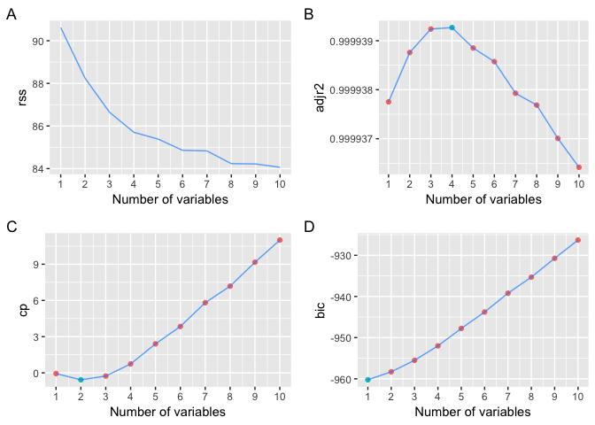
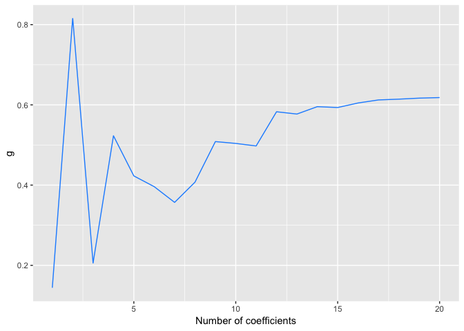

Linear Model Selection and Regularization
================
KS
2019-06-09

``` r
library("MASS")
library("tidyverse")
library("broom")
library("ISLR")
library("boot")
library("glue")
library("leaps")
library("reshape2")
library("gridExtra")
library("glmnet")
library("pls")
```

##### (8) Simulate data and perform best subset selection on it.

###### (a, b) Use the rnorm() function to generate a predictor X of length n = 100, as well as a noise vector ε of length n = 100. Generate a response vector Y of length n = 100 according to the model Y = β0 +β1X +β2X2 +β3X3 +ε, where β0, β1, β2, and β3 are constants

``` r
set.seed(1)
nobs <- 100
X <- rnorm(nobs)
e <- rnorm(nobs)
b0 <- 4
b1 <- -3
b2 <- -2
b3 <- 1
Y <- b0 + b1 * X + b2 * (X^2) + b3 * (X^3) + e

data_tb <- tibble(X, Y)
head(data_tb, 5)
```

    ## # A tibble: 5 x 2
    ##        X     Y
    ##    <dbl> <dbl>
    ## 1 -0.626  4.23
    ## 2  0.184  3.43
    ## 3 -0.836  3.62
    ## 4  1.60  -1.66
    ## 5  0.330  2.18

###### (c) Use the regsubsets() function to perform best subset selection in order to choose the best model containing the predictors X, X2, . . . , X10.

``` r
source("subsets-plots.R")

regfit.full <- regsubsets(Y ~ poly(X, 10, raw = TRUE), data_tb, nvmax = 10)
reg.summary <- summary(regfit.full)

nvars <- regfit.full$np - 1 #number of variables 
subsets_plots(reg.summary, nvars)
```

<!-- -->

``` r
coef(regfit.full, 3)
```

    ##              (Intercept) poly(X, 10, raw = TRUE)1 poly(X, 10, raw = TRUE)2 
    ##                 4.061507                -3.024720                -2.123791 
    ## poly(X, 10, raw = TRUE)3 
    ##                 1.017639

Each measure suggests models with the same number of parameters (CP = 3,
Rsquare = 3, BIC = 3). The coefficient estimates for the best model
suggested by the BIC criterion is shown.

###### (d) Repeat (c), using forward stepwise selection and also using back- wards stepwise selection.

``` r
regfit.fwd <- regsubsets(Y ~ poly(X, 10, raw = TRUE), data_tb, nvmax = 10, 
                        method = "forward")
reg.fwd.summary <- summary(regfit.fwd)
nvars <- regfit.fwd$np - 1
subsets_plots(reg.fwd.summary, nvars)
```

<!-- -->

``` r
coef(regfit.fwd, 3)
```

    ##              (Intercept) poly(X, 10, raw = TRUE)1 poly(X, 10, raw = TRUE)2 
    ##              4.076802788             -1.479955375             -2.240058647 
    ## poly(X, 10, raw = TRUE)9 
    ##              0.005264197

``` r
regfit.bwd <- regsubsets(Y ~ poly(X, 10, raw = TRUE), data_tb, nvmax = 10, 
                        method = "backward")
reg.bwd.summary <- summary(regfit.bwd)
nvars <- regfit.bwd$np - 1
subsets_plots(reg.bwd.summary, nvars)
```

<!-- -->

``` r
coef(regfit.bwd, 3)
```

    ##              (Intercept) poly(X, 10, raw = TRUE)1 poly(X, 10, raw = TRUE)2 
    ##                4.0738073               -2.0572937               -2.1784855 
    ## poly(X, 10, raw = TRUE)5 
    ##                0.1721833

The results agree with (c): the model with three parameters is chosen by
all three measures. The estimates are as shown.

5)  Now fit a lasso model to the simulated data, again using X,X2, . . .
    , X 10 as predictors. Use cross-validation to select the optimal
    value of λ. Create plots of the cross-validation error as a function
    of λ.

<!-- end list -->

``` r
#removed the column with 1s (ones)
x = model.matrix(Y ~ poly(X, 10, raw = TRUE), data = data_tb)[,-1] 

y = Y

fit_lasso <- glmnet(x, y, alpha = 1)
plot(fit_lasso)
```

<!-- -->

``` r
cv_lasso <- cv.glmnet(x, y, alpha = 1)
plot(cv_lasso)
```

<!-- -->

``` r
bestlam <- cv_lasso$lambda.min
bestlam
```

    ## [1] 0.02065097

``` r
predict(fit_lasso, s = bestlam, type = "coefficients")[1:11,]
```

    ##               (Intercept)  poly(X, 10, raw = TRUE)1 
    ##                 4.0479222                -2.3219130 
    ##  poly(X, 10, raw = TRUE)2  poly(X, 10, raw = TRUE)3 
    ##                -2.1367454                 0.3345286 
    ##  poly(X, 10, raw = TRUE)4  poly(X, 10, raw = TRUE)5 
    ##                 0.0000000                 0.1116355 
    ##  poly(X, 10, raw = TRUE)6  poly(X, 10, raw = TRUE)7 
    ##                 0.0000000                 0.0000000 
    ##  poly(X, 10, raw = TRUE)8  poly(X, 10, raw = TRUE)9 
    ##                 0.0000000                 0.0000000 
    ## poly(X, 10, raw = TRUE)10 
    ##                 0.0000000

Cross validation selects a lambda of 0.03458. Using the selected lambda
value gives a model with terms X, X1, X2, X3, X5. Lasso drives the
coefficients to zero.

###### (f) Now generate a response vector Y according to the model Y = β0 + β7X7 + ε, and perform best subset selection and the lasso.

``` r
b7 <- 2
Y <- b0 + b7 * X^7 + e
data_tb <- tibble(Y, X)
regfit.full <- regsubsets(Y ~ poly(X, 10, raw = TRUE), data_tb, nvmax = 10)
reg.summary <- summary(regfit.full)

nvars <- regfit.full$np - 1 #number of variables 
subsets_plots(reg.summary, nvars)
```

<!-- -->

``` r
coef(regfit.full, 1)
```

    ##              (Intercept) poly(X, 10, raw = TRUE)7 
    ##                  3.95894                  2.00077

``` r
x = model.matrix(Y ~ poly(X, 10, raw = TRUE), data = data_tb)[,-1]
fit_lasso <- glmnet(x, Y, alpha = 1)
plot(fit_lasso)
```

    ## Warning in plotCoef(x$beta, lambda = x$lambda, df = x$df, dev =
    ## x$dev.ratio, : 1 or less nonzero coefficients; glmnet plot is not
    ## meaningful

<!-- -->

``` r
cv_lasso <- cv.glmnet(x, Y, alpha = 1)
plot(cv_lasso)
```

<!-- -->

``` r
bestlam <- cv_lasso$lambda.min
bestlam
```

    ## [1] 3.534926

``` r
predict(fit_lasso, s = bestlam, type = "coefficients")[1:11, ]
```

    ##               (Intercept)  poly(X, 10, raw = TRUE)1 
    ##                  4.205086                  0.000000 
    ##  poly(X, 10, raw = TRUE)2  poly(X, 10, raw = TRUE)3 
    ##                  0.000000                  0.000000 
    ##  poly(X, 10, raw = TRUE)4  poly(X, 10, raw = TRUE)5 
    ##                  0.000000                  0.000000 
    ##  poly(X, 10, raw = TRUE)6  poly(X, 10, raw = TRUE)7 
    ##                  0.000000                  1.942447 
    ##  poly(X, 10, raw = TRUE)8  poly(X, 10, raw = TRUE)9 
    ##                  0.000000                  0.000000 
    ## poly(X, 10, raw = TRUE)10 
    ##                  0.000000

##### (9) Predict the number of applications received using the other variables in the College data set.

###### (a) Split the data into training and test set.

``` r
college <- as.tibble(College)
```

    ## Warning: `as.tibble()` is deprecated, use `as_tibble()` (but mind the new semantics).
    ## This warning is displayed once per session.

``` r
glimpse(college)
```

    ## Observations: 777
    ## Variables: 18
    ## $ Private     <fct> Yes, Yes, Yes, Yes, Yes, Yes, Yes, Yes, Yes, Yes, Ye…
    ## $ Apps        <dbl> 1660, 2186, 1428, 417, 193, 587, 353, 1899, 1038, 58…
    ## $ Accept      <dbl> 1232, 1924, 1097, 349, 146, 479, 340, 1720, 839, 498…
    ## $ Enroll      <dbl> 721, 512, 336, 137, 55, 158, 103, 489, 227, 172, 472…
    ## $ Top10perc   <dbl> 23, 16, 22, 60, 16, 38, 17, 37, 30, 21, 37, 44, 38, …
    ## $ Top25perc   <dbl> 52, 29, 50, 89, 44, 62, 45, 68, 63, 44, 75, 77, 64, …
    ## $ F.Undergrad <dbl> 2885, 2683, 1036, 510, 249, 678, 416, 1594, 973, 799…
    ## $ P.Undergrad <dbl> 537, 1227, 99, 63, 869, 41, 230, 32, 306, 78, 110, 4…
    ## $ Outstate    <dbl> 7440, 12280, 11250, 12960, 7560, 13500, 13290, 13868…
    ## $ Room.Board  <dbl> 3300, 6450, 3750, 5450, 4120, 3335, 5720, 4826, 4400…
    ## $ Books       <dbl> 450, 750, 400, 450, 800, 500, 500, 450, 300, 660, 50…
    ## $ Personal    <dbl> 2200, 1500, 1165, 875, 1500, 675, 1500, 850, 500, 18…
    ## $ PhD         <dbl> 70, 29, 53, 92, 76, 67, 90, 89, 79, 40, 82, 73, 60, …
    ## $ Terminal    <dbl> 78, 30, 66, 97, 72, 73, 93, 100, 84, 41, 88, 91, 84,…
    ## $ S.F.Ratio   <dbl> 18.1, 12.2, 12.9, 7.7, 11.9, 9.4, 11.5, 13.7, 11.3, …
    ## $ perc.alumni <dbl> 12, 16, 30, 37, 2, 11, 26, 37, 23, 15, 31, 41, 21, 3…
    ## $ Expend      <dbl> 7041, 10527, 8735, 19016, 10922, 9727, 8861, 11487, …
    ## $ Grad.Rate   <dbl> 60, 56, 54, 59, 15, 55, 63, 73, 80, 52, 73, 76, 74, …

``` r
college %>% map_df(~sum(is.na(.))) # check if any colums have NA values
```

    ## # A tibble: 1 x 18
    ##   Private  Apps Accept Enroll Top10perc Top25perc F.Undergrad P.Undergrad
    ##     <int> <int>  <int>  <int>     <int>     <int>       <int>       <int>
    ## 1       0     0      0      0         0         0           0           0
    ## # … with 10 more variables: Outstate <int>, Room.Board <int>, Books <int>,
    ## #   Personal <int>, PhD <int>, Terminal <int>, S.F.Ratio <int>,
    ## #   perc.alumni <int>, Expend <int>, Grad.Rate <int>

``` r
names(college) <- tolower(names(college))

set.seed(1)
train = sample(1:nrow(college), nrow(college) %/% 2)
test <- -train
```

###### (b) Fit a linear model using least squares on the training set, and

report the test error obtained.

``` r
lm.model <- lm(apps ~., data = college, subset = train)
apps.pred <- predict(lm.model, newdata = college[test,])
lm.mse <- mean((apps.pred - college$apps[test])^2)

glue("Test error obtained (MSE) - Least Squares = {round(lm.mse, 3)}")
```

    ## Test error obtained (MSE) - Least Squares = 1135758.318

###### (c) Fit a ridge regression model on the training set, with λ chosen

by cross-validation. Report the test error obtained.

``` r
set.seed(1)
X <- model.matrix(apps ~., data = college)[,-1] # remove constant term
Y <- college$apps # target

grid <- 10^seq(10, -2, length = 100)

ridge.mod <- glmnet(X[train,], Y[train], alpha = 0, 
                    lambda = grid, thresh = 1e-12)
cv.out <- cv.glmnet(X[train,], Y[train], alpha = 0)
plot(cv.out)
```

<!-- -->

``` r
bestlam <- cv.out$lambda.min
glue("Best lambda from CV = {round(bestlam, 3)}")
```

    ## Best lambda from CV = 405.84

``` r
ridge.pred <- predict(ridge.mod, s = bestlam, newx = X[test,])
ridge.mse <- mean((ridge.pred - Y[test])^2)

glue("Test error obtained (MSE) - Ridge = {round(ridge.mse, 3)}")
```

    ## Test error obtained (MSE) - Ridge = 976647.817

###### (d) Fit a lasso model on the training set, with λ chosen by cross- validation. Report the test error obtained, along with the number of non-zero coefficient estimates.

``` r
set.seed(1)

lasso.mod <- glmnet(X[train,], Y[train], alpha = 1, 
                    lambda = grid, thresh = 1e-12)
plot(lasso.mod)
```

    ## Warning in regularize.values(x, y, ties, missing(ties)): collapsing to
    ## unique 'x' values

<!-- -->

``` r
cv.out <- cv.glmnet(X[train, ], Y[train], alpha = 1)
plot(cv.out)
```

<!-- -->

``` r
bestlam <- cv.out$lambda.min
glue("Best lambda from CV = {round(bestlam, 3)}")
```

    ## Best lambda from CV = 1.973

``` r
lasso.pred <- predict(lasso.mod, s = bestlam, newx = X[test,])
lasso.mse <- mean((lasso.pred - Y[test])^2)
glue("Test error obtained (RMSE) - Lasso = {round(lasso.mse, 3)}")
```

    ## Test error obtained (RMSE) - Lasso = 1119322.981

``` r
out = glmnet(X, Y, alpha = 1)
lasso.coef <- predict(out, s = bestlam, type = "coefficients")
lasso.coef
```

    ## 18 x 1 sparse Matrix of class "dgCMatrix"
    ##                         1
    ## (Intercept) -471.39372069
    ## privateYes  -491.04485135
    ## accept         1.57033288
    ## enroll        -0.75961467
    ## top10perc     48.14698891
    ## top25perc    -12.84690694
    ## f.undergrad    0.04149116
    ## p.undergrad    0.04438973
    ## outstate      -0.08328388
    ## room.board     0.14943472
    ## books          0.01532293
    ## personal       0.02909954
    ## phd           -8.39597537
    ## terminal      -3.26800340
    ## s.f.ratio     14.59298267
    ## perc.alumni   -0.04404771
    ## expend         0.07712632
    ## grad.rate      8.28950241

``` r
# lasso.coef is an S4 object. To views slot names use slotNames(lasso.coef)
glue("Number of non-zero coefficient estimates = {sum(lasso.coef@x != 0)}")
```

    ## Number of non-zero coefficient estimates = 18

###### (e) Fit a PCR model on the training set, with M chosen by cross- validation. Report the test error obtained, along with the value of M selected by cross-validation.

``` r
set.seed(1)
pcr.fit <- pcr(apps ~., data = college,
               scale = TRUE, validation = "CV",
               subset = train) # on training set
summary(pcr.fit)
```

    ## Data:    X dimension: 388 17 
    ##  Y dimension: 388 1
    ## Fit method: svdpc
    ## Number of components considered: 17
    ## 
    ## VALIDATION: RMSEP
    ## Cross-validated using 10 random segments.
    ##        (Intercept)  1 comps  2 comps  3 comps  4 comps  5 comps  6 comps
    ## CV            4288     4006     2373     2372     2069     1961     1919
    ## adjCV         4288     4007     2368     2369     1999     1948     1911
    ##        7 comps  8 comps  9 comps  10 comps  11 comps  12 comps  13 comps
    ## CV        1919     1921     1876      1832      1832      1836      1837
    ## adjCV     1912     1915     1868      1821      1823      1827      1827
    ##        14 comps  15 comps  16 comps  17 comps
    ## CV         1853      1759      1341      1270
    ## adjCV      1850      1733      1326      1257
    ## 
    ## TRAINING: % variance explained
    ##       1 comps  2 comps  3 comps  4 comps  5 comps  6 comps  7 comps
    ## X       32.20    57.78    65.31    70.99    76.37    81.27     84.8
    ## apps    13.44    70.93    71.07    79.87    81.15    82.25     82.3
    ##       8 comps  9 comps  10 comps  11 comps  12 comps  13 comps  14 comps
    ## X       87.85    90.62     92.91     94.98     96.74     97.79     98.72
    ## apps    82.33    83.38     84.76     84.80     84.84     85.11     85.14
    ##       15 comps  16 comps  17 comps
    ## X        99.42     99.88    100.00
    ## apps     90.55     93.42     93.89

``` r
validationplot(pcr.fit, val.type = "MSEP")
```

<!-- -->

Results from the CV and the accompanying plot show that the lowest RMSE
is obtained when the number of components is 17 which is the full model
resulting in no dimension reduction. Instead we can choose M = 9 which
captures about 91% of the variance.

``` r
pcr.pred <- predict(pcr.fit, X[test,], ncomp = 9)
pcr.mse <- mean((pcr.pred - Y[test])^2)

glue("Test error obtained (RMSE) = {round(pcr.mse, 3)}")
```

    ## Test error obtained (RMSE) = 1583520.369

###### (f) Fit a PLS model on the training set, with M chosen by cross- validation. Report the test error obtained, along with the value of M selected by cross-validation.

``` r
pls.fit <- plsr(apps ~., data = college, subset = train, 
                scale = TRUE,
                validation = "CV")
summary(pls.fit)
```

    ## Data:    X dimension: 388 17 
    ##  Y dimension: 388 1
    ## Fit method: kernelpls
    ## Number of components considered: 17
    ## 
    ## VALIDATION: RMSEP
    ## Cross-validated using 10 random segments.
    ##        (Intercept)  1 comps  2 comps  3 comps  4 comps  5 comps  6 comps
    ## CV            4288     2213     1990     1733     1610     1381     1298
    ## adjCV         4288     2207     1985     1722     1580     1369     1285
    ##        7 comps  8 comps  9 comps  10 comps  11 comps  12 comps  13 comps
    ## CV        1279     1268     1254      1250      1241      1239      1238
    ## adjCV     1267     1256     1243      1239      1231      1229      1227
    ##        14 comps  15 comps  16 comps  17 comps
    ## CV         1236      1236      1236      1236
    ## adjCV      1225      1225      1225      1225
    ## 
    ## TRAINING: % variance explained
    ##       1 comps  2 comps  3 comps  4 comps  5 comps  6 comps  7 comps
    ## X       27.21    50.73    63.06    65.52    70.20    74.20    78.62
    ## apps    75.39    81.24    86.97    91.14    92.62    93.43    93.56
    ##       8 comps  9 comps  10 comps  11 comps  12 comps  13 comps  14 comps
    ## X       80.81    83.29     87.17     89.15     91.37     92.58     94.42
    ## apps    93.68    93.76     93.79     93.83     93.86     93.88     93.89
    ##       15 comps  16 comps  17 comps
    ## X        96.98     98.78    100.00
    ## apps     93.89     93.89     93.89

``` r
validationplot(pls.fit, val.type = "MSEP")
```

<!-- -->

``` r
# evaluate on test set with M = 8
pls.pred <- predict(pls.fit, X[test, ], ncomp = 8)
pls.mse <- mean((pls.pred - Y[test])^2)

glue("Test error obtained (RMSE) = {round(pls.mse, 3)}")
```

    ## Test error obtained (RMSE) = 1090290.341

###### (g)

The values for test errors for the models fitted above are:

``` r
glue("Least Squares: {round(lm.mse, 3)}")
```

    ## Least Squares: 1135758.318

``` r
glue("Ridge: {round(ridge.mse, 3)}")
```

    ## Ridge: 976647.817

``` r
glue("Lasso: {round(lasso.mse, 3)}")
```

    ## Lasso: 1119322.981

``` r
glue("PCR: {round(pcr.mse, 3)}")
```

    ## PCR: 1583520.369

``` r
glue("PLS: {round(pls.mse, 3)}")
```

    ## PLS: 1090290.341

Based on test errors, PCR performs the worst among the five models
considered while Ridge does the best. The Lasso results in no variable
selection which is expected in situation no particular variables may be
strongly related to the outcome. In fact, the best lambda value is quite
small which means that the Lasso does not perform much better than the
least squares model.

##### (10) We have seen that as the number of features used in a model increases, the training error will necessarily decrease, but the test error may not. We will now explore this in a simulated data set.

###### (a) Generate a data set with p = 20 features, n = 1000 observations, and an associated quantitative response vector generated according to the model

Y = Xβ+ε, where β has some elements that are exactly equal to zero.

``` r
set.seed(1)

p <- 20 # features
n <- 1000 # number of observations

X <- as.matrix(sapply(1:p, function(x) rnorm(n)))

e <- rnorm(n)
betas <- rnorm(p)
names(betas) <- paste("x_", 1:20, sep = "")

betas[c(3, 4, 9, 10, 19)] <- 0 #set some betas to zero

Y <- X %*% betas + e # dot product matric X and betas 

data_xy <- as_tibble(x = X)
```

    ## Warning: `as_tibble.matrix()` requires a matrix with column names or a `.name_repair` argument. Using compatibility `.name_repair`.
    ## This warning is displayed once per session.

``` r
names(data_xy) <- paste("x_", 1:20, sep = "")
data_xy["y"] <- Y
head(data_xy)
```

    ## # A tibble: 6 x 21
    ##      x_1     x_2     x_3    x_4    x_5    x_6     x_7    x_8    x_9    x_10
    ##    <dbl>   <dbl>   <dbl>  <dbl>  <dbl>  <dbl>   <dbl>  <dbl>  <dbl>   <dbl>
    ## 1 -0.626  1.13   -0.886   0.739 -1.13  -1.52  -0.619  -1.33   0.264 -1.22  
    ## 2  0.184  1.11   -1.92    0.387  0.765  0.629 -1.11    0.952 -0.829 -0.946 
    ## 3 -0.836 -0.871   1.62    1.30   0.571 -1.68  -2.17    0.860 -1.46   0.0914
    ## 4  1.60   0.211   0.519  -0.804 -1.35   1.18  -0.0313  1.06   1.68   0.701 
    ## 5  0.330  0.0694 -0.0558 -1.60  -2.03   1.12  -0.260  -0.351 -1.54   0.673 
    ## 6 -0.820 -1.66    0.696   0.933  0.590 -1.24   0.534  -0.131 -0.191  1.27  
    ## # … with 11 more variables: x_11 <dbl>, x_12 <dbl>, x_13 <dbl>,
    ## #   x_14 <dbl>, x_15 <dbl>, x_16 <dbl>, x_17 <dbl>, x_18 <dbl>,
    ## #   x_19 <dbl>, x_20 <dbl>, y[,1] <dbl>

``` r
ggplot(data_xy, aes(x = y)) + 
    geom_histogram(fill = "dodger blue", color = "grey", binwidth = 1) 
```

<!-- -->

###### (b) Split your data set into a training set containing 100 observations and a test set containing 900 observations.

``` r
# sample indices between 1:1000
train <- sample(c(1:1000), 100)
test <- -(train)
```

###### (c) Perform best subset selection on the training set, and plot the training set MSE associated with the best model of each size. Plot the test set MSE associated with the best model of each size.

``` r
train.fit <- regsubsets(y ~., data = data_xy[train,], nvmax = 20)
train.fit.summary <- summary(train.fit)

test.mat <- model.matrix(y ~., data = data_xy[test,])
val.errors <- rep(NA, 20)
# function to calculate mse for each train model from best subset selection model on test set
calc_mse <- function(i) {
    coefi <- coef(train.fit, id = i) # extract coefficients
    pred <- test.mat[, names(coefi)] %*% coefi # dot product
    val.errors[i] <- mean((data_xy$y[test] - pred)^2) # save mse
} # end of function

test_mse <- sapply(1:20, calc_mse) # apply the function to each subset
#which.min(test_mse) # identify subset with lowest mse

glue("MSE values for selected subsets on test set")
```

    ## MSE values for selected subsets on test set

``` r
test_mse
```

    ##  [1] 15.948735 14.194257  9.117744  7.357074  5.297032  4.008237  2.716508
    ##  [8]  2.378192  1.804254  1.674967  1.433057  1.543207  1.454799  1.460953
    ## [15]  1.381132  1.383268  1.386199  1.383471  1.382637  1.382254

``` r
test_mse_vals <- as.tibble(melt(test_mse, value.name = "test"))  %>%
    rowid_to_column("id")
train_mse_vals <- as.tibble(melt(train.fit.summary$rss/length(train),
                                 value.name = "train")) %>%
    rowid_to_column("id")
inner_join(train_mse_vals, test_mse_vals, by = "id") %>%
    melt(id.vars = "id") %>%
    rename(data = variable, mse = value) %>%
    ggplot(aes(x = id, y = mse, color = data)) +
        geom_line() +
    xlab("Model size") + ylab("MSE")
```

<!-- -->

From the graph, we can see that the test MSE always stays above the
train MSE as expected.

###### (e) For which model size does the test set MSE take on its minimum value?

``` r
glue("Model size for which test MSE takes on minimum value = {which.min(test_mse)}")
```

    ## Model size for which test MSE takes on minimum value = 15

``` r
glue("Fit the full data set to get the model with {which.min(test_mse)} variables")
```

    ## Fit the full data set to get the model with 15 variables

``` r
reg.best <- regsubsets(y ~., data = data_xy, nvmax = 18)
names(coef(reg.best, which.min(test_mse)))
```

    ##  [1] "(Intercept)" "x_1"         "x_2"         "x_4"         "x_5"        
    ##  [6] "x_6"         "x_7"         "x_8"         "x_11"        "x_12"       
    ## [11] "x_13"        "x_15"        "x_16"        "x_17"        "x_18"       
    ## [16] "x_20"

###### (f) How does the model at which the test set MSE is minimized compare to the true model used to generate the data?

``` r
glue("Fit the full data set to get the best model with {which.min(test_mse)} variables")
```

    ## Fit the full data set to get the best model with 15 variables

``` r
reg.best <- regsubsets(y ~., data = data_xy, nvmax = 18)
coef(reg.best, which.min(test_mse))
```

    ## (Intercept)         x_1         x_2         x_4         x_5         x_6 
    ##  0.06728836  0.61064058 -2.78412269 -0.06017144  0.78389281  1.18706236 
    ##         x_7         x_8        x_11        x_12        x_13        x_15 
    ##  0.27583657 -1.10694604  0.50702170 -0.34121264  0.29891953  1.34539981 
    ##        x_16        x_17        x_18        x_20 
    ## -1.69943147 -1.90075786 -1.33911874 -0.05443267

``` r
glue("Parameters in the true model.")
```

    ## Parameters in the true model.

``` r
betas
```

    ##         x_1         x_2         x_3         x_4         x_5         x_6 
    ##  0.60109155 -2.76711578  0.00000000  0.00000000  0.71197130  1.15727274 
    ##         x_7         x_8         x_9        x_10        x_11        x_12 
    ##  0.25097125 -1.09914106  0.00000000  0.00000000  0.49926364 -0.37971579 
    ##        x_13        x_14        x_15        x_16        x_17        x_18 
    ##  0.27895349  0.02597137  1.34252439 -1.68496253 -1.89403426 -1.38330270 
    ##        x_19        x_20 
    ##  0.00000000  0.00256629

Comparing the estimated coefficients from the selected model with the
parameters from the true model, we can see that the coefficients with
zero values are correctly dropped except for the coefficient on x\_4
which has a low value but not zero.

###### (g) Create a plot displaying sqrt\[sum(j=1 to p) (β(j) - β(rj))^2\] for a range of values of r, where β(jr) is the jth coefficient estimate for the best model containing r coefficients.

``` r
betas <- c('(Intercept)' = 0, betas)
g <- rep(NA, 20)
for (r in 1:20) {
    sum_r <- 0
    for (j in (names(coef(train.fit, r)))) {
        sum_r = sum_r + ((betas[j] - coef(train.fit, r)[j])^2)
    }
    g[r] <- sqrt(sum_r)
}

ggplot(data = NULL, aes(x = c(1:20), y = g)) + 
    geom_path(color = "dodger blue") +
    xlab("Number of coefficients")
```

<!-- -->

Although the difference between the estimated coefficients and the true
parameters is lowest with a single variable, the test error is minimized
when 15 coefficients are included in the model. In fact, comparing with
the figure in (d) we can see that test error is highest when the subset
contains only one variable.

##### (11) Predict per capita crime rate in the Boston data set.

``` r
set.seed(1)

boston <- as_tibble(Boston)
glimpse(boston)
```

    ## Observations: 506
    ## Variables: 14
    ## $ crim    <dbl> 0.00632, 0.02731, 0.02729, 0.03237, 0.06905, 0.02985, 0.…
    ## $ zn      <dbl> 18.0, 0.0, 0.0, 0.0, 0.0, 0.0, 12.5, 12.5, 12.5, 12.5, 1…
    ## $ indus   <dbl> 2.31, 7.07, 7.07, 2.18, 2.18, 2.18, 7.87, 7.87, 7.87, 7.…
    ## $ chas    <int> 0, 0, 0, 0, 0, 0, 0, 0, 0, 0, 0, 0, 0, 0, 0, 0, 0, 0, 0,…
    ## $ nox     <dbl> 0.538, 0.469, 0.469, 0.458, 0.458, 0.458, 0.524, 0.524, …
    ## $ rm      <dbl> 6.575, 6.421, 7.185, 6.998, 7.147, 6.430, 6.012, 6.172, …
    ## $ age     <dbl> 65.2, 78.9, 61.1, 45.8, 54.2, 58.7, 66.6, 96.1, 100.0, 8…
    ## $ dis     <dbl> 4.0900, 4.9671, 4.9671, 6.0622, 6.0622, 6.0622, 5.5605, …
    ## $ rad     <int> 1, 2, 2, 3, 3, 3, 5, 5, 5, 5, 5, 5, 5, 4, 4, 4, 4, 4, 4,…
    ## $ tax     <dbl> 296, 242, 242, 222, 222, 222, 311, 311, 311, 311, 311, 3…
    ## $ ptratio <dbl> 15.3, 17.8, 17.8, 18.7, 18.7, 18.7, 15.2, 15.2, 15.2, 15…
    ## $ black   <dbl> 396.90, 396.90, 392.83, 394.63, 396.90, 394.12, 395.60, …
    ## $ lstat   <dbl> 4.98, 9.14, 4.03, 2.94, 5.33, 5.21, 12.43, 19.15, 29.93,…
    ## $ medv    <dbl> 24.0, 21.6, 34.7, 33.4, 36.2, 28.7, 22.9, 27.1, 16.5, 18…

``` r
train <- sample(c(TRUE, FALSE), nrow(boston), replace = TRUE)
test <- !train
table(train, test)
```

    ##        test
    ## train   FALSE TRUE
    ##   FALSE     0  244
    ##   TRUE    262    0

``` r
test.mat <- model.matrix(crim ~., data = boston[test,])
```

###### (a) Try out some of the regression methods explored in this chapter, such as best subset selection, the lasso, ridge regression, and PCR.

``` r
lm.fit <- lm(crim ~., data = boston[train,])
lm.pred <- predict(lm.fit, newdata = boston[test,])
lm.mse <- mean((boston$crim[test] - lm.pred)^2)
glue("Least squares - MSE = {lm.mse}")
```

    ## Least squares - MSE = 50.6567800109438

``` r
lm.mse
```

    ## [1] 50.65678

``` r
source("subsets-plots.R")

# subsets: all, forward, backward
sub.all <- regsubsets(crim ~., data = boston[train,], 
                      nvmax = length(boston))
sub.fwd <- regsubsets(crim ~., data = boston[train,], 
                      nvmax = length(boston), 
                      method = "forward")
sub.bwd <- regsubsets(crim ~., data = boston[train,], 
                      nvmax = length(boston), 
                      method = "backward")

sub.all.summary <- summary(sub.all)
subsets_plots(sub.all.summary, (length(boston) - 1))
```

<!-- -->

``` r
glue("Number of variables (all subsets) chosen by BIC = {which.min(sub.all.summary$bic)}")
```

    ## Number of variables (all subsets) chosen by BIC = 3

``` r
sub.fwd.summary <- summary(sub.fwd)
subsets_plots(sub.fwd.summary, (length(boston) - 1))
```

<!-- -->

``` r
glue("Number of variables (forward subsets) chosen by BIC = {which.min(sub.fwd.summary$bic)}")
```

    ## Number of variables (forward subsets) chosen by BIC = 3

``` r
sub.bwd.summary <- summary(sub.bwd)
subsets_plots(sub.bwd.summary, (length(boston) - 1))
```

<!-- -->

``` r
glue("Number of variables (bacward subsets) chosen by BIC = {which.min(sub.bwd.summary$bic)}")
```

    ## Number of variables (bacward subsets) chosen by BIC = 3

``` r
val.errors = rep(NA, length(boston) - 1)
calc_mse <- function(i, fitted_model) {
    coefi = coef(fitted_model, id = i)
    pred = test.mat[, names(coefi)] %*% coefi
    val.errors[i] = mean((boston$crim[test] - pred)^2)
}

test_all_mse <- sapply(1:(length(boston) - 1), calc_mse, sub.all)
min_all_mse <- test_all_mse[which.min(test_all_mse)]
glue("all subsets method: model with minimum mse {min_all_mse} has {which.min(test_all_mse)} variables")
```

    ## all subsets method: model with minimum mse 50.4362695230199 has 9 variables

``` r
test_fwd_mse <- sapply(1:(length(boston) - 1), calc_mse, sub.fwd)
min_fwd_mse <- test_fwd_mse[which.min(test_fwd_mse)]
glue("forward subsets method: model with minimum mse {min_fwd_mse} has {which.min(test_fwd_mse)} variables")
```

    ## forward subsets method: model with minimum mse 50.4362695230199 has 9 variables

``` r
test_bwd_mse <- sapply(1:(length(boston) - 1), calc_mse, sub.bwd)
min_bwd_mse <- test_bwd_mse[which.min(test_bwd_mse)]
glue("backward subsets method: model with minimum mse {min_bwd_mse} has {which.min(test_bwd_mse)} variables")
```

    ## backward subsets method: model with minimum mse 50.4362695230199 has 9 variables

Repeat subset selection with cross validation.

``` r
set.seed(1)
k = 5 # total folds
folds <- sample(1:k, nrow(boston), replace = TRUE)
table(folds) # each fold acts as the test set
```

    ## folds
    ##   1   2   3   4   5 
    ## 106  95  90 103 112

``` r
cv.errors <- matrix(NA, k, 13, dimnames = list(NULL, paste(1:13)))

predict.regsubsets <- function(object, newdata, id, ...) {
    form <- as.formula(object$call[[2]])
    mat <- model.matrix(form, newdata)
    coefi <- coef(object, id = id)
    xvars <- names(coefi)
    mat[, xvars] %*% coefi #return vector of predictions
}

mean.cv.errors <- list()
for (m in c("exhaustive", "forward", "backward")) {
    for (j in 1:k) {
    best.fit <- regsubsets(crim ~., data = boston[folds != j,], 
                           nvmax = 13, method = m)
    for (i in 1:13) {
        pred = predict.regsubsets(best.fit, boston[folds == j,], id = i)
        cv.errors[j, i] <- mean((boston$crim[folds == j] - pred)^2)
    } # for
} # for
# take column means to get average error for each model size across folds
mean.cv.errors[m] <- list(apply(cv.errors, 2, mean))
}

ggplot(data = NULL, aes(x = c(1:13), y = mean.cv.errors$exhaustive)) + 
    geom_path(color = "dodger blue") +
    xlab("Number of variables") + 
    ylab("Method: Exhaustive") + 
    scale_x_continuous(breaks = c(1:13))
```

<!-- -->

``` r
ggplot(data = NULL, aes(x = c(1:13), y = mean.cv.errors$forward)) + 
    geom_path(color = "dodger blue") +
    xlab("Number of variables") + 
    ylab("Method: Forward") + 
    scale_x_continuous(breaks = c(1:13))
```

<!-- -->

``` r
ggplot(data = NULL, aes(x = c(1:13), y = mean.cv.errors$backward)) + 
    geom_path(color = "dodger blue") +
    xlab("Number of variables") + 
    ylab("Method: Backward") + 
    scale_x_continuous(breaks = c(1:13))
```

<!-- -->

``` r
num_exh <- which.min(mean.cv.errors$exhaustive)
num_fwd <- which.min(mean.cv.errors$forward)
num_bwd <- which.min(mean.cv.errors$backward)
mse_exh <- mean.cv.errors$exhaustive[num_exh]
mse_fwd <- mean.cv.errors$exhaustive[num_fwd]
mse_bwd <- mean.cv.errors$exhaustive[num_bwd]

glue("Exhaustive: {num_exh}, {mse_exh}")
```

    ## Exhaustive: 10, 42.7414398547862

``` r
glue("Forward: {num_fwd}, {mse_fwd}")
```

    ## Forward: 11, 42.7438012042359

``` r
glue("Backward: {num_bwd}, {mse_bwd}")
```

    ## Backward: 11, 42.7438012042359

Lasso with cross validation

``` r
set.seed(1)

X <- model.matrix(crim ~., data = boston)[,-1] # remove constant term
Y <- boston$crim # target

grid <- 10^seq(10, -2, length = 100)
lasso.mod <- glmnet(X[train,], Y[train], alpha = 1, 
                    lambda = grid, thresh = 1e-12)
plot(lasso.mod)
```

    ## Warning in regularize.values(x, y, ties, missing(ties)): collapsing to
    ## unique 'x' values

<!-- -->

``` r
cv.out <- cv.glmnet(X[train, ], Y[train], alpha = 1)
plot(cv.out)
```

<!-- -->

``` r
bestlam <- cv.out$lambda.min
glue("Best lambda from CV = {round(bestlam, 3)}")
```

    ## Best lambda from CV = 0.02

``` r
lasso.pred <- predict(lasso.mod, s = bestlam, newx = X[test,])
lasso.mse <- mean((lasso.pred - Y[test])^2)
glue("Test error obtained (MSE) - Lasso = {round(lasso.mse, 3)}")
```

    ## Test error obtained (MSE) - Lasso = 50.733

``` r
out <- glmnet(X, Y, alpha = 1, lambda = grid) # all data
lasso.coef <- predict(out, s = bestlam, type = "coefficients")
lasso.coef
```

    ## 14 x 1 sparse Matrix of class "dgCMatrix"
    ##                        1
    ## (Intercept) 15.274657338
    ## zn           0.041086972
    ## indus       -0.068744852
    ## chas        -0.674509624
    ## nox         -9.009346033
    ## rm           0.361194922
    ## age          .          
    ## dis         -0.914511964
    ## rad          0.554349050
    ## tax         -0.001960195
    ## ptratio     -0.239265646
    ## black       -0.007532969
    ## lstat        0.127257803
    ## medv        -0.182791130

``` r
glue("Number of non-zero coefficient estimates = {sum(lasso.coef != 0)}")
```

    ## Number of non-zero coefficient estimates = 13

Ridge with cross validation

``` r
set.seed(1)
ridge.mod <- glmnet(X[train,], Y[train], alpha = 0, 
                    lambda = grid, thresh = 1e-12)

cv.out <- cv.glmnet(X[train, ], Y[train], alpha = 0)
plot(cv.out)
```

<!-- -->

``` r
bestlam <- cv.out$lambda.min
glue("Best lambda from CV = {round(bestlam, 3)}")
```

    ## Best lambda from CV = 0.524

``` r
ridge.pred <- predict(ridge.mod, s = bestlam, newx = X[test,])
ridge.mse <- mean((ridge.pred - Y[test])^2)
glue("Test error obtained (MSE) - Ridge = {round(ridge.mse, 3)}")
```

    ## Test error obtained (MSE) - Ridge = 51.458

``` r
# fitting on all data
out <- glmnet(X, Y, alpha = 0, lambda = grid) # all data
ridge.coef <- predict(out, s = bestlam, type = "coefficients")
ridge.coef
```

    ## 14 x 1 sparse Matrix of class "dgCMatrix"
    ##                        1
    ## (Intercept)  9.216304252
    ## zn           0.033094398
    ## indus       -0.081678829
    ## chas        -0.735492893
    ## nox         -5.512833767
    ## rm           0.341785491
    ## age          0.001817833
    ## dis         -0.707576290
    ## rad          0.425545040
    ## tax          0.003301809
    ## ptratio     -0.139350335
    ## black       -0.008460989
    ## lstat        0.142613654
    ## medv        -0.140874372

PCR with cross validation

``` r
set.seed(1)
pcr.fit <- pcr(crim ~., data = boston, scale = TRUE,
               validation = "CV", subset = train)
summary(pcr.fit)
```

    ## Data:    X dimension: 262 13 
    ##  Y dimension: 262 1
    ## Fit method: svdpc
    ## Number of components considered: 13
    ## 
    ## VALIDATION: RMSEP
    ## Cross-validated using 10 random segments.
    ##        (Intercept)  1 comps  2 comps  3 comps  4 comps  5 comps  6 comps
    ## CV           8.065    6.591    6.582    6.067    6.053    6.050    6.163
    ## adjCV        8.065    6.587    6.579    6.061    6.047    6.043    6.151
    ##        7 comps  8 comps  9 comps  10 comps  11 comps  12 comps  13 comps
    ## CV       6.145    6.036    6.048     6.073     6.101     6.049     6.000
    ## adjCV    6.131    6.019    6.026     6.055     6.083     6.030     5.981
    ## 
    ## TRAINING: % variance explained
    ##       1 comps  2 comps  3 comps  4 comps  5 comps  6 comps  7 comps
    ## X       44.58    58.02    68.58    75.64    82.03    87.37    90.66
    ## crim    33.90    34.29    44.32    44.91    45.57    45.62    46.13
    ##       8 comps  9 comps  10 comps  11 comps  12 comps  13 comps
    ## X       93.02    95.01     96.87      98.4     99.54    100.00
    ## crim    48.13    48.80     48.96      49.0     49.91     50.71

``` r
validationplot(pcr.fit, val.type = "MSEP")
```

<!-- -->

``` r
glue("Selecting M = 8")
```

    ## Selecting M = 8

``` r
pcr.pred = predict(pcr.fit, X[test,], ncomp = 8)
pcr.mse = mean((pcr.pred - Y[test])^2)
glue("Test error obtained (MSE) - PCR = {round(pcr.mse, 3)}")
```

    ## Test error obtained (MSE) - PCR = 53.172

``` r
glue("----------------------------------------------------")
```

    ## ----------------------------------------------------

``` r
glue("Fitting on all the data using M = 8")
```

    ## Fitting on all the data using M = 8

``` r
pcr.fit <- pcr(Y ~ X, scale = TRUE, ncomp = 8)
summary(pcr.fit)
```

    ## Data:    X dimension: 506 13 
    ##  Y dimension: 506 1
    ## Fit method: svdpc
    ## Number of components considered: 8
    ## TRAINING: % variance explained
    ##    1 comps  2 comps  3 comps  4 comps  5 comps  6 comps  7 comps  8 comps
    ## X    47.70    60.36    69.67    76.45    82.99    88.00    91.14    93.45
    ## Y    30.69    30.87    39.27    39.61    39.61    39.86    40.14    42.47

We can now compare the MSE values obtained from the various methods.

``` r
glue("Least Squares: {round(lm.mse, 3)}")
```

    ## Least Squares: 50.657

``` r
glue("Reg Subsets (Exhaustive) - Validation: {round(min_all_mse, 3)}")
```

    ## Reg Subsets (Exhaustive) - Validation: 50.436

``` r
glue("Reg Subsets (Forward) - Validation: {round(min_fwd_mse, 3)}")
```

    ## Reg Subsets (Forward) - Validation: 50.436

``` r
glue("Reg Subsets (Backward) - Validation: {round(min_bwd_mse, 3)}")
```

    ## Reg Subsets (Backward) - Validation: 50.436

``` r
glue("Reg Subsets (Exhaustive) - CV: {round(mse_exh, 3)}")
```

    ## Reg Subsets (Exhaustive) - CV: 42.741

``` r
glue("Reg Subsets (Forward) - CV: {round(mse_fwd, 3)}")
```

    ## Reg Subsets (Forward) - CV: 42.744

``` r
glue("Reg Subsets (Backward) - CV: {round(mse_bwd, 3)}")
```

    ## Reg Subsets (Backward) - CV: 42.744

``` r
glue("Lasso - CV: {round(lasso.mse, 3)}")
```

    ## Lasso - CV: 50.733

``` r
glue("Ridge - CV: {round(ridge.mse, 3)}")
```

    ## Ridge - CV: 51.458

``` r
glue("PCR - CV: {round(pcr.mse, 3)}")
```

    ## PCR - CV: 53.172

The various subset methods give the lowest MSE values.
