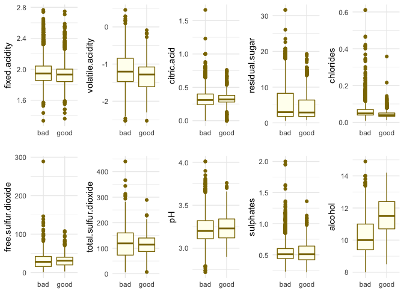
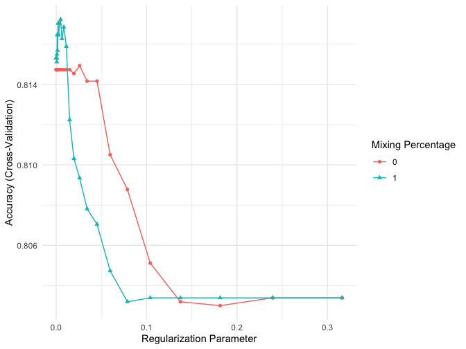

wine-analysis
================
KS
26/06/2019

``` r
library("tidyverse")
library("broom")
library("janitor")
library("caret")
library("viridis")
library("visibly")
library("gridExtra")
library("gtable")
library("grid")
library("patchwork")
library("Matrix")
library("corrplot")
library("glue")
library("glmnet")
library("pracma")
library("randomForestExplainer")
library("ggRandomForests")
library("lime")
library("ROCR")
library("plotROC")
library("pander")

theme_set(theme_minimal())
```

Get the data from [UCI
repository](https://archive.ics.uci.edu/ml/machine-learning-databases/wine-quality/).
Append the red wine and white wine datasets together.

``` r
#url_red = "https://archive.ics.uci.edu/ml/machine-learning-databases/wine-quality/winequality-red.csv"
#url_white = "https://archive.ics.uci.edu/ml/machine-learning-databases/wine-quality/winequality-white.csv"

#dest_file = "data/red.csv"
#download.file(url_red, destfile = dest_file)

#dest_file = "data/white.csv"
#download.file(url_white, destfile = dest_file)

redwine = read_delim("data/red.csv", delim = ";")
redwine = add_column(redwine, wine.color = "red")

whitewine = read_delim("data/white.csv", delim = ";")
whitewine = add_column(whitewine, wine.color = "white")

wine = bind_rows(redwine, whitewine)
names(wine) = make.names(names(wine),unique = TRUE)
glimpse(wine)
```

    Observations: 6,497
    Variables: 13
    $ fixed.acidity        <dbl> 7.4, 7.8, 7.8, 11.2, 7.4, 7.4, 7.9, 7.3, 7.8, 7.5, 6.7, 7.5, 5.6, 7.8, 8.9, 8.9, 8.5, 8.1, 7.4, 7.9, 8.9, 7.6, 7.9, 8.5, 6.9, 6.3, 7.6, 7.9, 7.1, 7.8, 6.7, 6.9, 8.3, 6.9, 5.2, 7.8, 7.8, 8.…
    $ volatile.acidity     <dbl> 0.700, 0.880, 0.760, 0.280, 0.700, 0.660, 0.600, 0.650, 0.580, 0.500, 0.580, 0.500, 0.615, 0.610, 0.620, 0.620, 0.280, 0.560, 0.590, 0.320, 0.220, 0.390, 0.430, 0.490, 0.400, 0.390, 0.410,…
    $ citric.acid          <dbl> 0.00, 0.00, 0.04, 0.56, 0.00, 0.00, 0.06, 0.00, 0.02, 0.36, 0.08, 0.36, 0.00, 0.29, 0.18, 0.19, 0.56, 0.28, 0.08, 0.51, 0.48, 0.31, 0.21, 0.11, 0.14, 0.16, 0.24, 0.21, 0.00, 0.00, 0.07, 0.…
    $ residual.sugar       <dbl> 1.90, 2.60, 2.30, 1.90, 1.90, 1.80, 1.60, 1.20, 2.00, 6.10, 1.80, 6.10, 1.60, 1.60, 3.80, 3.90, 1.80, 1.70, 4.40, 1.80, 1.80, 2.30, 1.60, 2.30, 2.40, 1.40, 1.80, 1.60, 1.90, 2.00, 2.40, 2.…
    $ chlorides            <dbl> 0.076, 0.098, 0.092, 0.075, 0.076, 0.075, 0.069, 0.065, 0.073, 0.071, 0.097, 0.071, 0.089, 0.114, 0.176, 0.170, 0.092, 0.368, 0.086, 0.341, 0.077, 0.082, 0.106, 0.084, 0.085, 0.080, 0.080,…
    $ free.sulfur.dioxide  <dbl> 11, 25, 15, 17, 11, 13, 15, 15, 9, 17, 15, 17, 16, 9, 52, 51, 35, 16, 6, 17, 29, 23, 10, 9, 21, 11, 4, 10, 14, 8, 17, 22, 15, 40, 13, 5, 3, 13, 7, 12, 12, 17, 8, 9, 5, 8, 22, 12, 5, 12, 4,…
    $ total.sulfur.dioxide <dbl> 34, 67, 54, 60, 34, 40, 59, 21, 18, 102, 65, 102, 59, 29, 145, 148, 103, 56, 29, 56, 60, 71, 37, 67, 40, 23, 11, 37, 35, 16, 82, 37, 113, 83, 50, 18, 15, 30, 19, 87, 87, 46, 14, 23, 11, 65…
    $ density              <dbl> 0.9978, 0.9968, 0.9970, 0.9980, 0.9978, 0.9978, 0.9964, 0.9946, 0.9968, 0.9978, 0.9959, 0.9978, 0.9943, 0.9974, 0.9986, 0.9986, 0.9969, 0.9968, 0.9974, 0.9969, 0.9968, 0.9982, 0.9966, 0.99…
    $ pH                   <dbl> 3.51, 3.20, 3.26, 3.16, 3.51, 3.51, 3.30, 3.39, 3.36, 3.35, 3.28, 3.35, 3.58, 3.26, 3.16, 3.17, 3.30, 3.11, 3.38, 3.04, 3.39, 3.52, 3.17, 3.17, 3.43, 3.34, 3.28, 3.17, 3.47, 3.38, 3.35, 3.…
    $ sulphates            <dbl> 0.56, 0.68, 0.65, 0.58, 0.56, 0.56, 0.46, 0.47, 0.57, 0.80, 0.54, 0.80, 0.52, 1.56, 0.88, 0.93, 0.75, 1.28, 0.50, 1.08, 0.53, 0.65, 0.91, 0.53, 0.63, 0.56, 0.59, 0.91, 0.55, 0.59, 0.54, 0.…
    $ alcohol              <dbl> 9.4, 9.8, 9.8, 9.8, 9.4, 9.4, 9.4, 10.0, 9.5, 10.5, 9.2, 10.5, 9.9, 9.1, 9.2, 9.2, 10.5, 9.3, 9.0, 9.2, 9.4, 9.7, 9.5, 9.4, 9.7, 9.3, 9.5, 9.5, 9.4, 9.8, 10.1, 10.6, 9.8, 9.4, 9.2, 9.6, 10…
    $ quality              <dbl> 5, 5, 5, 6, 5, 5, 5, 7, 7, 5, 5, 5, 5, 5, 5, 5, 7, 5, 4, 6, 6, 5, 5, 5, 6, 5, 5, 5, 5, 6, 5, 6, 5, 6, 5, 6, 6, 7, 4, 5, 5, 4, 6, 5, 5, 4, 5, 5, 5, 5, 5, 6, 6, 5, 6, 5, 5, 5, 5, 6, 5, 5, 7,…
    $ wine.color           <chr> "red", "red", "red", "red", "red", "red", "red", "red", "red", "red", "red", "red", "red", "red", "red", "red", "red", "red", "red", "red", "red", "red", "red", "red", "red", "red", "red",…

``` r
summary(wine)
```

``` 
 fixed.acidity    volatile.acidity  citric.acid     residual.sugar     chlorides       free.sulfur.dioxide total.sulfur.dioxide    density             pH          sulphates         alcohol         quality     
 Min.   : 3.800   Min.   :0.0800   Min.   :0.0000   Min.   : 0.600   Min.   :0.00900   Min.   :  1.00      Min.   :  6.0        Min.   :0.9871   Min.   :2.720   Min.   :0.2200   Min.   : 8.00   Min.   :3.000  
 1st Qu.: 6.400   1st Qu.:0.2300   1st Qu.:0.2500   1st Qu.: 1.800   1st Qu.:0.03800   1st Qu.: 17.00      1st Qu.: 77.0        1st Qu.:0.9923   1st Qu.:3.110   1st Qu.:0.4300   1st Qu.: 9.50   1st Qu.:5.000  
 Median : 7.000   Median :0.2900   Median :0.3100   Median : 3.000   Median :0.04700   Median : 29.00      Median :118.0        Median :0.9949   Median :3.210   Median :0.5100   Median :10.30   Median :6.000  
 Mean   : 7.215   Mean   :0.3397   Mean   :0.3186   Mean   : 5.443   Mean   :0.05603   Mean   : 30.53      Mean   :115.7        Mean   :0.9947   Mean   :3.219   Mean   :0.5313   Mean   :10.49   Mean   :5.818  
 3rd Qu.: 7.700   3rd Qu.:0.4000   3rd Qu.:0.3900   3rd Qu.: 8.100   3rd Qu.:0.06500   3rd Qu.: 41.00      3rd Qu.:156.0        3rd Qu.:0.9970   3rd Qu.:3.320   3rd Qu.:0.6000   3rd Qu.:11.30   3rd Qu.:6.000  
 Max.   :15.900   Max.   :1.5800   Max.   :1.6600   Max.   :65.800   Max.   :0.61100   Max.   :289.00      Max.   :440.0        Max.   :1.0390   Max.   :4.010   Max.   :2.0000   Max.   :14.90   Max.   :9.000  
  wine.color       
 Length:6497       
 Class :character  
 Mode  :character  
                   
                   
                   
```

``` r
head(wine)
```

``` 
# A tibble: 6 x 13
  fixed.acidity volatile.acidity citric.acid residual.sugar chlorides free.sulfur.dioxide total.sulfur.dioxide density    pH sulphates alcohol quality wine.color
          <dbl>            <dbl>       <dbl>          <dbl>     <dbl>               <dbl>                <dbl>   <dbl> <dbl>     <dbl>   <dbl>   <dbl> <chr>     
1           7.4             0.7         0               1.9     0.076                  11                   34   0.998  3.51     0.56      9.4       5 red       
2           7.8             0.88        0               2.6     0.098                  25                   67   0.997  3.2      0.68      9.8       5 red       
3           7.8             0.76        0.04            2.3     0.092                  15                   54   0.997  3.26     0.65      9.8       5 red       
4          11.2             0.28        0.56            1.9     0.075                  17                   60   0.998  3.16     0.580     9.8       6 red       
5           7.4             0.7         0               1.9     0.076                  11                   34   0.998  3.51     0.56      9.4       5 red       
6           7.4             0.66        0               1.8     0.075                  13                   40   0.998  3.51     0.56      9.4       5 red       
```

``` r
wine = wine %>% 
    mutate(rating = if_else(quality >= 7, "good", "bad"))

tabyl(wine, rating, quality) %>% pander()
```

| rating | 3  |  4  |  5   |  6   |  7   |  8  | 9 |
| :----: | :-: | :-: | :--: | :--: | :--: | :-: | :-: |
|  bad   | 30 | 216 | 2138 | 2836 |  0   |  0  | 0 |
|  good  | 0  |  0  |  0   |  0   | 1079 | 193 | 5 |

Create train and test sets (80:20 split).

``` r
set.seed(1)
intrain = createDataPartition(y = wine$rating, p = 0.8, list = FALSE)

xtrain = slice(wine, intrain)
xtest = slice(wine, -intrain)

dim(xtrain)
```

    [1] 5198   14

``` r
dim(xtest)
```

    [1] 1299   14

``` r
names(xtrain) 
```

``` 
 [1] "fixed.acidity"        "volatile.acidity"     "citric.acid"          "residual.sugar"       "chlorides"            "free.sulfur.dioxide"  "total.sulfur.dioxide" "density"              "pH"                  
[10] "sulphates"            "alcohol"              "quality"              "wine.color"           "rating"              
```

Let’s look at some descriptive statistics and some plots of the
predictors.

``` r
plot_features <- function(feature) {
    plt = ggplot(data = xtrain)
    plt1 = plt +
        geom_density(aes(x = .data[[feature]]), color = "gold4", 
                     fill = "ivory1", alpha = 0.5) +
        labs(x = "", y = "")
    plt2 = plt +
        geom_boxplot(aes(x = "", y = .data[[feature]]), 
                     color = "gold4", fill = "ivory1") + 
        coord_flip() +
        labs(x = "", y = feature) + 
        theme(axis.text.y = element_blank(), axis.ticks.y = element_blank())
    plt1 + plt2 + plot_layout(nrow = 2, heights = c(2, 1))
}

p = map(names(xtrain[1:11]), function(feature) plot_features(feature));
p[[1]]
```


``` r
p[[2]]
```


``` r
p[[3]]
```


``` r
p[[4]]
```


``` r
p[[5]]
```


``` r
p[[6]]
```


``` r
p[[7]]
```


``` r
p[[8]]
```


``` r
p[[9]]
```


``` r
p[[10]]
```


The box plots and the corresponding show that many of the variables have
extreme observations - they are right skewed. We can log-transform the
fixed.acidity and volatile.acidity which makes these variables more
normal. We ignore the others for now.

``` r
xtrain = xtrain %>% 
    mutate(fixed.acidity = log(fixed.acidity),
           volatile.acidity = log(volatile.acidity))
plot_features("fixed.acidity")
```


``` r
plot_features("volatile.acidity")
```


What about other aspects of the wines?

``` r
tabyl(xtrain, rating) %>% pander()
```

| rating |  n   | percent |
| :----: | :--: | :-----: |
|  bad   | 4176 | 0.8034  |
|  good  | 1022 | 0.1966  |

``` r
tabyl(xtrain, wine.color) %>% pander()
```

| wine.color |  n   | percent |
| :--------: | :--: | :-----: |
|    red     | 1286 | 0.2474  |
|   white    | 3912 | 0.7526  |

``` r
tabyl(xtrain, wine.color, quality) %>% pander()
```

| wine.color | 3  |  4  |  5   |  6   |  7  |  8  | 9 |
| :--------: | :-: | :-: | :--: | :--: | :-: | :-: | :-: |
|    red     | 6  | 45  | 539  | 525  | 159 | 12  | 0 |
|   white    | 16 | 133 | 1142 | 1770 | 710 | 137 | 4 |

``` r
round(prop.table(table(xtrain$wine.color, xtrain$rating)), 3) %>%  pander()
```

|           |  bad  | good  |
| :-------: | :---: | :---: |
|  **red**  | 0.215 | 0.033 |
| **white** | 0.589 | 0.164 |

Only about 20 percent of the wines are rated as good and about 75% of
the wines are white. Most wines are rated 5, 6, or 7 and no red wines
are rated 9 - the highest rating. Only four white wines have the highest
rating. The joint distribution shows that about 16% of the wines are
white and rated good. (not shown)

Next we look at the correlation table for the variables.

``` r
corr = round(cor(xtrain[1:12]), 3)
pracma::tril(corr)
```

``` 
                     fixed.acidity volatile.acidity citric.acid residual.sugar chlorides free.sulfur.dioxide total.sulfur.dioxide density    pH sulphates alcohol quality
fixed.acidity                1.000            0.000       0.000          0.000     0.000               0.000                0.000   0.000 0.000     0.000   0.000       0
volatile.acidity             0.221            1.000       0.000          0.000     0.000               0.000                0.000   0.000 0.000     0.000   0.000       0
citric.acid                  0.311           -0.338       1.000          0.000     0.000               0.000                0.000   0.000 0.000     0.000   0.000       0
residual.sugar              -0.093           -0.175       0.154          1.000     0.000               0.000                0.000   0.000 0.000     0.000   0.000       0
chlorides                    0.293            0.354       0.038         -0.127     1.000               0.000                0.000   0.000 0.000     0.000   0.000       0
free.sulfur.dioxide         -0.270           -0.340       0.144          0.415    -0.191               1.000                0.000   0.000 0.000     0.000   0.000       0
total.sulfur.dioxide        -0.304           -0.372       0.202          0.504    -0.272               0.721                1.000   0.000 0.000     0.000   0.000       0
density                      0.480            0.262       0.102          0.536     0.364               0.030                0.032   1.000 0.000     0.000   0.000       0
pH                          -0.274            0.214      -0.332         -0.270     0.038              -0.144               -0.243   0.010 1.000     0.000   0.000       0
sulphates                    0.289            0.219       0.063         -0.184     0.397              -0.181               -0.271   0.270 0.188     1.000   0.000       0
alcohol                     -0.121           -0.021      -0.013         -0.366    -0.257              -0.179               -0.265  -0.703 0.117    -0.013   1.000       0
quality                     -0.087           -0.261       0.081         -0.043    -0.202               0.059               -0.041  -0.311 0.032     0.037   0.441       1
```

``` r
corrplot(corr, type = "lower", diag = FALSE, 
         rect.col = "grey", rect.lwd = 1, 
         tl.col = "grey2")
```


Quality is somewhat correlated with volatile acidity, density and
alcohol. The correlations between total sulphur dioxide and free sulphur
dioxide; and density and alcohol are above 0.7. Further, density is
correlated with most other variables.

If we regress density on all predictors we get a R-square of 94%.

``` r
rsq = glance(lm(density ~. -quality -wine.color -rating, data = xtrain))$r.squared
glue("R-squared: {round(rsq, 3)}")
```

    R-squared: 0.939

We drop the variable ‘density’ from the analysis to avoid problems with
collinearity. ‘wine.color’ and ‘quality’ are also dropped.

``` r
xtrain = select(xtrain, c(-density, -wine.color, -quality))
names(xtrain)
```

``` 
 [1] "fixed.acidity"        "volatile.acidity"     "citric.acid"          "residual.sugar"       "chlorides"            "free.sulfur.dioxide"  "total.sulfur.dioxide" "pH"                   "sulphates"           
[10] "alcohol"              "rating"              
```

Next we look at some boxplots of the predictors against the response.

``` r
boxplts_response <- function(feature){
    ggplot(data = xtrain) + 
        geom_boxplot(aes(x = rating, y = .data[[feature]]), 
                         color = "gold4", fill = "ivory1") + 
        labs(x = "", y = feature)
}

plots = map(names(xtrain[1:10]), function(feature) boxplts_response(feature))
plots[[1]] + plots[[2]] + plots[[3]] + plots[[4]] + plots[[5]] + 
    plots[[6]] + plots[[7]] + plots[[8]] + plots[[9]] + plots[[10]] + 
    plot_layout(ncol = 5, nrow = 2)
```



Typically, one would standardize the predictors explicitly but the caret
package can do this as part of training. It will also automatically
standardize any test data.

##### Logistic Regression with regularization

``` r
cv_opts = trainControl(method = 'cv', number = 10)
regreg_opts = expand.grid(.alpha = c(0, 1),
                          .lambda = logspace(-4, -0.5, 30))

lrreg = train(rating ~., 
                       data = xtrain,
                       method = "glmnet", 
                       trControl = cv_opts, 
                       preProcess = c("center", "scale"),
                       tuneGrid = regreg_opts)
saveRDS(lrreg, "logistic_rr.RDS")
```

We can look at the model output and visualize the results.

``` r
lrreg
```

    glmnet 
    
    5198 samples
      10 predictor
       2 classes: 'bad', 'good' 
    
    Pre-processing: centered (10), scaled (10) 
    Resampling: Cross-Validated (10 fold) 
    Summary of sample sizes: 4678, 4677, 4678, 4678, 4678, 4679, ... 
    Resampling results across tuning parameters:
    
      alpha  lambda        Accuracy   Kappa        
      0      0.0001000000  0.8147360   0.2143419928
      0      0.0001320352  0.8147360   0.2143419928
      0      0.0001743329  0.8147360   0.2143419928
      0      0.0002301807  0.8147360   0.2143419928
      0      0.0003039195  0.8147360   0.2143419928
      0      0.0004012807  0.8147360   0.2143419928
      0      0.0005298317  0.8147360   0.2143419928
      0      0.0006995642  0.8147360   0.2143419928
      0      0.0009236709  0.8147360   0.2143419928
      0      0.0012195705  0.8147360   0.2143419928
      0      0.0016102620  0.8147360   0.2143419928
      0      0.0021261123  0.8147360   0.2143419928
      0      0.0028072162  0.8147360   0.2143419928
      0      0.0037065129  0.8147360   0.2143419928
      0      0.0048939009  0.8147360   0.2143419928
      0      0.0064616708  0.8147360   0.2143419928
      0      0.0085316785  0.8147360   0.2143419928
      0      0.0112648169  0.8147360   0.2143419928
      0      0.0148735211  0.8147360   0.2143419928
      0      0.0196382800  0.8145445   0.2019156364
      0      0.0259294380  0.8149317   0.1866341415
      0      0.0342359796  0.8141650   0.1643183833
      0      0.0452035366  0.8141639   0.1404113011
      0      0.0596845700  0.8105053   0.0981242044
      0      0.0788046282  0.8087734   0.0691058574
      0      0.1040498310  0.8051184   0.0278015011
      0      0.1373823796  0.8031939   0.0078225407
      0      0.1813930694  0.8030012  -0.0007654145
      0      0.2395026620  0.8033862   0.0000000000
      0      0.3162277660  0.8033862   0.0000000000
      1      0.0001000000  0.8153122   0.2578733189
      1      0.0001320352  0.8153122   0.2578733189
      1      0.0001743329  0.8153122   0.2578733189
      1      0.0002301807  0.8153122   0.2578733189
      1      0.0003039195  0.8153122   0.2578733189
      1      0.0004012807  0.8153122   0.2578733189
      1      0.0005298317  0.8153119   0.2571767173
      1      0.0006995642  0.8151195   0.2560290395
      1      0.0009236709  0.8155042   0.2554465409
      1      0.0012195705  0.8164661   0.2575124497
      1      0.0016102620  0.8156954   0.2539289843
      1      0.0021261123  0.8170415   0.2568035712
      1      0.0028072162  0.8164635   0.2505211799
      1      0.0037065129  0.8170423   0.2482182841
      1      0.0048939009  0.8172357   0.2449688315
      1      0.0064616708  0.8162745   0.2344222964
      1      0.0085316785  0.8168533   0.2321691962
      1      0.0112648169  0.8158932   0.2150886160
      1      0.0148735211  0.8122375   0.1827088677
      1      0.0196382800  0.8103137   0.1519611017
      1      0.0259294380  0.8093507   0.1216989137
      1      0.0342359796  0.8078126   0.0871252426
      1      0.0452035366  0.8070448   0.0535840051
      1      0.0596845700  0.8047334   0.0224251202
      1      0.0788046282  0.8031939  -0.0003823375
      1      0.1040498310  0.8033862   0.0000000000
      1      0.1373823796  0.8033862   0.0000000000
      1      0.1813930694  0.8033862   0.0000000000
      1      0.2395026620  0.8033862   0.0000000000
      1      0.3162277660  0.8033862   0.0000000000
    
    Accuracy was used to select the optimal model using the largest value.
    The final values used for the model were alpha = 1 and lambda = 0.004893901.

``` r
ggplot(lrreg) + theme_minimal()
```



``` r
lambda_sel = unlist(lrreg$finalModel["lambdaOpt"])
accr = unlist(max(lrreg$results["Accuracy"]))
glue("The accuracy for the lasso model (alpha = 1) corresponding to the best lambda = {round(lambda_sel, 3)} selected by CV is {round(accr, 3)}")
```

    The accuracy for the lasso model (alpha = 1) corresponding to the best lambda = 0.005 selected by CV is 0.817

The accuracy is not much better than a baseline classifier that
classifies based on the majority class (0.803).

##### k-nearest Neighbors

Next we fit a k-nearest Neighbors method with the number of neighbors as
the parameter to be tuned.

``` r
cv_opts = trainControl(method = 'cv', number = 10)
knn_opts = data.frame(k = seq(1, 15, 2))

knn_mod = train(rating ~., 
                data = xtrain,
                method = 'knn',
                preProcess = c('center', 'scale'), 
                trControl = cv_opts,
                tuneGrid = knn_opts)
saveRDS(knn_mod, "knn_mod.RDS")
```

``` r
knn_mod
```

    k-Nearest Neighbors 
    
    5198 samples
      10 predictor
       2 classes: 'bad', 'good' 
    
    Pre-processing: centered (10), scaled (10) 
    Resampling: Cross-Validated (10 fold) 
    Summary of sample sizes: 4678, 4679, 4678, 4678, 4678, 4678, ... 
    Resampling results across tuning parameters:
    
      k   Accuracy   Kappa    
       1  0.8466719  0.5253812
       3  0.8337839  0.4582440
       5  0.8328227  0.4385417
       7  0.8276267  0.4060916
       9  0.8308971  0.4080185
      11  0.8337843  0.4138425
      13  0.8330139  0.4011520
      15  0.8276282  0.3783040
    
    Accuracy was used to select the optimal model using the largest value.
    The final value used for the model was k = 1.

``` r
ggplot(knn_mod) + theme_minimal()
```


There is an improvement in accuracy (= 0.8466719) compared to the
logistic.

##### Support Vector Classifier

We fit a Support Vector Classifier with a radial kernel with cross
validation and tune two parameters C and gamma. C is the cost of
misclassification: when it is small, there is high bias and low
variance. The margin is wider and it is more permissive to violations.
The sigma parameter is a measure of the influence of any given training
example: a large sigma leads to high bias and low variance.

As for the variance and bias explanation, smaller sigma tends to be less
bias and more variance while larger sigma tends to be less variance and
more bias.

``` r
grid_svc = expand.grid(sigma = c(0.5, 1, 2, 3, 4),
                       C = c(1, 5, 10))

cv_opts = trainControl(method = 'cv', number = 10)

svc_mod = train(rating ~., 
                    data = xtrain, 
                    method = "svmRadial",
                    preProcess = c('center', 'scale'), 
                    trControl = cv_opts,
                    tuneGrid = grid_svc,
                    tuneLength = 5,
                    probability = TRUE)
saveRDS(svc_mod, "svc_mod.RDS")
```

We can look at the model output and plot the results.

``` r
svc_mod
```

    Support Vector Machines with Radial Basis Function Kernel 
    
    5198 samples
      10 predictor
       2 classes: 'bad', 'good' 
    
    Pre-processing: centered (10), scaled (10) 
    Resampling: Cross-Validated (10 fold) 
    Summary of sample sizes: 4678, 4679, 4678, 4678, 4678, 4678, ... 
    Resampling results across tuning parameters:
    
      sigma  C   Accuracy   Kappa    
      0.5     1  0.8555225  0.4526127
      0.5     5  0.8682207  0.5602613
      0.5    10  0.8651419  0.5592342
      1.0     1  0.8635990  0.4814523
      1.0     5  0.8695643  0.5509443
      1.0    10  0.8672540  0.5468486
      2.0     1  0.8693723  0.4747039
      2.0     5  0.8743745  0.5244561
      2.0    10  0.8741822  0.5239555
      3.0     1  0.8672554  0.4442937
      3.0     5  0.8716815  0.4796918
      3.0    10  0.8716815  0.4796918
      4.0     1  0.8647543  0.4254250
      4.0     5  0.8686020  0.4536521
      4.0    10  0.8686020  0.4536521
    
    Accuracy was used to select the optimal model using the largest value.
    The final values used for the model were sigma = 2 and C = 5.

``` r
ggplot(svc_mod) + theme_minimal()
```


The model reports the highest accuracy 0.8743745 for sigma = 2 and C =
5. This has been the method with the highest accuracy so far.

##### Random Forests

In the Random Forests method, several trees are constructed by sampling
repeatedly from the original data. We tune ‘mtry’ the minimum number of
samples required to split a node.

``` r
rf_opts = data.frame(mtry = c(2, 4, 7, 10))
cv_opts = trainControl(method = 'cv', number = 10)

rf_mod = train(rating ~., 
               data = xtrain,
               method = 'rf',
               preProcess = c('center', 'scale'),
               trControl = cv_opts,
               tuneGrid = rf_opts,
               localImp = TRUE,
               ntree = 1000)
saveRDS(rf_mod, "rf_mod.RDS")
```

Let’s look at the output model and plot it.

``` r
rf_mod
```

    Random Forest 
    
    5198 samples
      10 predictor
       2 classes: 'bad', 'good' 
    
    Pre-processing: centered (10), scaled (10) 
    Resampling: Cross-Validated (10 fold) 
    Summary of sample sizes: 4677, 4677, 4679, 4679, 4678, 4678, ... 
    Resampling results across tuning parameters:
    
      mtry  Accuracy   Kappa    
       2    0.8843892  0.5817228
       4    0.8840042  0.5883499
       7    0.8832372  0.5892422
      10    0.8809239  0.5830617
    
    Accuracy was used to select the optimal model using the largest value.
    The final value used for the model was mtry = 2.

``` r
ggplot(rf_mod) + theme_minimal()
```


The model selects mtry = 2.

We can examine some metrics that can help us understand what is
happening with the predictors.

``` r
varImp(rf_mod)
```

    rf variable importance
    
                         Importance
    alcohol                 100.000
    pH                       39.031
    volatile.acidity         33.747
    sulphates                23.359
    residual.sugar           21.415
    free.sulfur.dioxide      20.795
    chlorides                19.903
    total.sulfur.dioxide     15.780
    citric.acid               8.824
    fixed.acidity             0.000

The most important (100) to the least important (0) predictors are shown
in a variable importance table. Unsurprisingly, alcohol appears to be
the most important. A related measure to determine importance is the
minimum average depth. More important variables are more likely to be
split higher up in the tree: an average depth can be calculated for each
variable over all trees in the forest.

We can also look at partial dependence plots to understand the effect of
any predictor in the model after adjusting for the effects of others.

``` r
xtrain %>% 
    as.data.frame(xtrain) %>% 
    mutate(rating = as.factor(rating)) -> xtrain_df

rf2 = rfsrc(formula = rating ~., 
            data = xtrain_df,
            mtry = rf_mod$finalModel[["mtry"]])

gg_v = gg_variable(rf2)
gg_md = gg_minimal_depth(rf2)
```

We can plot the partial dependence plots for the top three variables.

``` r
xvar = gg_md$topvars[1:3]
plot(gg_v, xvar = xvar, panel = TRUE, alpha = .3) +
    labs(y = 'Probability: Good rating', x = "") +
    scale_color_manual(values = c("#FF5500", "#00aaff")) + 
    geom_smooth(aes(group = 1), color = "#98244C") +
    guides(colour = guide_legend(override.aes = list(alpha = 1))) +
    theme_minimal() +
    theme(legend.title = element_blank())
```


The probability of a good rating increases when the alcohol content is
between 10 and 13 percent. We will ignore chlorides for now; the
presence of extreme values distorts the graph but it should be noted
that having more chorides is associated with the probability of a poorer
rating. Volatile acidity also shows a negative association.

##### Assessing Random Forests method on test data

Of the models considered so far, the random forests method has peformed
the best in terms of accuracy. We will use this model and assess its
performance on the test set.

``` r
observed_rating = as.factor(xtest$rating)
preds_rf = predict(rf_mod, xtest)
confusionMatrix(preds_rf, observed_rating, positive = 'good') 
```

``` 
Confusion Matrix and Statistics

          Reference
Prediction  bad good
      bad  1042  241
      good    2   14
                                          
               Accuracy : 0.8129          
                 95% CI : (0.7906, 0.8338)
    No Information Rate : 0.8037          
    P-Value [Acc > NIR] : 0.2116          
                                          
                  Kappa : 0.082           
                                          
 Mcnemar's Test P-Value : <2e-16          
                                          
            Sensitivity : 0.05490         
            Specificity : 0.99808         
         Pos Pred Value : 0.87500         
         Neg Pred Value : 0.81216         
             Prevalence : 0.19630         
         Detection Rate : 0.01078         
   Detection Prevalence : 0.01232         
      Balanced Accuracy : 0.52649         
                                          
       'Positive' Class : good            
                                          
```

The model performs poorly: it is not much better than always guessing
the majority class. Precision is 0.875 while recall is poor around 0.05
which means that there are a lot of false negatives. These calculations
are based on a default threshold of 0.5.

While accuracy may be low, we might be more concerned about precision
because classifying a bad wine as good may be deemed more costly than
vice-versa. We can vary the decision thresholds and look at plots of the
true positive rate (recall) versus the false positive rate as well as
the positive predictive value (precision) versus recall.

``` r
ypred_test = predict(rf_mod, xtest, type = "prob")
target = if_else(xtest$rating == "good", 1, 0)

# ROC curve
rocplot = ggplot(data = NULL, aes(m = ypred_test[,2], d = target)) + 
    geom_roc(n.cuts = 20,labels = FALSE, 
             color = "chocolate", size = 1.0)
rocplot + 
    style_roc() + 
    geom_rocci() +
    annotate("text", x = .75, y = .25, 
           label = paste("AUC =", round(calc_auc(rocplot)$AUC, 2))) +
    labs(title = "ROC curve")
```


``` r
preds_roc = prediction(ypred_test[,2], target)
perf = performance(preds_roc,"prec","rec")

ggplot(data = NULL) +
    geom_line(aes(x = perf@x.values[[1]], #recall
                  y = perf@y.values[[1]], #precision
                  color = perf@alpha.values[[1]])) + 
    labs(x = "recall", 
         y = "precision", 
         color = "thresholds",
         title = "precision - recall curve") +
    scale_color_viridis_c(option = "viridis", direction = -1) +
    theme_minimal()
```


The ROC and the precision - recall curves are shown. At higher
thresholds, precision is high but recall is low. As mentioned
previously, there is a trade-off here and what we decide depends on the
costs involved. One might choose a recall of 0.25 which would roughly
correspond to a precision of 0.8.

The AUC is a measure of discrimination: the ability of the test
(classifier) to correctly classify good and bad wines. If we run the
test on any randomly drawn pair (good, bad), the AUC indicates the
percentage of such pairs classified correctly.

Prior to testing on test data, it would have been useful to consider the
presence of extreme values in the training data and assess their
influence on the models. We could also have explored interactions and
non-linear effects. It would also have been useful to consider
generalized additive models and subset selection procedures.
